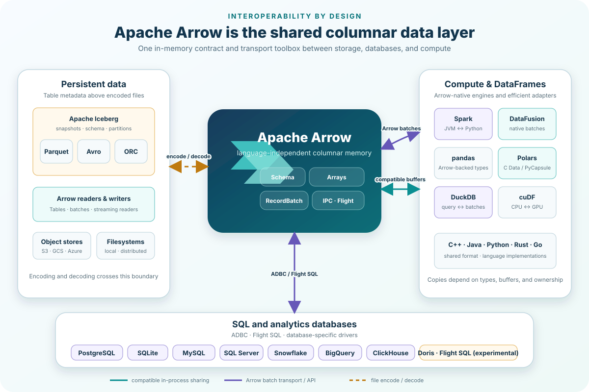

# rekep

`rekep` streams trading logs through Arrow into six Iceberg contracts: source
messages, FIX messages, instruments, books, orders, and executions.



```bash
pip install "rekep[all]"
```

```python
from rekep import TextFiles

capture = TextFiles.from_folder(
    "s3://bucket/logs/2026-08-14",
    pattern="*.log*",
    static_values={"source": "bridge-1"},
)

for messages in capture.read_arrow_reader():
    consume(messages)
```

Arrow is the boundary between every stage. `@scalar` declarations define the
in-memory schema, recursive casts, Iceberg projection, and portable YAML
contract. FIX parsing preserves repeated tags, unknown keys, metadata, and
structured components. The [Arrow interoperability guide](docs/arrow.md)
explains how that boundary connects Iceberg, Parquet, Avro, SQL databases,
Spark, and DataFrame/query engines without claiming every exchange is
zero-copy.

The project workflow is intentionally outside the package:

```text
parse_messages -> parse_fix -> parse_market -> flatten_orders
                      |             `-------> flatten_executions
                      `------------> flatten_instruments
```

`parse_market` can instead set `books: false` and write FIX-carried orders and
executions directly, without a book table or the two flattening stages.

Each step is a notebook under `tasks/<step>/` with an adjacent YAML config.
Airflow runs the same notebooks through `PapermillOperator`; package `Task`
only reads and writes their configuration.

Core properties:

- streamed local and `pyarrow.fs` text input;
- registry-driven, cross-version FIX metadata;
- stable cross-language XXH3 `int64` identities;
- immutable event, instrument, order, execution, and book histories;
- deterministic partition-aware Iceberg reads and bounded writes;
- six checked contracts under `schemas/rekep/`.

See the [documentation](https://platob.github.io/rekep/) or the local
[architecture overview](docs/index.md).

Development:

```bash
cd python
uv sync --all-extras --dev
uv run pytest
uv run ruff check .
```

Long Iceberg checks are explicit:

```bash
uv run pytest -m integration
```
