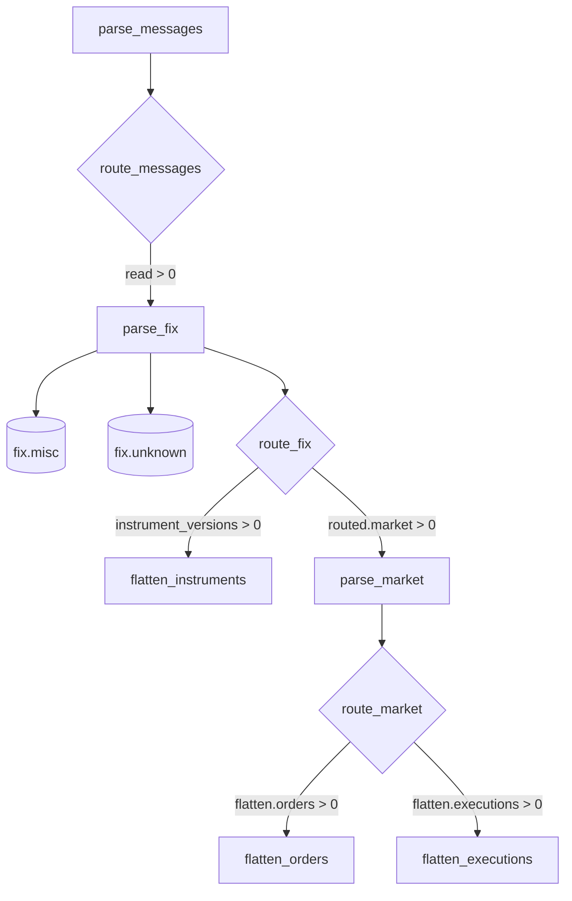

# Deploy and operate with Airflow

Airflow runs the repository's six publishing notebooks as the
`rekep_market_pipeline` DAG and the catalog-wide maintenance notebook as
`rekep_iceberg_maintenance`. This page covers a local first run and the
additional requirements for a distributed deployment.

The DAGs use the Airflow 3 `airflow.sdk` API and
`PapermillOperator(log_output=True)`. Use Airflow 3.x and
`apache-airflow-providers-papermill>=3.13,<4` with Python 3.12 or newer.
Airflow itself runs on Linux or another POSIX system; on Windows, use WSL2 or
Linux containers.

!!! warning "Deploy the repository, not only the DAG file"

    DAG parsing loads the YAML documents under `tasks/`, workers execute the
    adjacent notebooks, and the default FIX registry is `data/fix`. Keep the
    package, DAG, YAML, notebooks, schemas, and registry on the same revision.
    A `rekep` wheel by itself is not a complete deployment.

## What Airflow runs



| DAG | Schedule | Catch-up | Concurrent runs | Runtime parameter |
| --- | --- | --- | --- | --- |
| `rekep_market_pipeline` | hourly in UTC | enabled from 2026-01-01 | one | `branch` (`root`), `books` (`true`) |
| `rekep_iceberg_maintenance` | 02:30 UTC daily | disabled | one | `branch`, default `root` |

For every scheduled run, Airflow replaces the YAML `start` and `end` values
with its half-open data interval. The DAG's `branch` parameter replaces the
YAML branch in every notebook, and `books` selects the parse-market path. All
other job settings continue to come from the checked-in YAML files.

Each notebook records a `result` scrap with non-negative counts. A route task
reads that result and skips downstream work whose input count is zero. Routes
use attempted or read counts rather than `written`, so an idempotent replay
still reaches consumers even when the producer inserts no new rows.

## Configure the jobs first

The default input directory, `data/capture`, is not included in the
repository. Before the first run, edit
`tasks/parse_messages/parse_messages.yml` so `source` points to an existing
worker-visible directory or object-store prefix. Adjust `pattern`, `timezone`,
header rules, payload filters, and `fix_dictionary` for that capture. Set the
same `fix_dictionary` in `tasks/parse_fix/parse_fix.yml`; the first stage reads
MsgType metadata and the second performs full transcription.

The active catalog configuration in every task YAML is deliberately local:

```yaml
catalog: rekep
catalog_properties:
  type: sql
  uri: sqlite:///data/catalog.db
  warehouse: file://data/warehouse
```

The DAG resolves those relative paths beneath `REKEP_ROOT`. This is useful for
a single-host test, but the checkout must be writable and the catalog cannot
coordinate distributed workers.

For production, replace the catalog block consistently in all seven YAML files,
including `tasks/optimize_iceberg/optimize_iceberg.yml`.
The shipped Glue/S3 example is:

```yaml
catalog: rekep-production
catalog_properties:
  type: glue
  warehouse: s3://example-bucket/rekep/warehouse
  glue.region: eu-west-1
  s3.region: eu-west-1
  # glue.id: "123456789012"  # Optional cross-account catalog ID.
```

Install `pyiceberg[glue]` for this catalog and provide AWS credentials through
the worker's workload role or standard environment. Do not store credentials
in the YAML.

For MinIO or another S3-compatible store, configure every scheduler and worker
with the same portable defaults instead:

```bash
export S3_ENDPOINT_URL=http://minio:9000
export S3_ACCESS_KEY_ID=change-me
export S3_SECRET_ACCESS_KEY=change-me
export S3_REGION=us-east-1
# S3_SESSION_TOKEN is also read when temporary credentials require it.
```

Location URL values override these defaults, and explicit `s3.*` catalog
properties override both. Standard AWS profiles and workload roles continue to
work when the portable variables are absent.

Keep the table wiring aligned across the documents:

| Producer | Target | Consumer source |
| --- | --- | --- |
| `parse_messages` | `logs.messages` | `parse_fix` |
| `parse_fix` | `fix.market` | `flatten_instruments`, `parse_market` |
| `flatten_instruments` | `market.instruments` | `parse_fix.instrument_source` |
| `parse_market` in book mode | `market.books` | both flatteners |
| `parse_market` in direct mode | `market.orders`, `market.executions` | terminal tables |

`tasks/parse_market/parse_market.yml` sets the scheduled default market path;
the DAG's boolean `books` parameter can override it per run:

- `books: true` writes Books, then routes Orders and Executions to their
  independent flatteners.
- `books: false` writes FIX-carried Orders and Executions directly. Both
  flatteners are then intentionally skipped.

When changing an existing deployment to direct mode, use empty or dedicated
Order and Execution targets. Direct events and book-normalized events do not
have identical hashes, and an upsert does not remove historical rows from the
old mode.

## Local installation

The commands below use the current stable Airflow 3 release as an example.
Airflow's matching constraints file keeps its application dependencies
reproducible. Apply that file to the Airflow installation only; for later
dependencies, keep `apache-airflow` pinned so pip cannot change its version.

```bash
cd /path/to/rekep
export REKEP_ROOT="$PWD"

python3.12 -m venv .venv-airflow
source .venv-airflow/bin/activate

AIRFLOW_VERSION=3.3.1
PYTHON_VERSION=3.12
CONSTRAINT_URL="https://raw.githubusercontent.com/apache/airflow/constraints-${AIRFLOW_VERSION}/constraints-${PYTHON_VERSION}.txt"

python -m pip install --upgrade pip
python -m pip install \
  "apache-airflow==${AIRFLOW_VERSION}" \
  --constraint "$CONSTRAINT_URL"
python -m pip install \
  "apache-airflow==${AIRFLOW_VERSION}" \
  "apache-airflow-providers-papermill>=3.13,<4" \
  -e "${REKEP_ROOT}/python[iceberg,yaml]"
python -m pip check
```

The Papermill provider installs Papermill, Scrapbook, IPython's kernel, and
notebook conversion support. For the Glue example, add the catalog dependency
inside the same environment:

```bash
python -m pip install \
  "apache-airflow==${AIRFLOW_VERSION}" \
  "pyiceberg[glue]"
```

Configure paths before starting any Airflow component:

```bash
export AIRFLOW_HOME="$HOME/airflow-rekep"
export AIRFLOW__CORE__DAGS_FOLDER="$REKEP_ROOT/tasks/airflow"
export REKEP_NOTEBOOK_OUTPUT="$AIRFLOW_HOME/rekep-notebooks"

mkdir -p "$AIRFLOW_HOME" "$REKEP_NOTEBOOK_OUTPUT"
```

| Variable | Purpose |
| --- | --- |
| `REKEP_ROOT` | Absolute root containing `tasks/`, `data/`, and `python/` |
| `REKEP_NOTEBOOK_OUTPUT` | Writable location for executed notebooks |
| `AIRFLOW__CORE__DAGS_FOLDER` | Makes Airflow discover `market_pipeline.py` |

`REKEP_ROOT` and `REKEP_NOTEBOOK_OUTPUT` must be present in the DAG processor
and every task worker. The DAG does not create the notebook output directory.

Start a local all-in-one Airflow instance:

```bash
airflow standalone
```

Standalone initializes its metadata database and starts the DAG processor,
scheduler, triggerer, and API server. Open <http://localhost:8080>. The generated
admin password is stored at:

```bash
cat "$AIRFLOW_HOME/simple_auth_manager_passwords.json.generated"
```

In another shell with the same environment and virtual environment, validate
discovery before running data:

```bash
airflow info
airflow dags list --local
airflow dags list-import-errors --local
```

`rekep_market_pipeline` must appear in the list and the import-error list must
be empty. Also verify that the hard-coded `python3` notebook kernel resolves to
the environment containing `rekep`:

```bash
jupyter kernelspec list
python -c "import rekep, scrapbook; print(rekep.__file__)"
```

If `python3` is absent, register this interpreter:

```bash
python -m ipykernel install --sys-prefix --name python3 --display-name "rekep Airflow"
```

## Test one interval

Use a scratch catalog or a dedicated Iceberg branch for validation because
`airflow dags test` executes every selected notebook and therefore writes its
configured tables. It tests locally without creating a normal scheduled DAG
run.

```bash
airflow dags test \
  --dagfile-path "$REKEP_ROOT/tasks/airflow/market_pipeline.py" \
  --conf '{"branch":"root"}' \
  rekep_market_pipeline \
  2026-08-21T10:00:00Z
```

For the hourly schedule, that logical date selects the
`[2026-08-21T10:00:00Z, 2026-08-21T11:00:00Z)` interval. The interval is UTC;
the `timezone` in `parse_messages.yml` controls how timestamps without an
offset are interpreted inside the source logs.

Executed notebooks are retained under `REKEP_NOTEBOOK_OUTPUT`, named by task
and run timestamp. `log_output=True` also places notebook cell output in the
Airflow task log.

## Start scheduled runs

!!! danger "Review catch-up before unpausing"

    The shipped DAG has `catchup=True` and starts on 2026-01-01. Unpausing it
    creates one run for every completed hourly interval since that date.
    Confirm that the source and storage can serve the full history, or change
    the start date/catch-up policy and deploy that change before unpausing.

Inspect the next intervals, then unpause only when the catch-up policy is
intentional:

```bash
airflow dags next-execution --table --num-executions 5 rekep_market_pipeline
airflow dags unpause rekep_market_pipeline
airflow dags unpause rekep_iceberg_maintenance
```

Pause it without cancelling an already-running task:

```bash
airflow dags pause rekep_market_pipeline
```

Scheduled runs use `branch=root` and `books=true`. In the UI, **Trigger**
presents both fields. This direct-mode CLI run bypasses Book construction:

```bash
airflow dags trigger \
  --conf '{"branch":"root","books":false}' \
  rekep_market_pipeline
```

A trigger submitted while the DAG is paused remains queued. Manual-run data
intervals are inferred by Airflow's timetable and trigger path; use a backfill
when an exact historical sequence is required.

## Run Iceberg maintenance

The maintenance DAG visits every table in every nested namespace and runs the
same bounded routine as `IcebergDataset.optimize`: compact eligible data files,
expire eligible snapshots, then sweep unreachable data and metadata files. It
does not need a source interval and has catch-up disabled.

The checked-in policy in `tasks/optimize_iceberg/optimize_iceberg.yml` retains
at least 24 snapshots and every snapshot from the last seven days. Files are
deleted only when no retained snapshot or ref reaches them and they have been
orphaned for at least three days. Current table rows remain; time travel to an
expired snapshot does not. Manifest and manifest-list Avro files are shared, so
the sweep keeps one whenever any retained snapshot still references it.

Inspect and adjust that retention before unpausing the DAG. Schedule it for a
quiet warehouse period; the shipped 02:30 UTC time avoids the top-of-hour start
of the publishing DAG. The orphan grace protects new uncommitted files, and a
catalog conflict fails the run rather than silently overwriting another commit.
Airflow retries the notebook twice at ten-minute intervals.

Run one maintenance pass manually with:

```bash
airflow dags trigger \
  --conf '{"branch":"root"}' \
  rekep_iceberg_maintenance
```

The executed notebook's `result` scrap reports table count plus rewritten,
expired, deleted-file, and reclaimed-byte totals, with a per-table breakdown.

## Backfill historical hours

Preview the logical dates first:

```bash
airflow backfill create \
  --dry-run \
  --dag-id rekep_market_pipeline \
  --from-date 2026-08-21T10:00:00Z \
  --to-date 2026-08-21T11:00:00Z \
  --reprocess-behavior failed \
  --max-active-runs 1 \
  --dag-run-conf '{"branch":"root"}'
```

Remove `--dry-run` to create the backfill. Both date bounds are inclusive, so
this example creates the logical 10:00 and 11:00 hourly runs. Keep the runs in
ascending time order and keep `max_active_runs=1`: Instrument and market stages
resume lifecycle state from previously completed data. Do not use
`--run-backwards` for this pipeline.

## Iceberg branches

The Airflow `branch` parameter names an Iceberg ref, not a Git branch.
`root`, `main`, and `master` are aliases for the physical Iceberg main ref.

Any other name must already exist on every source and target table used by the
selected path. A named branch cannot bootstrap a fresh catalog: create the
tables on the root ref, write their first snapshots, create the named ref on
each table, and then trigger the DAG with that name.

If the deployment disables `core.dag_run_conf_overrides_params`, trigger-time
configuration cannot replace the default `root` parameter.

## Understand skips and replays

An Airflow `skipped` state is expected when a route count is zero:

| Result | Expected downstream state |
| --- | --- |
| `parse_messages.result.read == 0` | `parse_fix` and all consumers skipped |
| no Instrument versions | `flatten_instruments` skipped |
| no routed market messages | `parse_market` and both flatteners skipped |
| book mode with only Orders | `flatten_orders` runs; `flatten_executions` skipped |
| book mode with only Executions | `flatten_executions` runs; `flatten_orders` skipped |
| direct mode | both flatteners skipped; `parse_market` wrote terminal tables |

The YAML files ship with `merge_by: true`. Replaying an interval may report
zero writes because the declared keys are already stored. That is not an empty
input: the read/attempted counts still route the replay through downstream
parsing and schema logic.

## Monitor and recover

Use Grid view for task state and each task's **Log** tab for notebook output.
The retained executed notebook is the complete cell-by-cell artifact, while
the `result` Scrapbook scrap is the routing contract.

```bash
airflow dags list-runs --output table rekep_market_pipeline
airflow tasks states-for-dag-run \
  --output table \
  rekep_market_pipeline \
  RUN_ID
```

The shipped DAG does not set task-specific retries; the Airflow deployment's
defaults apply. After correcting a transient failure, clear the failed task in
Grid view. Include downstream tasks when their input may have changed. The CLI
equivalent for one logical interval is:

```bash
airflow tasks clear \
  --only-failed \
  --start-date 2026-08-21T10:00:00Z \
  --end-date 2026-08-21T10:00:00Z \
  --yes \
  rekep_market_pipeline
```

Executed notebooks accumulate and are not deleted by the DAG. Apply a
retention policy after the corresponding DAG runs no longer need them for
routing or diagnosis.

## Production deployment checklist

The repository does not ship a Docker, Compose, or Helm deployment. Integrate
the DAG into the Airflow platform your organization already operates. Airflow
3's versioned Git DAG bundles or an immutable image containing the complete
repository are suitable ways to keep the DAG and notebooks on one revision.

| Concern | Local validation | Distributed production |
| --- | --- | --- |
| Airflow metadata | Standalone SQLite | External PostgreSQL or MySQL |
| DAG delivery | Local DAG folder | Versioned DAG bundle or immutable image |
| Python runtime | One virtual environment | Same pinned image on processor and workers |
| Executed notebooks | Local directory | Shared writable volume or supported object store |
| Iceberg catalog | SQLite | Glue, REST, or another concurrent catalog |
| Iceberg warehouse | Local files | Shared object storage |
| Task logs | Local files | Remote logging or persistent shared logs |
| Credentials | Local profile | Workload identity or secret backend |

Before promotion:

1. Install the same Airflow, Papermill provider, `rekep`, catalog extras, and
   `python3` kernel on every task worker and the DAG processor.
2. Make the same absolute `REKEP_ROOT` available everywhere, or use a versioned
   bundle whose paths stay valid for the complete DAG run.
3. Mount `REKEP_NOTEBOOK_OUTPUT` read/write on every worker, or configure a URL
   supported by both Papermill and Scrapbook with the same credentials.
4. Replace all local SQLite/file catalog blocks consistently and verify source,
   registry, catalog, warehouse, and notebook-output access from a worker.
5. Keep credentials out of YAML and use Airflow's secret backend or workload
   identity.
6. Configure remote task logging, metadata database backups, health checks,
   notebook retention, and alerting.
7. Run `airflow dags test` against a scratch destination, inspect expected
   skips, then dry-run the intended backfill before unpausing.

Do not raise `max_active_runs` or reverse a backfill merely to drain history
faster. The pipeline deliberately carries prior Instrument and market
lifecycle state in chronological order.

## Troubleshooting

| Symptom | Check |
| --- | --- |
| DAG is absent | Run `airflow dags list-import-errors --local`; verify Airflow 3, provider 3.13+, and `REKEP_ROOT`. |
| YAML or notebook is missing | Deploy the complete repository revision and keep `REKEP_ROOT` identical on processors and workers. |
| `No such kernel named python3` | Register the worker environment with `ipykernel` and verify `jupyter kernelspec list`. |
| Notebook output cannot be opened | Create `REKEP_NOTEBOOK_OUTPUT`, fix permissions, and make it shared across workers. |
| Route says the `result` scrap is absent | Inspect the producer's executed notebook; it did not reach its result cell or an incompatible notebook was deployed. |
| SQLite is locked or files disappear | The local catalog/warehouse is being used by distributed or ephemeral workers; move to concurrent shared storage. |
| `Cannot scan unknown ref` | Use `root`, `main`, or `master`, or create the named branch on every relevant table first. |
| Many tasks are skipped | Compare the producer's `result` counts with the routing table above; zero-input skips are intentional. |
| Replay writes zero rows | Expected with `merge_by: true` when keys already exist; confirm read/attempted counts and downstream routing. |
| Thousands of runs become queued | Pause the DAG and review its 2026-01-01 start date and `catchup=True` policy. |

## Airflow references

- [Install Airflow with constraints](https://airflow.apache.org/docs/apache-airflow/stable/installation/installing-from-pypi.html)
- [Airflow prerequisites and supported platforms](https://airflow.apache.org/docs/apache-airflow/stable/installation/prerequisites.html)
- [Papermill provider requirements](https://airflow.apache.org/docs/apache-airflow-providers-papermill/stable/index.html)
- [Airflow CLI reference](https://airflow.apache.org/docs/apache-airflow/stable/cli-and-env-variables-ref.html)
- [DAG bundles](https://airflow.apache.org/docs/apache-airflow/stable/administration-and-deployment/dag-bundles.html)
- [Production deployment](https://airflow.apache.org/docs/apache-airflow/stable/administration-and-deployment/production-deployment.html)
- [DAG runs and catch-up](https://airflow.apache.org/docs/apache-airflow/stable/core-concepts/dag-run.html)
- [Task logging](https://airflow.apache.org/docs/apache-airflow/stable/administration-and-deployment/logging-monitoring/logging-tasks.html)
