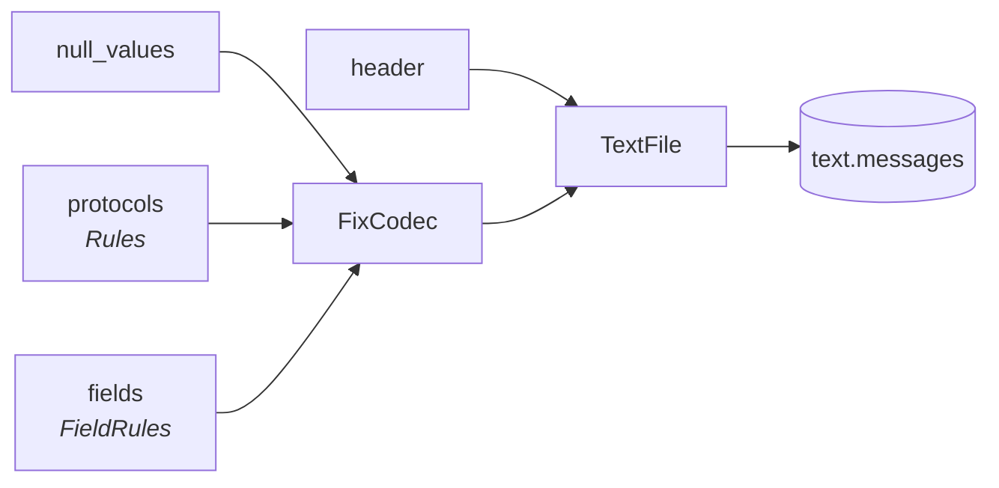

# Configuring a parse

Everything a capture differs by is a document, not a code change: what a line's
header looks like, which lines carry a message and how it is spelled, what a
field's values mean, and what counts as absent. A job hands the four of them to
`TextFile`/`TextFiles`, and every notebook under `tasks/` takes them as
parameters.



## The header a line opens with

`header_pattern` takes the source of a pattern as well as a compiled one, so a
capture whose header this package has never seen is a `header:` in the task
document. It must name the same four groups.

```python
from rekep import TextFile

VENDOR = (
    r"^(?P<timestamp>[0-9]{8}-[0-9:.]+)\|(?P<thread_name>[^|]*)\|"
    r"(?P<plugin_code>[^|]*)\|(?P<message>.*)$"
)

with TextFile.from_path("vendor.log", header_pattern=VENDOR) as log:
    rows = log.into_arrow_table()
```

The shipped `HEADER_PATTERN` reads the bracketed layout most trading logs
write, with the timestamp in any of the three shapes `rekep.times.SHAPES`
declares -- ISO, FIX's own `20260824-10:00:01.123`, and a compact
`20260824100001123`.

## Which lines carry a message

`Rules` is a list of protocol rules, first match wins. A rule's regexes must
work in Python `re` *and* in Arrow's RE2, because the scalar reading and the
columnar one are the same rule.

```yaml
protocols:
  rules:
    - protocol: VENUE
      pattern: '(?s)^<venue>'
      plugin_pattern: '^VenueBridge$'
      separator: ';'
      codec: fix        # `fix` reads wire tags, `ul` rendered names, `none` neither
    - protocol: OTHER
      pattern: ''       # empty patterns make this the fall-through
      codec: none
```

`Rules.into_default()` reads a FIX trading log: a wrapped bridge message, a
wire message, a bridge message, known operational traffic, then everything
else.

## What a field's values mean

`FieldRules` says how one field reads whatever the dictionary says about it.
One rule reaches every reading of that field, because every one of them
resolves through `FixCodec.tag_field` and casts through `cast_arrow_fix`.

```yaml
fields:
  rules:
    # A vendor tag no dictionary will ever carry, which holds an instant.
    - field: "9999"
      type: timestamp[us, tz=UTC]
    # A date this feed writes as text where the standard says otherwise.
    - field: MaturityDate
      type: date32[day]
    # Spellings only this estate writes.
    - field: Side
      values: {BUYSIDE: "1", SELLSIDE: "2"}
```

- `field` names its field however the log does: a tag, a canonical name, or a
  rendered key. It resolves through the same index a parsed key resolves
  through.
- `type` is an Arrow type as Arrow spells one. A FIX datatype (`UTCDateOnly`)
  is accepted and normalizes to it, so a rule read back always states its unit
  and its zone -- `type: date` comes back `date32[day]`.
- `values` maps what a feed writes to what it means, and wins the dictionary's
  own translation for that field.

A declared type changes how the text is **read**; the column keeps the type its
contract declares. Reading `TransactTime` as `date32[day]` stores that day's
midnight in the `timestamp[us, tz=UTC]` column the contract fixes.

```python
from rekep import FieldRules, FixCodec, FixRegistry

codec = FixCodec(
    registry=FixRegistry(cache_dir="data/fix", offline=True),
    fields=FieldRules.from_dict(
        {"rules": [{"field": "9999", "type": "timestamp[us, tz=UTC]"}]}
    ),
)
```

## What counts as absent

`null_values` drops a pair before anything else looks at it, so a feed that
writes `<null>` for "the field is not set" does not store the string.

```yaml
null_values: ["", "null", "<null>", "n/a"]
```

## Where each one is read

| Parameter | Read by | Stage |
| --- | --- | --- |
| `header` | `TextFile.header_pattern` | `parse_messages` |
| `timezone` | `TextFile.timezone` | `parse_messages` |
| `protocols` | `FixCodec.rules` | `parse_messages` |
| `null_values` | `FixCodec.null_values` | `parse_messages` |
| `rules` | `FixMessageRules` (which `etype` a line is) | `parse_messages` |
| `fields` | `FixCodec.fields` | `parse_messages`, `parse_fix` |
| `fix_dictionary` | `FixRegistry.cache_dir` | `parse_messages`, `parse_fix` |

`parse_messages` structures a line and `parse_fix` resolves it, so a change to
`fields` or to the dictionary is a re-run of `parse_fix` alone: nothing
re-tokenises a line that was already split.
