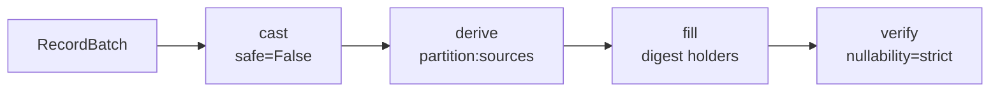

# Field contract

The native `Field` is the public field type:

```python
import pyarrow

from rekep import Field, Message
from yggdryl import Field as NativeField

assert Field is NativeField
schema = Message.field().into_arrow_schema()
assert schema.names == [
    "url",
    "rownum",
    "timestamp",
    "timepartition",
    "threadname",
    "branch",
    "level",
    "mimetype",
    "msgtype",
    "msgdirection",
    "msghash",
    "body",
]
timestamp = schema.field("timestamp")
assert timestamp.type == pyarrow.timestamp("us", tz="UTC")
assert timestamp.nullable
partition = schema.field("timepartition")
assert partition.type == timestamp.type
assert partition.metadata[b"partition:sources"] == b'["timestamp"]'
assert partition.metadata[b"iceberg:partition_key"] == b"hour"
```

`@scalar` derives the cached field from the dataclass annotations; `Annotated`
options supply the Iceberg markers. `Field.into_arrow_schema`,
`from_arrow_schema`, `into_json` and `from_json` own every conversion.

| you want | use |
| --- | --- |
| the immediate children | iterate the `Field` |
| one datatype | `child.dtype.into_arrow()` |
| the derived columns | `partition_field_names` |
| the digest holders | `digest_field_names` |

rekep adds no wrappers around those views; its remaining field helpers declare
Iceberg metadata or bridge it to PyIceberg.

## The three declarations

| helper | metadata | meaning |
| --- | --- | --- |
| `primary_key()` | `iceberg:primary_key` | part of the merge identity |
| `partition_key()` | `field:partition` | identity partition; a transform argument writes `iceberg:partition_key` instead |
| `derived_from(sources, transform)` | `partition:sources` | compute this column from those, natively |
| `digest_key(sources)` | `digest:role=holder` | this column *holds* a digest over those |

The identity and transformed Iceberg markers are mutually exclusive -- a field
carrying both is rejected at declaration and at spec conversion. A
`derived_from(...)` declaration is independent of either.

A digest holder's inputs state nothing, which is the point: a schema marks one
holder and leaves its sources ordinary columns. The declared datatype must be
the algorithm's exact width, so the 128-bit default takes
`fixed_size_binary[16]`.

```python
import pyarrow
from yggdryl import Field

from rekep.fields import digest_key

options = digest_key(["body"], dtype=pyarrow.binary(16))["metadata"]
holder = Field("msghash", "fixed_size_binary[16]", True, options)
assert holder.digest.is_holder()
assert holder.digest.sources == ["body"]
assert holder.digest.algorithm == "xxh3-128"
```

The raw [`Message`](../products/message.md) declares exactly one, over `body`.

## The apply



Every rekep Arrow boundary delegates to that one apply: batches through
`Field.apply_arrow_batch`, streams through `Field.apply_arrow_reader`, which
compiles once. Missing and null required values, protocol exemptions, nested
array casts, final verification and stream ownership are native contracts, not
rekep implementations.

The `Message` timestamp is an aware UTC instant: Arrow stores microseconds,
Iceberg maps it to `timestamptz`, and the `hour` transform over the derived
`timepartition` copy partitions it without reducing stored precision.
