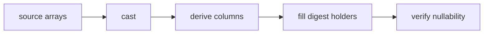

# Field contract

The public field type is Yggdryl's native `Field`.

```python
import pyarrow

from rekep import Field, Message
from yggdryl import Field as NativeField

assert Field is NativeField
schema = Message.field().into_arrow_schema()
assert schema.names == [
    "url",
    "rownum",
    "timestamp",
    "timepartition",
    "threadId",
    "sessionUid",
    "msgCtxId",
    "seqNum",
    "plugin",
    "level",
    "bodyhash",
    "body",
]
assert schema.field("timestamp").type == pyarrow.timestamp("us", tz="UTC")
```

`@yggdryl.scalar` derives the cached field from the dataclass annotations.
`Annotated` options supply digest, derivation, primary-key, and Iceberg
partition metadata. `Field.into_arrow_schema`, `from_arrow_schema`,
`into_json`, and `from_json` own all conversions.

| declaration | meaning |
| --- | --- |
| `primary_key()` | part of merge identity |
| `partition_key()` | identity Iceberg partition |
| `partition_key("hour")` | transformed Iceberg partition |
| `derived_from(sources, transform)` | native computed Arrow column |
| `digest_key(sources)` | native digest holder |

The identity and transformed partition markers are mutually exclusive. A
digest holder alone names its inputs; source fields remain ordinary fields.
The holder type must match the algorithm width.

```python
import pyarrow
from yggdryl import Field

from rekep.fields import digest_key

options = digest_key(["body"], dtype=pyarrow.binary(16))["metadata"]
holder = Field("bodyhash", "fixed_size_binary[16]", True, options)

assert holder.digest.is_holder()
assert holder.digest.sources == ["body"]
assert holder.digest.algorithm == "xxh3-128"
```

## Native application order



For `parse_messages`, `Message.field()` is installed directly on
`TextOptions`, so the text reader performs that sequence while producing each
batch. Other Arrow boundaries call `Field.apply_arrow_batch` or
`Field.apply_arrow_reader`; rekep does not reproduce the plan.

The raw timestamp is aware UTC at microsecond resolution. `timepartition`
copies it and carries Iceberg's hour transform without reducing the stored
timestamp precision.
