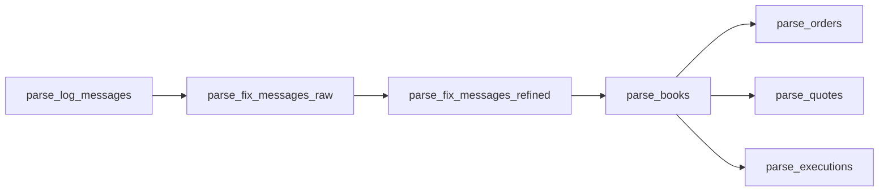

# Run the graph

A run is the seven tasks in the graph's order over one window. Each task
reads only the table before it, so its edges are the whole schedule:



The three flattening tasks read the one book snapshot `parse_books`
committed, and write three tables: they run side by side, handed that
`snapshot_id`. Where the tasks run, how often and over which window is the
runner's: a script, a cron job, or an orchestrator such as
[Airflow](airflow.md).

## A plain-Python runner

```python
import tempfile
from concurrent.futures import ThreadPoolExecutor
from pathlib import Path

from rekep import Storages
from rekep.pipeline import (
    FLATTENERS,
    Landed,
    parse_books,
    parse_fix_messages_raw,
    parse_fix_messages_refined,
    parse_log_messages,
)
from rekep.times import window_of


def run(storages, capture, window) -> dict[str, Landed]:
    """Every task over one window, in the graph's order; the flatteners side by side."""
    landed = {
        "parse_log_messages": parse_log_messages(capture, storages, window),
        "parse_fix_messages_raw": parse_fix_messages_raw(storages, window),
        "parse_fix_messages_refined": parse_fix_messages_refined(storages, window),
        "parse_books": parse_books(storages, window),
    }
    snapshot = landed["parse_books"].snapshot_id
    with ThreadPoolExecutor(max_workers=len(FLATTENERS)) as pool:
        running = {
            task.__name__: pool.submit(task, storages, window, snapshot_id=snapshot)
            for task in FLATTENERS.values()
        }
        landed.update({name: future.result() for name, future in running.items()})
    return landed


root = Path(tempfile.mkdtemp())
storages = Storages.from_dict(
    {
        layer: {
            "name": layer,
            "properties": {
                "type": "sql",
                "uri": f"sqlite:///{root / layer}.db",
                "warehouse": str(root / layer),
            },
        }
        for layer in ("bronze", "silver", "gold")
    }
)
window = window_of("2026-08-14T00:00:00Z", "2026-08-14T16:30:00Z")
with storages:
    first = run(storages, "file:data/capture/ulbridge.log", window)
    assert {task: landed.written for task, landed in first.items()} == {
        "parse_log_messages": 129,
        "parse_fix_messages_raw": 72,
        "parse_fix_messages_refined": 47,
        "parse_books": 29,
        "parse_orders": 8,
        "parse_quotes": 0,
        "parse_executions": 7,
    }
    # A rerun is a retry. The keyed tasks find every row they answer held as
    # it is and write none; the books and the event tables replace their
    # window again.
    again = run(storages, "file:data/capture/ulbridge.log", window)
    assert {task: (landed.written, landed.skipped) for task, landed in again.items()} == {
        "parse_log_messages": (0, 129),
        "parse_fix_messages_raw": (0, 125),
        "parse_fix_messages_refined": (0, 47),
        "parse_books": (29, 0),
        "parse_orders": (8, 0),
        "parse_quotes": (0, 0),
        "parse_executions": (7, 0),
    }
```

A failure stops the run where it happened: the failed task leaves its table's
previous snapshot visible, and nothing after it runs over a table it did not
finish. Retrying is running the task again over the same window, then the
tasks after it: a keyed task keeps the commits it made before it failed, and
its retry writes the rest ([commits](../tasks/index.md#commits)).

## Windows

Every task takes the run's window `[start, end)` over `currunix`, and every
table is laid out by the hour of `currunix`, so a window of whole hours maps
onto whole partitions. Two ways to cover time:

- **Incremental.** Each scheduled interval is one window: an hourly schedule
  runs `[10:00, 11:00)`, then `[11:00, 12:00)`. A rerun of an interval
  leaves each table holding what it landed, once, so a late retry or a
  catch-up run is the same call.
- **Backfill.** A historical range is a run per interval over it, in time
  order, or one run over a wider window. The bronze log task may also land the
  whole range once, before the later tasks walk it window by window: a later
  task reads only its own window of the table before it.

```python
import datetime

from rekep.times import window_of

first_day = datetime.date(2026, 8, 1)
days = [first_day + datetime.timedelta(days=offset) for offset in range(14)]
for day in days:
    window = window_of(day.isoformat(), day.isoformat())
    run(storages, "s3://market-capture/ulbridge?region=eu-west-1", window)
```

A task over a window writes that window and nothing else -- a keyed task
merges its rows into its table, a book or event task replaces it -- so two
runs over different windows may land side by side, and a rerun over a window
wider than the one first run is always safe: it lands what it finds.

## Late events

Each table is windowed on its own clock. Bronze `log_messages` is dated by the
instant a line was printed at, read in the `timezone` `parse_log_messages`
is given: the zone the bridge prints its clock in, `rekep.times.TIMEZONE`
(`Europe/Zurich`) unless stated. That is the shipped capture's zone, so its
lines of 14:46 are dated 12:46 UTC, the hour of the messages they carry. A
FIX table is dated by the instant a message states, and a book by the
instant the fold reached.

`parse_fix_messages_refined` reads its window and one hour before it
(`HISTORY`) and writes the events the walk dates inside its window, so an
event lands only in a window that holds both its bronze row and the instant
it is walked to. Counted in events -- `snapshot_millis=0`, so no hourly view
is landed beside them -- hourly windows over the capture's day land all but
one of the events one window over the day does: an expiry whose order began
more than `HISTORY` before it, which only a window holding the whole chain
places. A run over the day after them answers all 23, finds the 22 the hours
landed held as they are, and inserts the expiry:

```python
import datetime
import tempfile
from pathlib import Path

from rekep import Storages
from rekep.pipeline import parse_fix_messages_raw, parse_fix_messages_refined, parse_log_messages
from rekep.times import window_of

root = Path(tempfile.mkdtemp())
storages = Storages.from_dict(
    {
        layer: {
            "name": layer,
            "properties": {
                "type": "sql",
                "uri": f"sqlite:///{root / layer}.db",
                "warehouse": str(root / layer),
            },
        }
        for layer in ("bronze", "silver", "gold")
    }
)
day = window_of("2026-08-14", "2026-08-14")
hours = [
    (day[0] + datetime.timedelta(hours=hour), day[0] + datetime.timedelta(hours=hour + 1))
    for hour in range(24)
]
with storages:
    parse_log_messages("file:data/capture/ulbridge.log", storages, day)
    parse_fix_messages_raw(storages, day)
    hourly = sum(
        parse_fix_messages_refined(storages, hour, snapshot_millis=0).written for hour in hours
    )
    daily = parse_fix_messages_refined(storages, day, snapshot_millis=0)
    assert (hourly, daily.written + daily.skipped) == (22, 23)
    assert (daily.written, daily.skipped) == (1, 22)
```

A capture read in a zone other than its bridge's dates every line hours away
from the message it carries. Read as UTC, the shipped capture's lines are
dated 14:46 and carry messages of 12:46, so the line of a message stating no
`SendingTime` no longer stands within `official_time_delay_ms` of its
`TransactTime`: the parse dates the message by its line, two hours after the
instant the walk dates it at, and no hourly window holds both. Copies of one
message the parse dated by different clocks settle on different identities
and no longer fold, so the day holds 27 events rather than 23, and hourly
windows land four fewer. An hourly walk also merges only the copies its window
holds, so an event it lands may settle another identity than the day's walk
gives it: the day finds 11 of its 27 events held as they are and inserts the
other 16 beside the hours' rows.

```python
import datetime
import tempfile
from pathlib import Path

from rekep import Storages
from rekep.pipeline import parse_fix_messages_raw, parse_fix_messages_refined, parse_log_messages
from rekep.times import window_of

root = Path(tempfile.mkdtemp())
storages = Storages.from_dict(
    {
        layer: {
            "name": layer,
            "properties": {
                "type": "sql",
                "uri": f"sqlite:///{root / layer}.db",
                "warehouse": str(root / layer),
            },
        }
        for layer in ("bronze", "silver", "gold")
    }
)
day = window_of("2026-08-14", "2026-08-14")
hours = [
    (day[0] + datetime.timedelta(hours=hour), day[0] + datetime.timedelta(hours=hour + 1))
    for hour in range(24)
]
with storages:
    parse_log_messages("file:data/capture/ulbridge.log", storages, day, timezone="UTC")
    parse_fix_messages_raw(storages, day)
    hourly = sum(
        parse_fix_messages_refined(storages, hour, snapshot_millis=0).written for hour in hours
    )
    daily = parse_fix_messages_refined(storages, day, snapshot_millis=0)
    assert (hourly, daily.written + daily.skipped) == (23, 27)
    assert (daily.written, daily.skipped) == (16, 11)
```

Schedule for it:

- Run the bronze tasks per interval, as captures arrive.
- Read every capture in the zone its bridge prints: `timezone=` wherever that
  is not `Europe/Zurich`.
- Run the silver tasks behind them, over windows that end where bronze has
  landed every line that can date into them -- lag them by the bridge's
  delivery delay -- and, where a chain outlives `HISTORY`, wide enough to hold
  it.
- Reconcile by rerunning a wider window: a keyed task merges its rows into
  its table and a book or event task replaces its window, so a daily rerun of
  the silver tasks over yesterday inserts whatever the hourly runs could not
  place and replaces a row it settles otherwise under the same identity. It
  takes no row back: an event a narrower walk settled under another identity
  keeps that row beside the wider walk's.

## Partition pruning

Every scan hands the window to Iceberg as a predicate on `currunix`, which
Iceberg projects through the hour transform, so a task plans only the
partitions its window covers: `parse_fix_messages_raw` the window's hours of
bronze `log_messages` and the epoch hour, `parse_fix_messages_refined` those
of bronze `fix_messages` and the hour before, `parse_books` those of silver
`fix_messages` and the hour before, and the flatteners exactly the window's
hours of silver `books`. `IcebergDataset.scan_plan`
shows what a predicate plans without reading it:

```python
import tempfile
from pathlib import Path

from rekep import Storages
from rekep.iceberg import window_filter
from rekep.pipeline import LOG_MESSAGES, parse_log_messages
from rekep.times import window_of

root = Path(tempfile.mkdtemp())
storages = Storages.from_dict(
    {
        layer: {
            "name": layer,
            "properties": {
                "type": "sql",
                "uri": f"sqlite:///{root / layer}.db",
                "warehouse": str(root / layer),
            },
        }
        for layer in ("bronze", "silver", "gold")
    }
)
with storages:
    parse_log_messages("file:data/capture/ulbridge.log", storages, window_of("2026-08-14", "2026-08-14"))
    lines = storages.dataset(LOG_MESSAGES)
    try:
        hour = window_of("2026-08-14T12:00:00Z", "2026-08-14T13:00:00Z")
        plan = lines.scan_plan(window_filter("currunix", hour))
    finally:
        lines.close()
    # The capture's lines fall in four hours; the window plans the one it covers.
    assert (plan["files"], plan["total_files"], plan["rows"]) == (1, 4, 112)
```

A window that does not start and end on an hour still plans whole hours --
the partitions it touches -- and the tasks that replace an exact window
(`parse_books` and the flatteners) leave the rest of those hours' rows as they
were.
