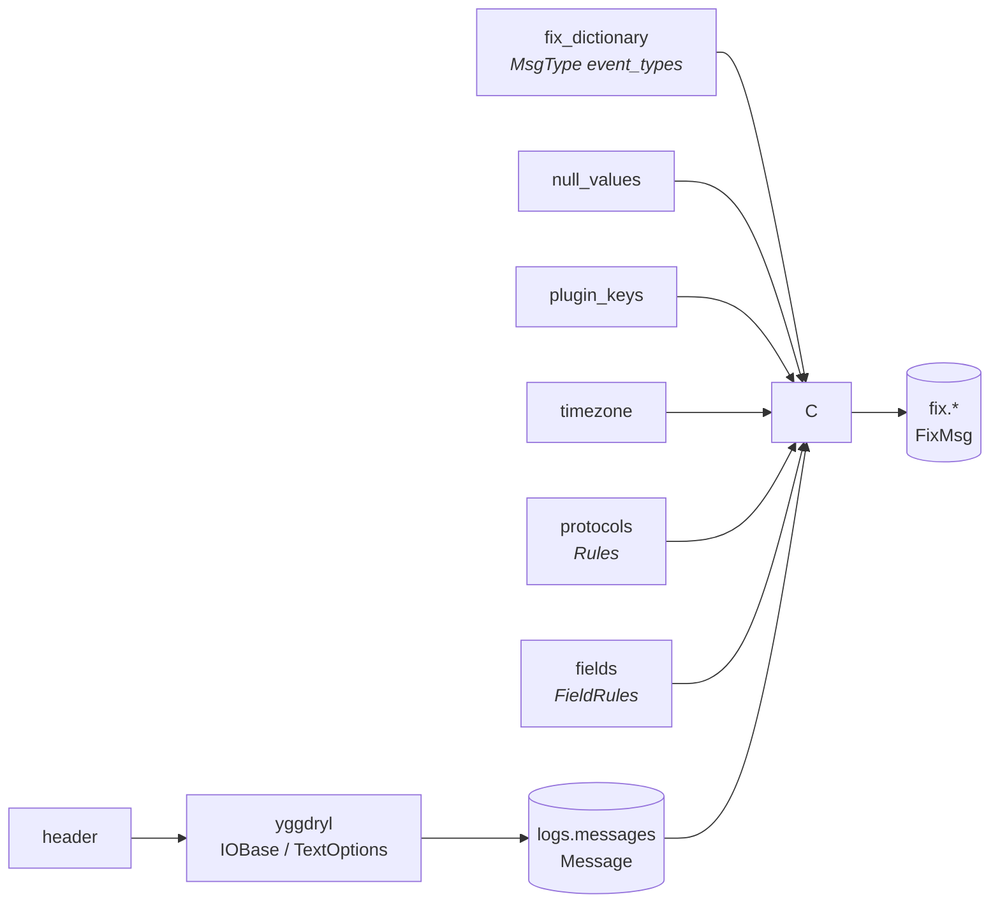

# Configuring a parse

Everything a capture differs by is a document, not a code change.
`parse_messages` configures yggdryl's filesystem, path selection, physical-line
batches and header captures. `parse_fix` owns timezone conversion, protocol
classification, tokenization, source-key aliases, absent values and registry
resolution.



## The header a line opens with

`TextOptions.rowheader` takes a byte-regex spelling. Its complete match is
removed from `body`, and its named captures become nullable columns. A capture
whose header this package has never seen supplies that prefix as `header:` in
the task document. Use any of `timestamp`, `threadname`, `plugin`, and `level`;
`url`, `rownum`, and `body` belong to yggdryl and cannot be capture names.

```python
from yggdryl import IOBase, TextOptions

VENDOR = (
    r"^(?P<timestamp>[0-9]{8}-[0-9:.]+)\|(?P<threadname>[^|]*)\|"
    r"(?P<plugin>[^|]*)\|(?P<level>[^|]*)\|"
)

options = TextOptions()
options.rowheader = VENDOR
options.with_rownum = 1
options.autotype = False
rows = IOBase("vendor.log").into_text(options).read_arrow_reader()
```

The task's default prefix reads the bracketed layout most trading logs write,
with the timestamp in any of the three shapes `rekep.times.SHAPES` declares --
ISO, FIX's own `20260824-10:00:01.123`, and a compact `20260824100001123`.
`autotype` stays false: `Message.timestamp` preserves the source spelling and
`FixCodec.timezone` turns it into the parsed `recunix` instant.

## Which lines carry a message

`Rules` is a list of protocol rules, first match wins -- the first
*configured* rule, wherever in the line its pattern matches, which is what
lets a specific rule sit in front of a general one.

A rule matches by what it declares. A rule that writes a `pattern` or a
`plugin_pattern` is decided by those; one that writes neither is decided by
the shape its codec names -- the keys the payload's own parsed pairs hold.
That is how the key-shaped shipped protocol rules work, and why a value full of
digits or a `#A=1` quoted inside a `Text <58>` changes nothing.

A rule carries one `pattern`; alternatives join with `|`, and
`rekep.fix.rules.joined_pattern` spells that join so each branch keeps its
own flags. A rule's regex must work in Python `re` *and* in
Arrow's RE2, because the scalar reading and the columnar one are one rule.

```yaml
protocols:
  rules:
    - protocol: VENUE
      pattern: '(?s)^<venue>'
      plugin_pattern: '^VENUEBRIDGE$'
      separator: ';'
      extra_entry_separators: ["\u001e\u001f"]
      # `fix` is numbered tags alone, `ul` named keys alone, `fixml` both,
      # `xml` ordered XML entries, and `none` parses no pairs at all.
      codec: fixml
    - protocol: OTHER
      pattern: ''       # empty patterns make this the fall-through
      codec: none
```

`Rules.into_default()` reads bare and `XmlApi` XML as `XML`; then `FIX`,
`FIXML` and `UL` by the keys each payload holds; then known operational traffic
as `MISC`; then everything else as `OTHER`. `entry_separator` fixes one indexed-entry
delimiter; `extra_entry_separators` extends literal auto-detection for that
protocol. A rule's `protocol` is a [`Protocol`](../enums/protocol.md) code, so
a name of its own is at most sixteen bytes of `[A-Z0-9._-]` and anything else is
refused when the rule set is read.

## Which event a payload represents

The FIX registry's `MsgType <35>` record owns the configurable
`event_types` mapping. `parse_fix` applies it after parsing `body`; it does not
maintain a second set of payload regexes.

```json
{
  "name": "MsgType",
  "type": "string",
  "nullable": true,
  "fix": {
    "tag": "35",
    "type": "String",
    "values": [
      {"value": "8", "meaning": "ExecutionReport"},
      {"value": "D", "meaning": "NewOrderSingle"}
    ],
    "event_types": {"0": "SESSION", "8": "EXECUTION", "D": "ORDER", "W": "BOOK"}
  }
}
```

Enum members are stored by **name**. The value each name stands for is its
ASCII mnemonic packed big-endian into an `int64` (`EXECUTION`, `ORDER`,
`BOOK`), which is a nineteen-digit integer and unreadable in a file people
edit. A name this release does not declare is refused on load rather than
read as a degraded `UNKNOWN`.

A row without a discriminator is `MISC`. Registry metadata classifies session,
allocation, settlement, confirmation, news, position, collateral and party
traffic as their own `EventType`; a known but unmapped value remains `MISC`,
and a private value absent from the registry is `UNKNOWN`.

The market layer owns which message shapes it implements, under the standard's
own name for each, and asks the dictionary what this feed spells them as:
`newordersingle` encodes to `D` here and to whatever a venue writes instead.
The registry carries no second handler vocabulary and nothing converts a
MsgType back into a name. `parse_messages` retains every selected physical
text row; the shared `parse_fix.yml` `exclude_msgtypes` parameter controls what
enters FIX tables.

Lifecycle fields carry one `states` conversion beside their value dictionary.
Every consumer, including Order fallbacks, reads that map. Python declarations
use `State` members; registry documents name them.

```json
{
  "name": "ExecType",
  "type": "string",
  "nullable": true,
  "fix": {
    "tag": "150",
    "type": "char",
    "states": {"0": "NEW", "1": "PARTIALLY_FILLED", "2": "FILLED", "G": "REPLACED", "H": "CANCELLED"}
  }
}
```

`PARTIALLY_FILLED` and `FILLED` states create an Execution, as do configured
ExecType values whose normalized name begins `trade`. A partial fill is
`PARTIALLY_FILLED` for its Order and `FILLED` for the completed execution;
trade correction and cancellation states do not replace a missing OrdStatus.

## What a field's values mean

`FieldRules` says how one field reads whatever the dictionary says about it.
One rule reaches every reading of that field, because every one of them
resolves through `FixCodec.tag_field` and casts through `cast_arrow_fix`.

```yaml
fields:
  rules:
    # A vendor tag no dictionary will ever carry, which holds an instant.
    - field: "9999"
      type: timestamp[us, tz=UTC]
    # A local date this feed may later publish with a clock.
    - field: MaturityDate
      type: timestamp[us]
    # Spellings only this estate writes.
    - field: Side
      values: {BUYSIDE: "1", SELLSIDE: "2"}
```

- `field` names its field however the log does: a tag, a canonical name, or a
  rendered key. It resolves through the same index a parsed key resolves
  through.
- `type` is an Arrow type as Arrow spells one. A FIX datatype (`UTCDateOnly`,
  `date`) is accepted and normalizes to what the dictionary projects it to, so
  a rule read back always states its unit and its zone -- and every FIX
  temporal projects to an instant, so both of those come back `timestamp[us]`.
  Persisted FIX-backed fields use `timestamp[us]`, the width Iceberg stores.
  A date-only value is midnight; a later rule can retain a supplied clock.
- `values` maps what a feed writes to what it means, and wins the dictionary's
  own translation for that field.

A declared type changes how the text is **read**; the column keeps the type its
contract declares. Reading `MaturityDate` as `timestamp[us]` keeps both
`20260821` at midnight and `20260821-10:30:00` at its stated local clock.

```python
from rekep import FieldRules, FixCodec, FixRegistry

codec = FixCodec(
    registry=FixRegistry(cache_dir="data/fix"),
    fields=FieldRules.from_dict({"rules": [{"field": "9999", "type": "timestamp[us, tz=UTC]"}]}),
)
```

## What counts as absent

`null_values` drops a pair before anything else looks at it, so a feed that
writes `<null>` for "the field is not set" does not store the string.

```yaml
plugin_keys:
  XmlApi: {clientid: ClOrdID, type: MsgType}
null_values: ["", "null", "<null>", "n/a", "none"]
```

Plugin names and null values match case-insensitively. Key names use the same
folded comparison as the FIX registry.

## Where each one is read

| Parameter | Read by | Stage |
| --- | --- | --- |
| `source`, `pattern`, `recursive` | yggdryl `IOBase` selection | `parse_messages` |
| `header` | yggdryl `TextOptions.rowheader` | `parse_messages` |
| `batch_row_size` | yggdryl `TextOptions.batch_row_size` | `parse_messages` |
| `start`, `end` | calendar source roots | `parse_messages` |
| `timezone` | raw `timestamp` to `FixMsg.recunix` | all `parse_fix_*` tasks |
| `exclude_msgtypes` | parsed `FixMsg.msgtype` filter | all `parse_fix_*` tasks |
| `plugin_keys` | `FixCodec` entry-key normalization | all `parse_fix_*` tasks |
| `null_values` | `FixCodec` entry filter | all `parse_fix_*` tasks |
| `protocols` | `FixCodec.rules`, then `FixMsg.protocol` | all `parse_fix_*` tasks |
| `fields` | `FixCodec.fields` | all `parse_fix_*` tasks |
| `fix_dictionary` | MsgType metadata and full `FixRegistry` | all `parse_fix_*` tasks |

`parse_messages` retains only the raw source coordinates, header captures and
exact binary body. Changing `fields`, protocol classification, plugin aliases,
null spellings, timezone or the dictionary reruns the three `parse_fix_*`
tasks without reopening the source logs. Each category run parses the raw body
under the same `parse_fix.yml` configuration, then applies its Arrow category
mask. Repeated parsing is deliberate: `logs.messages` never depends on a FIX
dictionary or protocol rule.

The shipped UL rule prefers the bridge's detailed instrument classification:

```yaml
protocol: UL
codec: ul
pop: {DetailedCFICode: CFICode}
```

`pop` removes the rendered source field and any target value on the same row,
then keeps the source value under the target name. Other rows and pair order
are unchanged.
