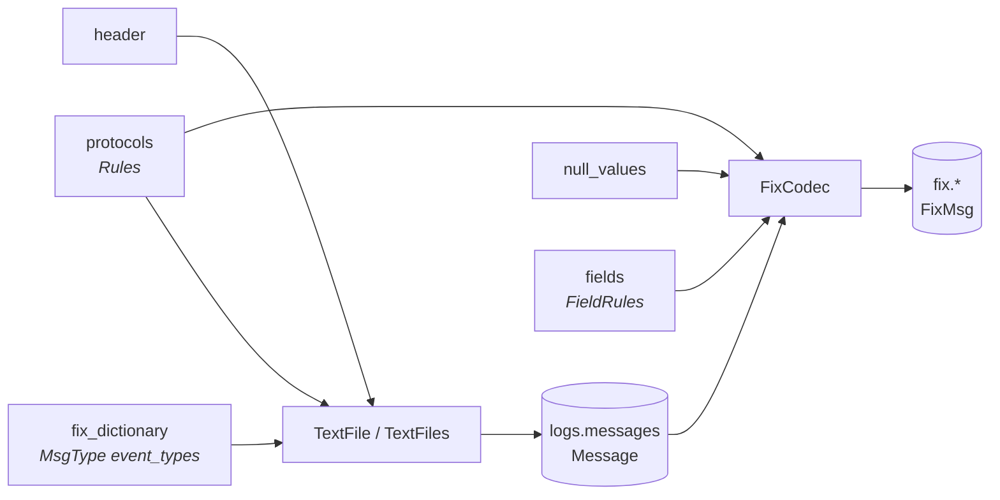

# Configuring a parse

Everything a capture differs by is a document, not a code change. The message
stage owns the log header, timezone, and protocol-neutral key/value split. The
FIX stage owns which payloads are FIX, which key spellings its rules admit,
what their fields mean, and what counts as absent.



## The header a line opens with

`header_pattern` takes the source of a pattern as well as a compiled one, so a
capture whose header this package has never seen is a `header:` in the task
document. It must name the same four groups.

```python
from rekep import TextFile

VENDOR = (
    r"^(?P<timestamp>[0-9]{8}-[0-9:.]+)\|(?P<threadname>[^|]*)\|"
    r"(?P<plugincode>[^|]*)\|(?P<message>.*)$"
)

with TextFile.from_path("vendor.log", header_pattern=VENDOR) as log:
    rows = log.into_arrow_table()
```

The shipped `HEADER_PATTERN` reads the bracketed layout most trading logs
write, with the timestamp in any of the three shapes `rekep.times.SHAPES`
declares -- ISO, FIX's own `20260824-10:00:01.123`, and a compact
`20260824100001123`.

## Which lines carry a message

`Rules` is a list of protocol rules, first match wins -- the first
*configured* rule, wherever in the line its pattern matches, which is what
lets a specific rule sit in front of a general one.

A rule matches by what it declares. A rule that writes a `pattern` or a
`plugin_pattern` is decided by those; one that writes neither is decided by
the shape its codec names -- the keys the payload's own parsed pairs hold.
That is how the three shipped protocol rules work, and why a value full of
digits or a `#A=1` quoted inside a `Text <58>` changes nothing.

A rule carries one `pattern`; alternatives join with `|`, and
`rekep.fix.rules.joined_pattern` spells that join so each branch keeps its
own flags. A rule's regex must work in Python `re` *and* in
Arrow's RE2, because the scalar reading and the columnar one are one rule.

```yaml
protocols:
  rules:
    - protocol: VENUE
      pattern: '(?s)^<venue>'
      plugin_pattern: '^VenueBridge$'
      separator: ';'
      extra_entry_separators: ["\u001e\u001f"]
      # `fix` is numbered tags alone, `ul` named keys alone, `fixml` both
      # together, and `none` parses no pairs at all.
      codec: fixml
    - protocol: OTHER
      pattern: ''       # empty patterns make this the fall-through
      codec: none
```

`Rules.into_default()` reads a FIX trading log: `FIX`, `FIXML` and `UL` by
the keys each payload holds, then known operational traffic as `MISC`, then
everything else as `OTHER`. `entry_separator` fixes one indexed-entry
delimiter; `extra_entry_separators` extends literal auto-detection for that
protocol. A rule's `protocol` is a [`Protocol`](../enums/protocol.md) code, so
a name of its own is at most eight printable ASCII bytes and a longer one is
refused when the rule set is read.

## Which event a payload represents

The FIX registry's `MsgType <35>` record owns the configurable
`event_types` mapping. `parse_messages` loads that projection and applies an
exact Arrow lookup; it does not maintain a second set of payload regexes.

```json
{
  "name": "MsgType",
  "type": "string",
  "nullable": true,
  "fix": {
    "tag": "35",
    "type": "String",
    "values": "[{\"value\":\"8\",\"meaning\":\"ExecutionReport\"},{\"value\":\"D\",\"meaning\":\"NewOrderSingle\"}]",
    "event_types": "{\"8\":\"EXECUTION\",\"D\":\"ORDER\",\"W\":\"BOOK\"}",
    "states": "{\"D\":\"PENDING_NEW\"}"
  }
}
```

Enum members are stored by **name**. The value each name stands for is its
ASCII mnemonic packed big-endian into an `int64` (`EXECUTION`, `ORDER`,
`BOOK`), which is a nineteen-digit integer and unreadable in a file people
edit. A name this release does not declare is refused on load rather than
read as a degraded `UNKNOWN`.

A row without a discriminator is `MISC`. A discriminator known by the
registry but without a market mapping is also `MISC`; a private value absent
from the registry is `UNKNOWN`. Market kinds start at `EventType.INTENT`, so
these terminal values cannot enter `fix.market` accidentally.

The market layer owns which message shapes it implements, under the standard's
own name for each, and asks the dictionary what this feed spells them as:
`newordersingle` encodes to `D` here and to whatever a venue writes instead.
The registry carries no second handler vocabulary and nothing converts a
MsgType back into a name. Operational MsgTypes are source policy configured
through `parse_messages.include_msgtypes` and `exclude_msgtypes`.

Lifecycle fields carry one `states` conversion beside their value dictionary.
Every consumer, including Order fallbacks, reads that map. Python declarations
use `State` members; registry documents name them.

```json
{
  "name": "ExecType",
  "type": "string",
  "nullable": true,
  "fix": {
    "tag": "150",
    "type": "char",
    "states": "{\"0\":\"NEW\",\"1\":\"PARTIALLY_FILLED\",\"2\":\"FILLED\",\"G\":\"REPLACED\",\"H\":\"CANCELLED\"}"
  }
}
```

`PARTIALLY_FILLED` and `FILLED` states create an Execution, as do configured
ExecType values whose normalized name begins `trade`. A partial fill is
`PARTIALLY_FILLED` for its Order and `FILLED` for the completed execution;
trade correction and cancellation states do not replace a missing OrdStatus.

## What a field's values mean

`FieldRules` says how one field reads whatever the dictionary says about it.
One rule reaches every reading of that field, because every one of them
resolves through `FixCodec.tag_field` and casts through `cast_arrow_fix`.

```yaml
fields:
  rules:
    # A vendor tag no dictionary will ever carry, which holds an instant.
    - field: "9999"
      type: timestamp[us, tz=UTC]
    # A date this feed writes as text where the standard says otherwise.
    - field: MaturityDate
      type: date32[day]
    # Spellings only this estate writes.
    - field: Side
      values: {BUYSIDE: "1", SELLSIDE: "2"}
```

- `field` names its field however the log does: a tag, a canonical name, or a
  rendered key. It resolves through the same index a parsed key resolves
  through.
- `type` is an Arrow type as Arrow spells one. A FIX datatype (`UTCDateOnly`,
  `date`) is accepted and normalizes to what the dictionary projects it to, so
  a rule read back always states its unit and its zone -- and every FIX
  temporal projects to an instant, so both of those come back `timestamp[ns]`.
  A rule that wants the day says `date32[day]`, which is exactly what the
  `MaturityDate` rule above is for.
- `values` maps what a feed writes to what it means, and wins the dictionary's
  own translation for that field.

A declared type changes how the text is **read**; the column keeps the type its
contract declares. Reading `TransactTime` as `date32[day]` stores that day's
midnight in the `timestamp[us, tz=UTC]` column the contract fixes.

```python
from rekep import FieldRules, FixCodec, FixRegistry

codec = FixCodec(
    registry=FixRegistry(cache_dir="data/fix", offline=True),
    fields=FieldRules.from_dict({"rules": [{"field": "9999", "type": "timestamp[us, tz=UTC]"}]}),
)
```

## What counts as absent

`null_values` drops a pair before anything else looks at it, so a feed that
writes `<null>` for "the field is not set" does not store the string.

```yaml
null_values: ["", "null", "<null>", "n/a"]
```

## Where each one is read

| Parameter | Read by | Stage |
| --- | --- | --- |
| `header` | `TextFile.header_pattern` | `parse_messages` |
| `timezone` | `TextFile.timezone` | `parse_messages` |
| `spill` | `TextFile`/`TextFiles` compressed-input policy | `parse_messages` |
| `include_regexes`, `exclude_regexes` | `TextFile` raw payload filter | `parse_messages` |
| `include_msgtypes`, `exclude_msgtypes` | exact pre-tokenization MsgType filter | `parse_messages` |
| `technical_plugins` | parsed `plugincode` filter before persistence | `parse_messages` |
| `start`, `end`, `duration_ns` | `TextFile` recording-time stream | `parse_messages` |
| `batch_row_size`, `batch_byte_size`, `max_row_byte_size` | [`TextFile` parser bounds](../pipeline/tasks/parse-messages.md) | `parse_messages` |
| `protocols` | `Message.protocol`, then `FixCodec.rules` | both parse stages |
| `null_values` | `FixCodec.null_values` | `parse_fix` |
| `fields` | `FixCodec.fields` | `parse_fix` |
| `fix_dictionary` | MsgType metadata, then full `FixRegistry` | both parse stages |

`parse_messages` retains both the unsplit payload and its ordered generic
arguments. A change to `fields`, protocol classification or the dictionary
reruns `parse_fix` without reopening the source logs or tokenizing the payload
again. Changing MsgType event metadata requires rebuilding `logs.messages`;
changing field boundaries only reruns `parse_fix`.

A custom `protocols` document must be identical in both task YAML files.
`parse_messages` stores the selected protocol before the raw payload is
projected away; `parse_fix` uses the same rule to interpret those stored
arguments.
