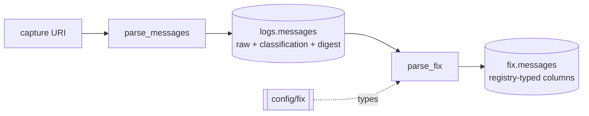

# FIX

Everything this project does with the FIX protocol, in one place, under four
themes.

The protocol is owned natively: the dictionary, the readers, the fixed row
schema, the derived facts and the digests. rekep owns the raw `Message`
contract and the Iceberg seam. There is no FIX parser, registry, or row model
of its own, and adding one is a defect.

| theme | what it answers |
| --- | --- |
| [Registry](registry.md) | what a FIX field *is* here, and how to browse the dictionary |
| [Decode](decode.md) | how a captured line becomes typed columns, with the debug to prove it |
| [Encode](encode.md) | how fields become a wire frame, and what the frame owes the standard |
| [Quality](quality.md) | classification, digests, deduplication, and what "unmapped" means |

## The path a byte takes



`parse_messages` never interprets a body. It captures the record, classifies it
with one native scan, digests the exact bytes, and stores them.
`parse_fix` reads back only the records that named a `MsgType`, hands them to
the native FIX Arrow reader, and writes the fixed schema -- columns named by
tag, because a tag is the one name a field has in every version and every
dialect.

Both stages are described end to end under
[Pipeline](../pipeline/index.md); the two tables are
[`logs.messages`](../products/message.md) and
[`fix.messages`](../products/fix-message.md).

## The dictionary this checkout parses against

[`config/fix`](https://github.com/Platob/yggfin/tree/main/config/fix) is the
dictionary `parse_fix` defaults to: 6,203 definitions as the canonical
`primitive/` and `nested/` JSON shards `FixRegistry.write_into` emits. It is
the `registry` parameter's default, and it types every FIX column in
`fix.messages` -- the eighty-seven the fixed schema projects, the seven derived
ones included.

```python
from yggdryl import IOBase
from yggdryl.fix import FixRegistry

registry = FixRegistry.from_handle(IOBase.from_uri("file:config/fix"))
registry.with_crate_fields()
print(len(registry), "definitions")
```

Binding through `IOBase` is what makes `registry` accept the same URI spellings
`filesystem` does: a relative `file:` path, an absolute one, or
`s3://example-bucket/config/fix?region=eu-west-1`.

`with_crate_fields` puts the seven derived facts beside the
specification's own into the dictionary: the message digest, the version read,
the cross-venue ticker, the market clock, the partition it falls in, and the
two parent order identifiers. They occupy this crate's own branch, so no
standard tag is claimed, and `fix.messages` carries them as columns `30001`
through `30007` whether or not a dictionary declares them -- `fix_schema` falls
back to them for a tag nobody else does.

## What runs where

The interactive parts of this section run entirely in the browser, against a
[generated dump](registry.md#the-dump-these-pages-read) of that same dictionary.
Nothing you paste into a decoder leaves the tab. Their scanner is written
against the core's -- the same frame location, the same six separator
spellings, the same printed-SOH unescape, and the same media type and direction
taxonomies -- so a line decoded on these pages resolves the way `parse_fix`
resolves it. It is a transcription rather than the thing itself: the Rust and
Python path is the authority, and [Decode](decode.md) shows how to run it.
