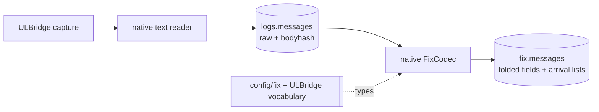

# FIX

Yggdryl owns the FIX dictionary, codec, fixed Arrow schema, derived values,
and arrival record. rekep supplies raw `Message` rows and the Iceberg boundary;
it has no FIX parser, registry, or row model of its own.

| page | question |
| --- | --- |
| [Registry](registry.md) | which field, type, alias, branch, and code set does a key resolve to? |
| [Decode](decode.md) | how does one line or Arrow reader become a `FixMsg`? |
| [Encode](encode.md) | how is a parsed arrival record emitted again? |
| [Quality](quality.md) | which identities and guarantees survive both stages? |

## Pipeline



`parse_messages` frames and types the log header but never inspects the body.
`parse_fix` passes every stored body to `parse_arrow_reader`. A line without a
FIX frame still receives a codec row, preserving source position and the four
required stamps.

## Registry used by the task

`config/fix` contributes 6,203 stored definitions. Every newly constructed
registry already contains 16 Yggdryl fields at tags 65000–65015, and
`with_ulbridge_fields()` adds 43 fields on the `ulbridge` branch.

```python
from yggdryl import IOBase
from yggdryl.fix import FixRegistry

registry = FixRegistry.from_handle(IOBase.from_uri("file:config/fix"))
assert len(registry) == 6219
registry.with_ulbridge_fields()
assert len(registry) == 6262
```

The registry types the fixed projection. Arrow columns use folded canonical
names such as `msgtype`; their numeric FIX tags remain field metadata.

## Browser diagnostics

The interactive registry and decoder use generated projections of the same
dictionary and run entirely in the browser. They are diagnostics, not a
second parser. The Rust/Python Yggdryl path remains authoritative.
