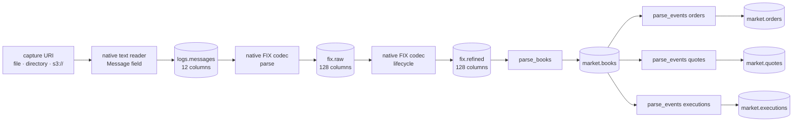

<section class="rkp-hero" aria-labelledby="rkp-home-title">
  <div class="rkp-hero__copy">
    <p class="rkp-hero__eyebrow">RKP / Arrow-native ingestion</p>
    <h1 id="rkp-home-title">rekep</h1>
    <p class="rkp-hero__lead">Stream ULBridge text records through Arrow into Iceberg.</p>
    <p class="rkp-hero__flow" aria-label="Text to Arrow to Iceberg">TEXT → MESSAGE → FIX → ICEBERG</p>
    <nav class="rkp-hero__actions" aria-label="Start with rekep">
      <a href="pipeline/">Run the pipeline</a>
      <a href="products/message/">Inspect Message</a>
      <a href="fix/">Explore FIX</a>
    </nav>
  </div>
  <figure class="rkp-hero__mark">
    
  </figure>
</section>

## Install

```bash
pip install "rekep[iceberg] @ git+https://github.com/Platob/yggfin#subdirectory=python"
```

`rekep` is installed from this repository rather than from PyPI: from a
checkout, `pip install "./python[iceberg]"`.

The market stages require Yggdryl 0.1.11, which the package pins.

## Run

`rekep.pipeline` holds one function per table. From the repository root, over
the checked ULBridge fixture and the day it was captured on, into a SQLite
catalog in a scratch directory:

```python
import tempfile
from pathlib import Path

from rekep.iceberg import IcebergCatalog
from rekep.pipeline import Landed, parse_fix_raw, parse_fix_refined, parse_messages
from rekep.times import window_of

root = Path(tempfile.mkdtemp())
catalog = IcebergCatalog.from_dict(
    {
        "name": "rekep",
        "properties": {
            "type": "sql",
            "uri": f"sqlite:///{root}/catalog.db",
            "warehouse": str(root / "warehouse"),
        },
    }
)
day = window_of("2026-08-14", "2026-08-14")
try:
    capture = "file:data/capture/ulbridge.log"
    assert parse_messages(capture, catalog, day) == Landed(read=144, written=144)
    assert parse_fix_raw(catalog, day) == Landed(read=144, written=49, skipped=30)
    assert parse_fix_refined(catalog, day) == Landed(read=49, written=19)
finally:
    catalog.close()
```

Each stage answers what it read and wrote: 144 lines land in
`logs.messages`, their 79 messages settle as 49 `fix.raw` events once the key
folds the 30 that restate another hop's, and the walk lands 19 `fix.refined`
rows.



The seven tables use four [runtime-derived contracts](contracts/index.md):
Message, FixMsg, Book and MarketEvent. Books derive from the native empty
reader schema; all three flat market tables share its execution-event shape.
The event stages run independently against the same committed book snapshot,
flattening order/quote deltas and already decomposed execution leaves.

Market stages read strict `[start, end)` windows and atomically replace the
same interval, including empty reruns. Books start without earlier resting
depth. The [market run example](pipeline/index.md#run-the-graph) folds the
fixture's midday hour; the afternoon holds an incomplete AE side that book
projection correctly refuses. Existing [dbt products](pipeline/dbt.md) remain
optional.

The text reader emits the exact `Message` schema: header captures are typed,
`body` is the line past its header, and the line's own `currunix`, `curruuid`
and `currhashcode` arrive with the read rather than being computed after it.
Nothing in that contract is derived from anything else, and the table is laid
out by the hour of `currunix` alone, exactly as both FIX tables are laid out
by the hour of theirs. The FIX codec reads that table back as a reader,
through two stages over one codec, each landing in a table: parse reads every
frame a line carried and settles what it implied, and lifecycle names the
chains it belongs to. A row is a message and not a line, so the fixture's 144
stored lines settle as 79 messages and 49 `fix.raw` rows: a line carrying
prose answers none, a line carrying many frames answers one row per frame,
and the same message logged at every hop it passed is one event. Lifecycle
adds one expiry row.

```python
from rekep import Message

print(Message.into_field().into_arrow_schema())
```

## Where to go

| you want | read |
| --- | --- |
| what the seven tables hold | [Data products](products/index.md) |
| how the parts fit | [Architecture](overview/architecture.md) |
| the exact stage contracts | [Pipeline](pipeline/index.md) |
| the two FIX stages | [Parse FIX raw](pipeline/parse-fix-raw.md) · [Parse FIX refined](pipeline/parse-fix-refined.md) |
| native books and market events | [Parse books](pipeline/parse-books.md) · [Market events](pipeline/parse-events.md) |
| optional SQL products | [dbt products](pipeline/dbt.md) |
| the runtime FIX dictionary | [Registry](fix/registry.md) |
| to decode or encode a frame | [Decode](fix/decode.md) · [Encode](fix/encode.md) |
| where the tables live | [Catalogs](storage/catalogs.md) |
