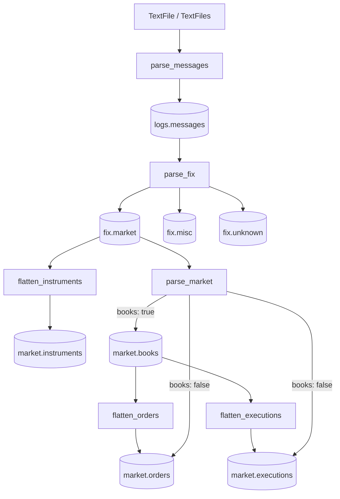

# rekep

`rekep` turns ordered text logs into Arrow records and writes six portable
shapes: source messages, FIX messages, instruments, books, orders, and
executions.


Arrow is the project's shared columnar boundary: Iceberg tables and encoded
files sit on one side, while Spark, DataFrames, query engines, and SQL database
drivers sit on the other. The distinction matters—Arrow is neither the store
nor the engine, so each can change without replacing the in-memory contract.
See [why rekep chooses Apache Arrow](arrow.md) for the sourced interoperability
details and the limits of zero-copy exchange.

## Workflow



Concrete stages are notebooks with adjacent YAML files under `tasks/`. The
package owns reusable parsing, schemas, lifecycle logic, and storage adapters;
it does not own deployment-specific jobs.

## One record end to end

```python
from rekep import FixMsg, Message
from rekep.market import Book, Execution, Order

line = (
    "8=FIX.4.4|35=8|52=20260821-10:30:00.250|"
    "37=ORD-9|11=CL-7|17=EX-3|150=F|39=1|"
    "55=BTC-USD|207=XCME|15=USD|54=1|38=10|44=100.5|"
    "32=4|31=100.25|14=4|151=6|60=20260821-10:29:59.998|10=123"
)

# logs.messages: protocol-neutral source record
message = Message(
    message=line,
    source_url="capture.log",
    source_rownum=1,
).identify()

# fix.market: registry-resolved FIX record
fixmsg = FixMsg.from_text(
    message.message,
    source_url=message.source_url,
    source_rownum=message.source_rownum,
)

# market.orders and market.executions
events = list(fixmsg.into_market_events(fix_version="4.4"))
order = next(event for event in events if isinstance(event, Order))
execution = next(event for event in events if isinstance(event, Execution))

# market.instruments and market.books
instrument = fixmsg.into_instrument(fix_version="4.4")
book = next(Book.from_fixmsgs([fixmsg], purge_alive=False))

assert message.MsgType == fixmsg.MsgType == "8"
assert (order.client_order_id, order.qty) == ("CL-7", 6.0)
assert (execution.exec_id, execution.qty, execution.px) == ("EX-3", 4.0, 100.25)
assert instrument is not None and instrument.symbol == book.symbol == "BTC-USD"
```

The scalar example exposes each boundary. File-scale work keeps the same
shapes in Arrow batches, as shown below and in the [pipeline guide](tasks.md).

## Guides

**Declaring data**

- [Why Arrow](arrow.md): storage, database, and compute interoperability.
- [Design](design.md): boundaries and maintenance rules.
- [Types](types.md): `@scalar`, fields, and recursive casts.
- [Contracts](contracts.md): the six portable schemas.
- [Enums](enums/index.md): stored keys, values, and FIX spellings.
- [Identity](identity.md): cross-language binary hashing.

**Parsing**

- [FixMsg](fixmsg.md): streamed text parsing and routing.
- [FIX](fix.md): registry-driven transcription.
- [Configuring a parse](configuring.md): headers, rules, field readings.

**Downstream**

- [Market](market.md): events, instruments, books, and audit rows.
- [Iceberg](iceberg.md): streaming reads, writes, and maintenance.
- [Pipeline](tasks.md): notebooks, configs, and Airflow.
- [Airflow](airflow.md): deployment, runs, backfills, and operations.
- [End-to-end run](workflow-run.md): execution evidence and schema lineage.
- [Benchmarks](benchmarks.md): focused internal measurements.

## Install

```bash
pip install rekep
pip install "rekep[iceberg]"   # persisted tables
pip install "rekep[all]"       # all package extras
```

```python
from rekep import FixCodec, FixMsg, FixRegistry, TextFiles

registry = FixRegistry(cache_dir="data/fix", offline=True)

source = TextFiles.from_folder(
    "logs",
    pattern="*.log*",
    msg_type_event_types=registry.msg_type_event_types(),
)
for messages in source.read_arrow_reader():
    parsed = FixMsg.from_message_arrow_batch(messages, FixCodec(registry=registry))
```

Every scalable API returns an Arrow reader. Table helpers are explicit choices
for data known to fit in memory.

## Command line

```bash
rekep fields dump --pyclass rekep.text.fixmsg:FixMsg --target fixmsg.yaml
rekep fields load --target fixmsg.yaml
rekep fix registry show --store data/fix 35
rekep fix registry check --store data/fix
rekep fix shell --store data/fix
```

`fields` publishes declarations. `fix registry` is the JSON command surface;
`fix shell` is the interactive terminal. Styling stays on `stderr`, payloads
stay on `stdout`, and colour disables itself outside a capable terminal.
