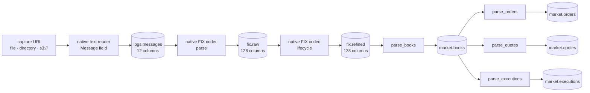

<section class="rkp-hero" aria-labelledby="rkp-home-title">
  <div class="rkp-hero__copy">
    <p class="rkp-hero__eyebrow">RKP / Arrow-native ingestion</p>
    <h1 id="rkp-home-title">rekep</h1>
    <p class="rkp-hero__lead">Stream ULBridge text records through Arrow into Iceberg.</p>
    <p class="rkp-hero__flow" aria-label="Text to Arrow to Iceberg">TEXT → MESSAGE → FIX → ICEBERG</p>
    <nav class="rkp-hero__actions" aria-label="Start with rekep">
      <a href="pipeline/operations/run/">Run ingestion</a>
      <a href="products/message/">Inspect Message</a>
      <a href="fix/">Explore FIX</a>
    </nav>
  </div>
  <figure class="rkp-hero__mark">
    
  </figure>
</section>

## Install

```bash
pip install "rekep[iceberg]"
```

Market tasks require Yggdryl 0.1.11. See the [pipeline guide](pipeline/index.md)
for installing and running the pinned environment.

## Run

```bash
rekep task run tasks/parse_messages/parse_messages.json
rekep task run tasks/parse_fix_raw/parse_fix_raw.json
rekep task run tasks/parse_fix_refined/parse_fix_refined.json
```

The checked ULBridge fixture demonstrates the three source stages:

```text
parse_messages     144 read, 144 written,  0 skipped  → logs.messages
parse_fix_raw      144 read,  49 written, 30 skipped  → fix.raw  (79 messages)
parse_fix_refined   49 read,  19 written,  0 skipped  → fix.refined
```



The seven tables use four [runtime-derived contracts](contracts/index.md):
Message, FixMsg, Book and MarketEvent. Books derive from the native empty
reader schema; all three flat market tables share its execution-event shape.
The event tasks run independently against the same committed book snapshot,
flattening order/quote deltas and already decomposed execution leaves.

Market stages read strict `[start, end)` windows and atomically replace the
same interval, including empty reruns. Books start without earlier resting
depth. Use valid deployed refined records for the
[market run example](pipeline/operations/run.md#market-events-from-one-book-snapshot);
the bundled source fixture contains an incomplete AE side that book projection
correctly refuses. Existing [dbt products](pipeline/tasks/build-dbt.md) remain optional.

The text reader emits the exact `Message` schema: header captures are typed,
`body` is the line past its header, and the line's own `currunix`, `curruuid`
and `currhashcode` arrive with the read rather than being computed after it.
Nothing in that contract is derived from anything else, and the table is laid
out by the hour of `currunix` alone, exactly as both FIX tables are laid out
by the hour of theirs. The FIX codec reads that table back as a reader,
through two stages over one codec, each landing in a table: parse reads every
frame a line carried and settles what it implied, and lifecycle names the
chains it belongs to. A row is a message and not a line, so the fixture's 144
stored lines settle as 79 messages and 49 `fix.raw` rows: a line carrying
prose answers none, a line carrying many frames answers one row per frame,
and the same message logged at every hop it passed is one event. Lifecycle
adds one expiry row.

```python
from rekep import Message

print(Message.into_field().into_arrow_schema())
```

## Where to go

| you want | read |
| --- | --- |
| what the seven tables hold | [Data products](products/index.md) |
| how the parts fit | [Architecture](overview/architecture.md) |
| the exact task contracts | [Pipeline](pipeline/index.md) |
| the two FIX tasks | [Parse FIX raw](pipeline/tasks/parse-fix-raw.md) · [Parse FIX refined](pipeline/tasks/parse-fix-refined.md) |
| native books and market events | [Parse books](pipeline/tasks/parse-books.md), [Orders](pipeline/tasks/parse-orders.md), [Quotes](pipeline/tasks/parse-quotes.md), [Executions](pipeline/tasks/parse-executions.md) |
| optional SQL products | [Build dbt](pipeline/tasks/build-dbt.md) |
| the runtime FIX dictionary | [Registry](fix/registry.md) |
| to decode or encode a frame | [Decode](fix/decode.md) · [Encode](fix/encode.md) |
| to schedule it | [Airflow](pipeline/airflow.md) |
