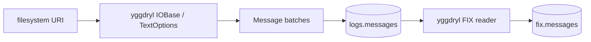

<section class="rkp-hero" aria-labelledby="rkp-home-title">
  <div class="rkp-hero__copy">
    <p class="rkp-hero__eyebrow">RKP / Arrow-native ingestion</p>
    <h1 id="rkp-home-title">rekep</h1>
    <p class="rkp-hero__lead">Stream physical text records through Yggdryl and Arrow into Iceberg.</p>
    <p class="rkp-hero__flow" aria-label="Text to Arrow to Iceberg">TEXT → ARROW → ICEBERG</p>
    <nav class="rkp-hero__actions" aria-label="Start with rekep">
      <a href="pipeline/operations/run/">Run ingestion</a>
      <a href="products/message/">Inspect Message</a>
      <a href="fix/">Explore FIX</a>
    </nav>
  </div>
  <figure class="rkp-hero__mark">
    
  </figure>
</section>

## Install

```bash
pip install "rekep[iceberg]"
```

## Run

```bash
rekep task run tasks/parse_messages/parse_messages.json
rekep task run tasks/parse_fix/parse_fix.json
```



The task accepts one filesystem URI. Yggdryl owns binding, recursive discovery,
decompression, header capture, and physical-line batches. Rekep uses Yggdryl's
strict native `Field.apply_arrow_*` boundary to cast each batch, derive its
partition column, and write the stream through PyIceberg.

```python
from rekep import Field, Message
from yggdryl import Field as YggdrylField

assert Field is YggdrylField
print(Message.field().into_arrow_schema())
```

The checked raw contract is
[`schemas/rekep/message.json`](contracts/index.md). `parse_fix` derives its
registry-dependent output contract from Yggdryl's native reader instead of
checking in a second FIX schema.

## Explore FIX

The [FIX section](fix/index.md) is the protocol side of the same pipeline,
under four themes: the [dictionary](fix/registry.md) and how to browse it,
[decoding](fix/decode.md) a captured line with full debug,
[encoding](fix/encode.md) one by hand, and the
[quality](fix/quality.md) each stage asserts -- classification, digests,
deduplication, and coverage. The browsers run in your tab against a generated
dump; nothing you paste is uploaded.
