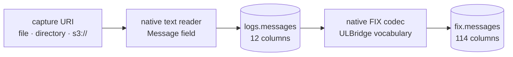

<section class="rkp-hero" aria-labelledby="rkp-home-title">
  <div class="rkp-hero__copy">
    <p class="rkp-hero__eyebrow">RKP / Arrow-native ingestion</p>
    <h1 id="rkp-home-title">rekep</h1>
    <p class="rkp-hero__lead">Stream ULBridge text records through Arrow into Iceberg.</p>
    <p class="rkp-hero__flow" aria-label="Text to Arrow to Iceberg">TEXT → MESSAGE → FIX → ICEBERG</p>
    <nav class="rkp-hero__actions" aria-label="Start with rekep">
      <a href="pipeline/operations/run/">Run ingestion</a>
      <a href="products/message/">Inspect Message</a>
      <a href="fix/">Explore FIX</a>
    </nav>
  </div>
  <figure class="rkp-hero__mark">
    
  </figure>
</section>

## Install

```bash
pip install "rekep[iceberg]"
```

## Run

```bash
rekep task run tasks/parse_messages/parse_messages.json
rekep task run tasks/parse_fix/parse_fix.json
```

The checked ULBridge fixture demonstrates the complete contract. `parse_fix`
writes one row more than it read, because one of those lines is a bridge
configuration document stating two messages:

```text
parse_messages  111 read, 111 written, 0 skipped  → logs.messages
parse_fix        111 read, 112 written, 0 skipped  → fix.messages
```



The text reader emits the exact `Message` schema: header captures are typed,
`timepartition` is derived, and `bodyhash` is filled before the first Iceberg
boundary. The FIX codec consumes that reader directly. It preserves every row,
including prose, and stamps the four required FIX columns even when no frame is
present.

```python
from rekep import Message

print(Message.into_field().into_arrow_schema())
```

## Where to go

| you want | read |
| --- | --- |
| what the two tables hold | [Data products](products/index.md) |
| how the parts fit | [Architecture](overview/architecture.md) |
| the exact task contracts | [Pipeline](pipeline/index.md) |
| the runtime FIX dictionary | [Registry](fix/registry.md) |
| to decode or encode a frame | [Decode](fix/decode.md) · [Encode](fix/encode.md) |
| to schedule it | [Airflow](pipeline/airflow.md) |
