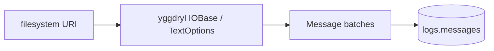

<section class="rkp-hero" aria-labelledby="rkp-home-title">
  <div class="rkp-hero__copy">
    <p class="rkp-hero__eyebrow">RKP / Arrow-native ingestion</p>
    <h1 id="rkp-home-title">rekep</h1>
    <p class="rkp-hero__lead">Stream physical text records through Yggdryl and Arrow into Iceberg.</p>
    <p class="rkp-hero__flow" aria-label="Text to Arrow to Iceberg">TEXT → ARROW → ICEBERG</p>
    <nav class="rkp-hero__actions" aria-label="Start with rekep">
      <a href="pipeline/operations/run/">Run ingestion</a>
      <a href="products/message/">Inspect Message</a>
    </nav>
  </div>
  <figure class="rkp-hero__mark">
    
  </figure>
</section>

## Install

```bash
pip install "rekep[iceberg]"
```

## Run

```bash
rekep task run tasks/parse_messages/parse_messages.yml
```



The task accepts one filesystem URI. Yggdryl owns binding, recursive discovery,
decompression, header capture, and physical-line batches. Rekep strictly casts
those batches to the native Yggdryl `Message.field()` and writes them through
the PyIceberg boundary.

```python
from rekep import Field, Message
from yggdryl import Field as YggdrylField

assert Field is YggdrylField
print(Message.field().into_arrow_schema())
```

The checked contract is [`schemas/rekep/message.yaml`](contracts/index.md).
The removed Rekep FIX and market implementation is intentionally deferred to a
separate refactor built directly on `yggdryl.fix`.
