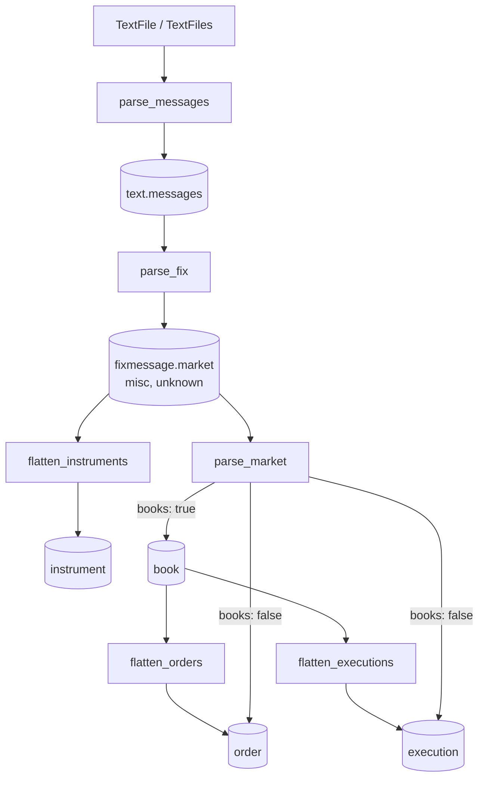

# rekep

`rekep` turns ordered text logs into Arrow records and writes five Iceberg
products: FIX messages, instruments, books, orders, and executions.


Arrow is the project's shared columnar boundary: Iceberg tables and encoded
files sit on one side, while Spark, DataFrames, query engines, and SQL database
drivers sit on the other. The distinction matters—Arrow is neither the store
nor the engine, so each can change without replacing the in-memory contract.
See [why rekep chooses Apache Arrow](arrow.md) for the sourced interoperability
details and the limits of zero-copy exchange.

## Workflow



Concrete stages are notebooks with adjacent YAML files under `tasks/`. The
package owns reusable parsing, schemas, lifecycle logic, and storage adapters;
it does not own deployment-specific jobs.

## Guides

**Declaring data**

- [Why Arrow](arrow.md): storage, database, and compute interoperability.
- [Design](design.md): boundaries and maintenance rules.
- [Types](types.md): `@scalar`, fields, and recursive casts.
- [Contracts](contracts.md): the five portable schemas.
- [Identity](identity.md): cross-language binary hashing.

**Parsing**

- [FixMessage](fixmessage.md): streamed text parsing and routing.
- [FIX](fix.md): registry-driven transcription.
- [Configuring a parse](configuring.md): headers, rules, field readings.

**Downstream**

- [Market](market.md): events, instruments, books, and audit rows.
- [Iceberg](iceberg.md): streaming reads, writes, and maintenance.
- [Pipeline](tasks.md): notebooks, configs, and Airflow.
- [Airflow](airflow.md): deployment, runs, backfills, and operations.
- [End-to-end run](workflow-run.md): execution evidence and schema lineage.
- [Benchmarks](benchmarks.md): focused internal measurements.

## Install

```bash
pip install rekep
pip install "rekep[iceberg]"   # persisted tables
pip install "rekep[all]"       # all package extras
```

```python
from rekep import FixMessage, TextFiles

source = TextFiles.from_folder("logs", pattern="*.log*")
reader = source.read_arrow_reader(schema=FixMessage.into_field())
```

Every scalable API returns an Arrow reader. Table helpers are explicit choices
for data known to fit in memory.

## Command line

```bash
rekep fields dump --pyclass rekep.text.fixmessage:FixMessage --target fixmessage.yaml
rekep fields load --target fixmessage.yaml
rekep fix shell --store data/fix
```

`fields` publishes a declaration and checks one loads; `fix` reads, edits and
checks the FIX dictionary, either verb by verb or from a prompt. Styling goes
to `stderr` and the payload to `stdout`, so a dump piped into a file is the
document and nothing else -- and colour and box drawing turn themselves off
without a terminal, under `NO_COLOR`, or where the stream cannot encode them.
