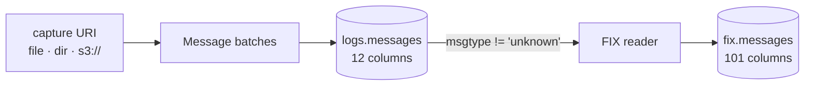

<section class="rkp-hero" aria-labelledby="rkp-home-title">
  <div class="rkp-hero__copy">
    <p class="rkp-hero__eyebrow">RKP / Arrow-native ingestion</p>
    <h1 id="rkp-home-title">rekep</h1>
    <p class="rkp-hero__lead">Stream physical text records through Arrow into Iceberg.</p>
    <p class="rkp-hero__flow" aria-label="Text to Arrow to Iceberg">TEXT → ARROW → ICEBERG</p>
    <nav class="rkp-hero__actions" aria-label="Start with rekep">
      <a href="pipeline/operations/run/">Run ingestion</a>
      <a href="products/message/">Inspect Message</a>
      <a href="fix/">Explore FIX</a>
    </nav>
  </div>
  <figure class="rkp-hero__mark">
    
  </figure>
</section>

## Install

```bash
pip install "rekep[iceberg]"
```

## Run

```bash
rekep task run tasks/parse_messages/parse_messages.json
rekep task run tasks/parse_fix/parse_fix.json
```

```text
parse_messages  14 read, 14 written,  0 skipped   →  logs.messages
parse_fix        4 read,  4 written,  0 skipped   →  fix.messages
```



One URI in, two Iceberg tables out. Binding, traversal, decompression, header
capture and physical-line batching happen natively, before the first
`RecordBatch`; rekep casts each batch through one strict `Field.apply_arrow_*`
boundary and writes the stream through PyIceberg.

```python
from rekep import Message

print(Message.field().into_arrow_schema())
```

## Where to go

| you want | read |
| --- | --- |
| what the two tables hold | [Data products](products/index.md) |
| how the parts fit | [Architecture](overview/architecture.md) |
| to browse 6,203 FIX definitions | [Registry](fix/registry.md) |
| to decode or encode a frame in your tab | [Decode](fix/decode.md) · [Encode](fix/encode.md) |
| to schedule it | [Airflow](pipeline/airflow.md) |

## Explore FIX

The [FIX section](fix/index.md) is the protocol side of the same pipeline:
the [dictionary](fix/registry.md) and how to browse it, [decoding](fix/decode.md)
a captured line with full debug, [encoding](fix/encode.md) one by hand, and the
[quality](fix/quality.md) each stage asserts. The browsers run in your tab
against a generated dump; nothing you paste is uploaded.
