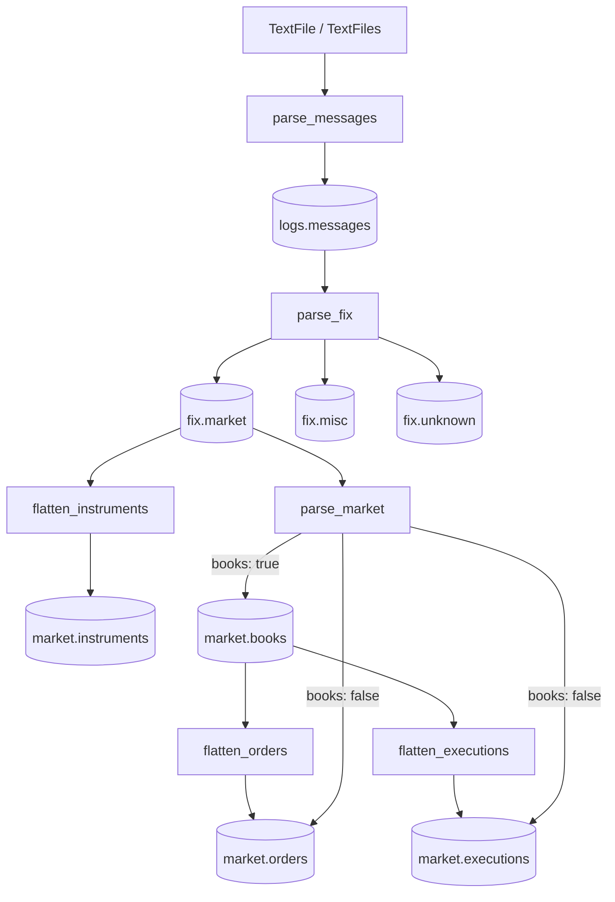

<section class="rkp-hero" aria-labelledby="rkp-home-title">
  <div class="rkp-hero__copy">
    <p class="rkp-hero__eyebrow">RKP / Arrow-native market data</p>
    <h1 id="rkp-home-title">rekep</h1>
    <p class="rkp-hero__lead">Turn ordered text logs into Arrow records and six portable shapes: source messages, FIX messages, instruments, books, orders, and executions.</p>
    <p class="rkp-hero__flow" aria-label="Log to FIX to market">LOG → FIX → MARKET</p>
    <nav class="rkp-hero__actions" aria-label="Start with rekep">
      <a href="pipeline/operations/run/">Run pipeline</a>
      <a href="fix/transcribe/">Transcribe FIX</a>
    </nav>
  </div>
  <figure class="rkp-hero__mark">
    
    
  </figure>
</section>

## Install

```bash
pip install rekep
pip install "rekep[iceberg]"   # persisted tables
pip install "rekep[all]"       # all package extras
```

## Choose a task

- [Transcribe a FIX message](fix/transcribe.md)
- [Run the complete pipeline](pipeline/operations/run.md)
- [Browse the FIX registry](fix/registry.md)
- [Publish an Arrow contract](contracts/index.md#publishing)

<div class="rkp-diagram-scroll" role="region" aria-label="Scrollable Apache Arrow interoperability diagram" tabindex="0">
  
  
</div>

Arrow is the project's shared columnar boundary: Iceberg tables and encoded
files on one side, Spark, DataFrames, query engines, and SQL database drivers
on the other. Arrow is neither the store nor the engine, so each can change
without replacing the in-memory contract. See [why rekep chooses Apache Arrow](overview/arrow.md)
for the sourced interoperability details and the limits of zero-copy exchange.

## Workflow



Concrete stages are notebooks with adjacent YAML files under `tasks/`. The
package owns reusable parsing, schemas, lifecycle logic, and storage adapters;
it does not own deployment-specific jobs.

## One record end to end

```python
from rekep import FixMsg, Message
from rekep.market import Book, Execution, Order

line = (
    "8=FIX.4.4|35=8|52=20260821-10:30:00.250|"
    "37=ORD-9|11=CL-7|17=EX-3|150=F|39=1|"
    "55=BTC-USD|207=XCME|15=USD|54=1|38=10|44=100.5|"
    "32=4|31=100.25|14=4|151=6|60=20260821-10:29:59.998|10=123"
)

# logs.messages: protocol-neutral source record
message = Message(
    message=line,
    sourceurl="capture.log",
    sourcerownum=1,
).identify()

# fix.market: registry-resolved FIX record
fixmsg = FixMsg.from_text(
    message.message,
    sourceurl=message.sourceurl,
    sourcerownum=message.sourcerownum,
)

# market.orders and market.executions
events = list(fixmsg.into_market_events(fix_version="4.4"))
order = next(event for event in events if isinstance(event, Order))
execution = next(event for event in events if isinstance(event, Execution))

# market.instruments and market.books
instrument = fixmsg.into_instrument(fix_version="4.4")
book = next(Book.from_fixmsgs([fixmsg], purge_alive=False))

assert message.MsgType == fixmsg.MsgType == "8"
assert (order.clordid, order.qty) == ("CL-7", 6.0)
assert (execution.execid, execution.qty, execution.px) == ("EX-3", 4.0, 100.25)
assert instrument is not None and instrument.symbol == book.symbol == "BTC-USD"
```

The scalar example exposes each boundary. File-scale work keeps the same
shapes in Arrow batches, as shown below and in the [pipeline guide](pipeline/index.md).

```python
from rekep import FixCodec, FixMsg, FixRegistry, TextFiles

registry = FixRegistry(cache_dir="data/fix", offline=True)

source = TextFiles.from_folder(
    "logs",
    pattern="*.log*",
    msg_type_event_types=registry.msg_type_event_types(),
)
for messages in source.read_arrow_reader():
    parsed = FixMsg.from_message_batch(messages, FixCodec(registry=registry))
```

Every scalable API returns an Arrow reader. Table helpers are explicit choices
for data known to fit in memory.

## Command line

```bash
rekep fields dump --pyclass rekep.text.fixmsg:FixMsg --target fixmsg.yaml
rekep fix registry show --store data/fix 35
rekep fix shell --store data/fix
```

`fields` publishes declarations. `fix registry` is the JSON command surface;
`fix shell` is the interactive terminal. Styling stays on `stderr`, payloads
stay on `stdout`, and colour disables itself outside a capable terminal. See
the [registry CLI guide](fix/shell.md) for the bounded interactive workflow.
