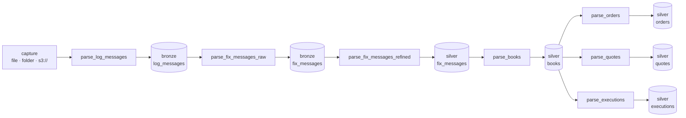

<section class="rkp-hero" aria-labelledby="rkp-home-title">
  <div class="rkp-hero__copy">
    <p class="rkp-hero__eyebrow">RKP / Arrow-native record keeping</p>
    <h1 id="rkp-home-title">rekep</h1>
    <p class="rkp-hero__lead">Land ULBridge text captures as bronze and silver Iceberg tables.</p>
    <p class="rkp-hero__flow" aria-label="Capture to bronze to silver to gold">CAPTURE → BRONZE → SILVER → GOLD</p>
    <nav class="rkp-hero__actions" aria-label="Start with rekep">
      <a href="tasks/">Read the tasks</a>
      <a href="dags/">Run the graph</a>
      <a href="samples/">See the rows</a>
    </nav>
  </div>
  <figure class="rkp-hero__mark">
    
  </figure>
</section>

## What rekep is

`rekep` is a processing library. It reads the text a ULBridge FIX bridge logs,
parses every FIX frame the lines carry, walks the frames into the lifecycle
events they are, folds those into order books and flattens the books into
order, quote and execution events -- one Iceberg table per step. Each step is
one function of `rekep.pipeline`, a **task**, over one window of time; where,
when and over which window a task runs is its caller's: a scheduler's or a
script's.

```bash
pip install "rekep[iceberg] @ git+https://github.com/Platob/yggfin#subdirectory=python"
```

`rekep` is installed from this repository rather than from PyPI: from a
checkout, `pip install "./python[iceberg]"`, with `glue` or `s3tables` added
for those catalogs. Applications import `rekep` and nothing beneath it.

## Three layers

Tables live in three Iceberg catalogs, one per layer of the medallion layout,
and a table is named `<layer>.<namespace>.<table>`: the layer is the catalog
holding it. [`Storages`](storages/index.md) holds the three catalogs.

| layer | holds | tables |
| --- | --- | --- |
| **bronze** | what was read, as it was read: the captured lines, and every FIX frame parsed out of them | `record_keeping.log_messages`, `record_keeping.fix_messages` |
| **silver** | what a walk settled: one row per FIX event with its lifecycle, the books folded from them, and the events flattened out of the books | `record_keeping.fix_messages`, `.books`, `.orders`, `.quotes`, `.executions` |
| **gold** | the consumers' layer: aggregates and products built from silver | none written here |

Gold is where a consumer's own models land -- dbt models over the silver
sources [`schemas/`](tables/index.md#dbt-sources) declares, for instance.

## The table graph


```mermaid
flowchart LR
    C["capture<br/>file · folder · s3://"] --> T1["parse_log_messages"]
    T1 --> L[("bronze<br/>log_messages")]
    L --> T2["parse_fix_messages_raw"]
    T2 --> R[("bronze<br/>fix_messages")]
    R --> T3["parse_fix_messages_refined"]
    T3 --> S[("silver<br/>fix_messages")]
    S --> T4["parse_books"]
    T4 --> B[("silver<br/>books")]
    B --> T5["parse_orders"] --> O[("silver<br/>orders")]
    B --> T6["parse_quotes"] --> Q[("silver<br/>quotes")]
    B --> T7["parse_executions"] --> E[("silver<br/>executions")]
```

Each task reads the table before it and nothing else, so the order is the
graph's. The last three read one book snapshot, the one `parse_books`
committed, and are independent of one another: they may run side by side.
[Tasks](tasks/index.md) documents each one, [DAGs](dags/index.md) runs them.

## Run it

From the repository root, over the shipped capture into three local SQLite
catalogs under a scratch folder:

```python
import tempfile
from concurrent.futures import ThreadPoolExecutor
from pathlib import Path

from rekep import Storages
from rekep.pipeline import (
    FLATTENERS,
    Landed,
    parse_books,
    parse_fix_messages_raw,
    parse_fix_messages_refined,
    parse_log_messages,
)
from rekep.times import window_of

root = Path(tempfile.mkdtemp())
storages = Storages.from_dict(
    {
        layer: {
            "name": layer,
            "properties": {
                "type": "sql",
                "uri": f"sqlite:///{root / layer}.db",
                "warehouse": str(root / layer),
            },
        }
        for layer in ("bronze", "silver", "gold")
    }
)
window = window_of("2026-08-14T00:00:00Z", "2026-08-14T16:30:00Z")
with storages:
    capture = "file:data/capture/ulbridge.log"
    assert parse_log_messages(capture, storages, window) == Landed(read=129, written=129)
    assert parse_fix_messages_raw(storages, window) == Landed(read=129, written=126)
    assert parse_fix_messages_refined(storages, window) == Landed(read=126, written=49)
    books = parse_books(storages, window)
    assert (books.read, books.written) == (49, 30)
    with ThreadPoolExecutor(max_workers=len(FLATTENERS)) as pool:
        running = {
            kind: pool.submit(task, storages, window, snapshot_id=books.snapshot_id)
            for kind, task in FLATTENERS.items()
        }
        written = {kind: future.result().written for kind, future in running.items()}
    assert written == {"orders": 8, "quotes": 0, "executions": 8}
```

The window holds 129 of the capture's 144 lines -- all but the evening's 15,
which the bridge printed at 23:59 on its Central European clock, 21:59 UTC.
They carry 69 FIX frames; every report of a fill splits off the execution it
reports, and the trade report one per side it states, so the parse answers
126 messages, each copy a hop logged placed apart at its instant and kept as
a row of its own. The walk folds those into 22 events and restates every
chain still alive on each whole hour, 27 views, 49 rows. The book fold makes
them into 30 books, one `MIC:CFI` category per instant -- 7 an event moved
and 23 restated on the hour between 02:00 and 16:00 -- holding 8 orders and
8 executions: a view is its book's membership at its hour, never an event of
its own.
[Data samples](samples/index.md) shows the rows, and says why the window
closes at 16:30.

## Where to go

| you want | read |
| --- | --- |
| to configure the three catalogs | [Storages](storages/index.md) |
| to query the landed tables from Excel or another XMLA client | [XMLA endpoint](storages/xmla.md) |
| what one task reads, writes and answers | [Tasks](tasks/index.md) |
| to schedule the graph, with Airflow or without | [DAGs](dags/index.md) |
| what a column means | [Tables](tables/index.md) |
| the Iceberg and dbt contracts | [`schemas/`](tables/index.md#contracts) |
| the FIX dictionary a parse types against | [FIX registry](fix/index.md) |
| real rows of every table | [Data samples](samples/index.md) |
