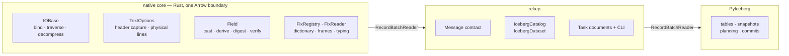
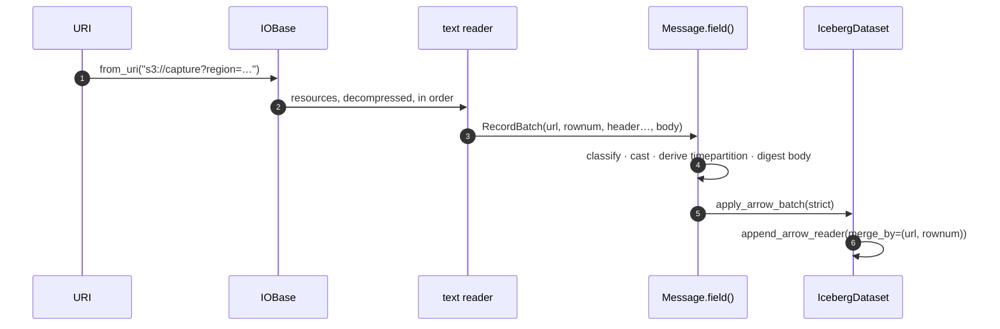
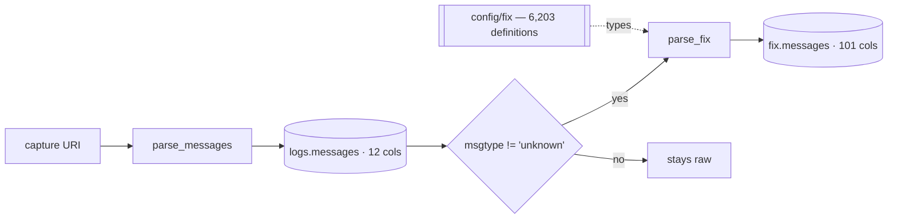

# Architecture

rekep is a seam, not a stack. Three systems each own a layer, and rekep owns
what has to be declared between them: the `Message` contract, the merge
identity, and the Iceberg commit.



## No second implementation

| owner | owns |
| --- | --- |
| native core | filesystems, byte streams, compression, text media, fields, FIX dictionaries and parsing |
| Arrow | columnar shape, kernels, casts |
| PyIceberg | tables, ids, snapshots, scan planning, commits |
| rekep | the `Message` contract and the narrow seam between the three |

rekep adds no field class, no filesystem layer, no text reader, no codec, and
no FIX registry of its own. `rekep.Field` *is* the native `Field`:

```python
from rekep import Field, Message
from yggdryl import Field as NativeField

assert Field is NativeField
schema = Message.field().into_arrow_schema()
```

## One pass, end to end



Every arrow in that diagram carries a `RecordBatch` or a
`RecordBatchReader`. Nothing materializes the capture, and nothing converts a
row into a Python object on the way through.

```python
from rekep import Message
from rekep.iceberg import IcebergCatalog


def ingest(batches, catalog):
    """The whole seam: apply the contract, append under the merge key."""
    store = IcebergCatalog.from_dict(catalog)
    dataset = store.dataset("logs.messages", field=Message.field())
    for batch in batches:
        dataset.append_arrow_batch(Message.apply_arrow_batch(batch), merge_by=True)
```

## Two stages, two tables



The split is deliberate: stage one keeps the line and *names* what it is; stage
two reads that naming rather than repeating it. See
[Data products](../products/index.md).

## Repository layout

```text
python/src/rekep/     the installed package — contract, Iceberg seam, CLI
tasks/parse_messages/ Marimo application + its JSON document
tasks/parse_fix/      Marimo application + its JSON document
tasks/airflow/        DAG, operator, runner
config/fix/           the FIX dictionary both stages resolve against
schemas/rekep/        the checked portable contracts
```

Orchestration lives outside the package: applications and their inputs are in
`tasks/`, and package code holds reusable models and storage behavior only.
