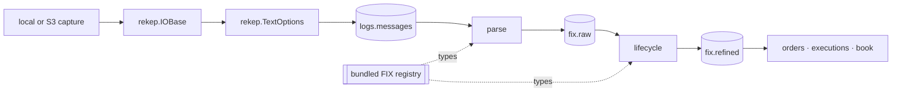

# Architecture

rekep presents one public API over a native, Arrow-first data path. Tasks,
tools, and documentation use `rekep` names; implementation dependencies do not
leak into an application.



## Ownership

| layer | owns |
| --- | --- |
| resource | URI binding, local and object-store traversal, decompression, bounded reads |
| text | physical-line framing, header capture, `crosscode` and `seqnum` |
| field | schema metadata, casts, digests, partitions, Arrow conversion |
| FIX | dictionary, dialect membership, code sets, line classification, parsing, lifecycle, fixed Arrow projection |
| Iceberg | table conversion, identifiers, snapshots, scan planning, commits |
| tasks | application parameters, stage boundaries, counts, and orchestration |

There is one `Field`, one resource handle, one text reader, one codec, and one
FIX registry. rekep re-exports those types rather than wrapping them in
compatibility classes.

```python
from rekep import Field, IOBase, Message, TextOptions
from rekep.fix import FixCodec, FixRegistry, fix_registry

assert isinstance(Message.into_field(), Field)
assert isinstance(Message.text_options(), TextOptions)
assert isinstance(fix_registry(), FixRegistry)
assert FixCodec(fix_registry())
assert IOBase.from_uri("file:data/capture").exists()
```

## Streaming boundary

The text reader yields `RecordBatch` objects. `parse_messages` hands the read
the run's window as its filter, views and casts its rows to the `Message`
field at the storage boundary, and gives one `RecordBatchReader` directly to
Iceberg. `parse_fix_raw` reads that table as another reader, projected to the
seven columns the parse consumes, passes it through the codec's parse, and
writes the native FixMsg row directly. `parse_fix_refined` reads `fix.raw` in
turn, walks those native rows, and writes the same shape. No production stage
converts rows through Python dictionaries or stages an S3 object on local
disk.

## Stable identity

A stored line names its source through `crosscode`, the object it was read
from, and `seqnum`, its row number there counted from 1, and itself through
`curruuid`, the identity the native read states over it. A message parsed out
of that line records the identity in `srcuuids`, which joins to the line's
`curruuid`; no walk changes what the identity means. The join across the
products is exact provenance rather than a recomputation:

```text
fix.raw(srcuuids[*]) -> logs.messages(curruuid)
fix.refined(srcuuids[*]) -> logs.messages(curruuid)
```

Capture location is read only after joining `srcuuids` to
`logs.messages.curruuid`. A parse answers one row per message rather than one
per line, so the FIX products add the identities the parse settled and are
keyed on a `curruuid` of their own.

A line's `currhashcode` identifies the line itself: the read digests its
cross code, the header's captures except the clock, its row number and then
its body, so two lines of identical bytes answer two codes. Its `curruuid` is
a UUIDv7 packing the microsecond of `currunix` and that whole 64-bit code. A
FIX row's `curruuid` is derived the same way from the settled message's own
instant and content code, so it identifies the message and not a line the
message was logged on. They intentionally answer different questions.

## Repository layout

```text
python/src/rekep/         public package and bundled registry
tasks/parse_messages/     text-line Marimo application + JSON parameters
tasks/parse_fix_raw/      FIX parse Marimo application + JSON parameters
tasks/parse_fix_refined/  FIX lifecycle Marimo application + JSON parameters
tasks/build_dbt/          dbt Marimo application + JSON parameters
tasks/optimize_iceberg/   maintenance Marimo application + JSON parameters
tasks/airflow/            DAGs, operator, and standalone child runner
schemas/rekep/            reviewed table contracts
docs/                     contracts, operations, products, and roadmap
tools/                    registry browser and documentation projection
data/                     default capture, catalog and warehouse locations
data/dbt/                 the dbt project: models, schemas, macros, one profile
config/                   an operator's own FIX dictionary, when one is used
```

`optimize_iceberg` is maintenance rather than ingestion: it is not in the
scheduled graph, and it is documented with the storage it settles, under
[Iceberg maintenance](../storage/iceberg.md#maintenance).

`build_dbt` is derivation rather than ingestion: dbt owns the SQL its products
are written in, and `rekep.dbt` is the one seam that makes a source an Iceberg
read and a model an Iceberg commit through the dataset above. It is documented
with the task that runs it, under [Build dbt](../pipeline/tasks/build-dbt.md).
