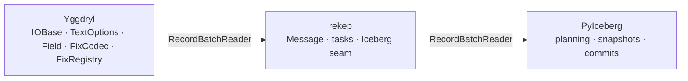
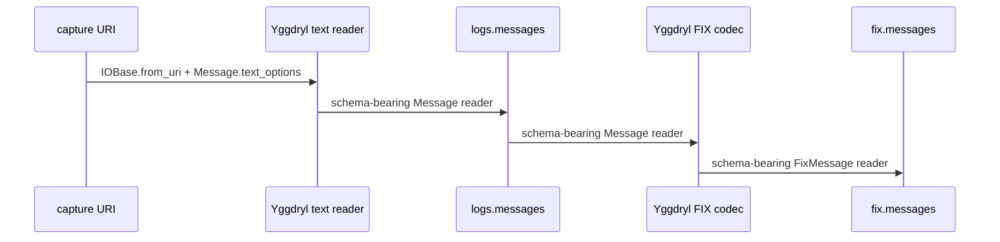
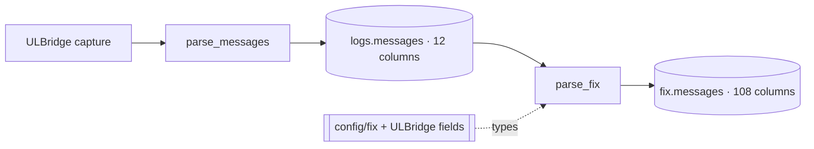

# Architecture

rekep is a seam, not a second implementation. Yggdryl owns bytes through
typed Arrow rows; PyIceberg owns tables and commits; rekep declares the raw
row and connects the two.



## Ownership

| owner | contract |
| --- | --- |
| Yggdryl | resources, streams, compression, text rows, field application, FIX dictionaries and codecs |
| Arrow | columnar shape, kernels, and casts |
| PyIceberg | ids, table schemas, partition specs, scans, snapshots, and commits |
| rekep | `Message`, task configuration, and the Arrow/PyIceberg boundary |

`rekep.Field` is Yggdryl's native field type. There is no rekep FIX model,
text reader, filesystem layer, or registry.

```python
from rekep import Field, Message
from yggdryl import Field as NativeField

assert Field is NativeField
assert len(Message.field()) == 12
```

## One reader at each stage



`Message.text_options()` installs `Message.field()` on the native text reader.
The reader therefore casts header captures, derives `timepartition`, fills
`bodyhash`, and verifies strict nullability without a Python row loop or a
second apply pass.

```python
from rekep import Message
from rekep.iceberg import IcebergCatalog
from yggdryl import IOBase


def ingest(filesystem, catalog):
    source = IOBase.from_uri(filesystem)
    reader = source.read_arrow_reader(options=Message.text_options())
    store = IcebergCatalog.from_dict(catalog)
    dataset = store.dataset("logs.messages", field=Message.field())
    return dataset.append_arrow_reader(reader, Message.field(), merge_by=True)
```

The production task closes every resource shown in the compact example.

## Two stable boundaries



`parse_messages` does not inspect the body. `parse_fix` does not pre-classify
or filter rows. The codec reads every body and preserves one output row per
input row unless `dedup` is explicitly enabled.

## Repository layout

```text
python/src/rekep/     Message and the Iceberg seam
tasks/parse_messages/ native text → logs.messages
tasks/parse_fix/      logs.messages → native FIX codec → fix.messages
tasks/airflow/        DAG, operator, and locked runner
config/fix/           runtime FIX dictionary
schemas/rekep/        checked schema snapshots
```
