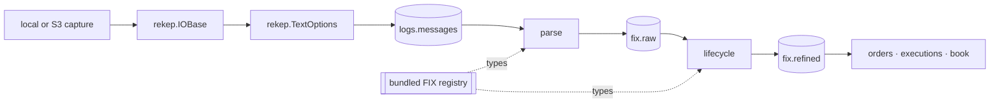

# Architecture

rekep presents one public API over a native, Arrow-first data path. The
pipeline stages, tools, and documentation use `rekep` names; implementation
dependencies do not leak into an application.



## Ownership

| layer | owns |
| --- | --- |
| resource | URI binding, local and object-store traversal, decompression, bounded reads |
| text | physical-line framing, header capture, `crosscode` and `seqnum` |
| field | schema metadata, casts, digests, partitions, Arrow conversion |
| FIX | dictionary, dialect membership, code sets, line classification, parsing, lifecycle, fixed Arrow projection |
| market core | admission, continuation, book state, expirations, native event identities and AE decomposition |
| Arrow | columnar delta selection and list flattening |
| Iceberg | table conversion, identifiers, snapshots, scan planning, atomic window commits |
| pipeline | one function per table: its window, its source scan, its write mode, and what it answers |

There is one `Field`, one resource handle, one text reader, one codec, and one
FIX registry. rekep re-exports those types rather than wrapping them in
compatibility classes.

```python
from rekep import Field, IOBase, Message, TextOptions
from rekep.fix import FixCodec, FixRegistry, fix_registry

assert isinstance(Message.into_field(), Field)
assert isinstance(Message.text_options(), TextOptions)
assert isinstance(fix_registry(), FixRegistry)
assert FixCodec(fix_registry())
assert IOBase.from_uri("file:data/capture").exists()
```

## Streaming boundary

The text reader yields `RecordBatch` objects. `parse_messages` hands the read
the run's window as its filter, views and casts its rows to the `Message`
field at the storage boundary, and gives one `RecordBatchReader` directly to
Iceberg. `parse_fix_raw` reads that table as another reader, projected to the
seven columns the parse consumes, passes it through the codec's parse, and
writes the native FixMsg row directly. `parse_fix_refined` reads `fix.raw` in
turn, walks those native rows, and writes the same shape. `parse_books` reads
strictly its refined window into the native book reader, then `parse_events`
selects deltas or execution leaves with Arrow kernels from one pinned book
snapshot, one event kind per call. The book fold starts without pre-window depth. No production stage
converts rows through Python dictionaries or stages an S3 object on local
disk.

## Stable identity

A stored line names its source through `crosscode`, the object it was read
from, and `seqnum`, its row number there counted from 1, and itself through
`curruuid`, the identity the native read states over it. A message parsed out
of that line records the identity in `srcuuids`, which joins to the line's
`curruuid`; no walk changes what the identity means. The join across the
products is exact provenance rather than a recomputation:

```text
fix.raw(srcuuids[*]) -> logs.messages(curruuid)
fix.refined(srcuuids[*]) -> logs.messages(curruuid)
```

Capture location is read only after joining `srcuuids` to
`logs.messages.curruuid`. A parse answers one row per message rather than one
per line, so the FIX products add the identities the parse settled and are
keyed on a `curruuid` of their own.

A line's `currhashcode` identifies the line itself: the read digests its
cross code, the header's captures except the clock, its row number and then
its body, so two lines of identical bytes answer two codes. Its `curruuid` is
the identity the pinned native revision derives; no Python stage reconstructs
it from rounded timestamps or stored content codes. A FIX row identifies a
settled message rather than a capture line, and a projected market event has
the native identity of its own facts. Preserve these values and their explicit
provenance links across storage.


## Repository layout

```text
python/src/rekep/             public package and bundled registry
python/src/rekep/pipeline.py  one function per table the graph writes:
  parse_messages              text lines
  parse_fix_raw               FIX parse
  parse_fix_refined           FIX lifecycle
  parse_books                 native book fold
  parse_events                order, quote or execution projection
python/src/rekep/deploy.py    the seven tables, created ahead of a run
python/src/rekep/dbt.py       the dbt-duckdb plugin
schemas/rekep/                reviewed table contracts
docs/                         contracts, pipeline, products, storage, and roadmap
tools/                        the FIX registry asset dump
data/capture/                 the checked ULBridge capture
data/dbt/                     the dbt project: models, schemas, macros, one profile
config/                       an operator's own FIX dictionary, when one is used
```

Maintenance is not a stage: it rewrites the tables the stages wrote and
declares none of its own, and it is documented with the storage it settles,
under [Iceberg maintenance](../storage/iceberg.md#maintenance).

The dbt products are derivation rather than ingestion: dbt owns the SQL they
are written in, and `rekep.dbt` is the one seam that makes a source an Iceberg
read and a model an Iceberg commit through the dataset above. `dbt build` runs
them, under [dbt products](../pipeline/dbt.md).
