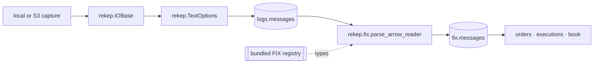

# Architecture

rekep presents one public API over a native, Arrow-first data path. Tasks,
tools, and documentation use `rekep` names; implementation dependencies do not
leak into an application.



## Ownership

| layer | owns |
| --- | --- |
| resource | URI binding, local and object-store traversal, decompression, bounded reads |
| text | physical-line framing, header capture, source URL and row number |
| field | schema metadata, casts, digests, partitions, Arrow conversion |
| FIX | dictionary, branches, code sets, line classification, parsing, fixed Arrow projection |
| Iceberg | table conversion, identifiers, snapshots, scan planning, commits |
| tasks | application parameters, stage boundaries, counts, and orchestration |

There is one `Field`, one resource handle, one text reader, one codec, and one
FIX registry. rekep re-exports those types rather than wrapping them in
compatibility classes.

```python
from rekep import Field, IOBase, Message, TextOptions
from rekep.fix import FixCodec, FixRegistry, fix_registry

assert isinstance(Message.field(), Field)
assert isinstance(Message.text_options(), TextOptions)
assert isinstance(fix_registry(), FixRegistry)
assert FixCodec(fix_registry())
assert IOBase.from_uri("file:data/capture")
```

## Streaming boundary

The text reader yields `RecordBatch` objects. `parse_messages` applies the
`Message` field and gives one `RecordBatchReader` directly to Iceberg.
`parse_fix` reads that table as another reader, passes it to the FIX parser,
applies the parser's field once, and writes it. No production stage converts
rows through Python dictionaries or stages an S3 object on local disk.

## Stable identity

The source object URI and 1-based physical row number are retained through
both products. That pair is the primary key and the lossless join:

```text
logs.messages(url, rownum) == fix.messages(url, rownum)
```

`bodyhash` identifies exact source bytes. `msghash` identifies the parsed FIX
arrival record after session-envelope exclusions. They intentionally answer
different questions.

## Repository layout

```text
python/src/rekep/       public package and bundled registry
tasks/parse_messages/   raw-line Marimo application + JSON parameters
tasks/parse_fix/        FIX Marimo application + JSON parameters
tasks/optimize_iceberg/ maintenance Marimo application + JSON parameters
tasks/airflow/          DAG, operator, and standalone child runner
schemas/rekep/          reviewed table contracts
docs/                   contracts, operations, products, and roadmap
tools/                  registry browser and documentation projection
data/                   default capture, catalog and warehouse locations
config/                 an operator's own FIX dictionary, when one is used
```

`optimize_iceberg` is maintenance rather than ingestion: it is not in the
scheduled graph, and it is documented with the storage it settles, under
[Iceberg maintenance](../storage/iceberg.md#maintenance).
