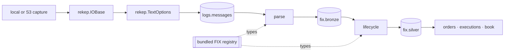

# Architecture

rekep presents one public API over a native, Arrow-first data path. Tasks,
tools, and documentation use `rekep` names; implementation dependencies do not
leak into an application.



## Ownership

| layer | owns |
| --- | --- |
| resource | URI binding, local and object-store traversal, decompression, bounded reads |
| text | physical-line framing, header capture, source URL and row number |
| field | schema metadata, casts, digests, partitions, Arrow conversion |
| FIX | dictionary, dialect membership, code sets, line classification, parsing, lifecycle, fixed Arrow projection |
| Iceberg | table conversion, identifiers, snapshots, scan planning, commits |
| tasks | application parameters, stage boundaries, counts, and orchestration |

There is one `Field`, one resource handle, one text reader, one codec, and one
FIX registry. rekep re-exports those types rather than wrapping them in
compatibility classes.

```python
from rekep import Field, IOBase, Message, TextOptions
from rekep.fix import FixCodec, FixRegistry, fix_registry

assert isinstance(Message.into_field(), Field)
assert isinstance(Message.text_options(), TextOptions)
assert isinstance(fix_registry(), FixRegistry)
assert FixCodec(fix_registry())
assert IOBase.from_uri("file:data/capture").exists()
```

## Streaming boundary

The text reader yields `RecordBatch` objects. `parse_messages` applies the
`Message` field and gives one `RecordBatchReader` directly to Iceberg.
`parse_fix_bronze` reads that table as another reader, passes it through the
codec's parse, applies the published field once, and writes it.
`parse_fix_silver` reads `fix.bronze` as a reader in turn, widens each row
back to the dictionary's types, walks the chains, applies the same field, and
writes it. No production stage converts rows through Python dictionaries or
stages an S3 object on local disk.

## Stable identity

A stored line names its source through the object URI and the 1-based
physical row number, and itself through `curruuid`, the identity the native
read states over it. A message parsed out of that line names it as its one
`srcuuids` entry, and no walk moves it, so the join across the three products
is exact provenance rather than a recomputation:

```text
logs.messages(curruuid) == fix.bronze(srcuuids[0]) == fix.silver(srcuuids[0])
```

`sourceurl` and `rownum` are carried beside it on every FIX row, so the line
is also readable by where it was. A parse answers one row per message rather
than one per line, so the FIX products add the identities the parse settled
and are keyed on a `curruuid` of their own.

A line's `currhashcode` identifies exact source bytes: the code the read
states over the whole line, and the key of `logs.messages`. `curruuid` on a
FIX row identifies the settled
message: sixteen ordered bytes over its settled instant and its named content.
They intentionally answer different questions.

## Repository layout

```text
python/src/rekep/       public package and bundled registry
tasks/parse_messages/   raw-line Marimo application + JSON parameters
tasks/parse_fix_bronze/ FIX parse Marimo application + JSON parameters
tasks/parse_fix_silver/ FIX lifecycle Marimo application + JSON parameters
tasks/build_dbt/        dbt Marimo application + JSON parameters
tasks/optimize_iceberg/ maintenance Marimo application + JSON parameters
tasks/airflow/          DAGs, operator, and standalone child runner
schemas/rekep/          reviewed table contracts
docs/                   contracts, operations, products, and roadmap
tools/                  registry browser and documentation projection
data/                   default capture, catalog and warehouse locations
data/dbt/               the dbt project: models, schemas, macros, one profile
config/                 an operator's own FIX dictionary, when one is used
```

`optimize_iceberg` is maintenance rather than ingestion: it is not in the
scheduled graph, and it is documented with the storage it settles, under
[Iceberg maintenance](../storage/iceberg.md#maintenance).

`build_dbt` is derivation rather than ingestion: dbt owns the SQL its products
are written in, and `rekep.dbt` is the one seam that makes a source an Iceberg
read and a model an Iceberg commit through the dataset above. It is documented
with the task that runs it, under [Build dbt](../pipeline/tasks/build-dbt.md).
