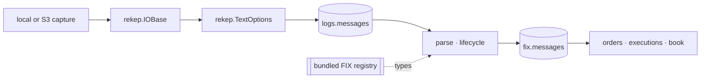

# Architecture

rekep presents one public API over a native, Arrow-first data path. Tasks,
tools, and documentation use `rekep` names; implementation dependencies do not
leak into an application.



## Ownership

| layer | owns |
| --- | --- |
| resource | URI binding, local and object-store traversal, decompression, bounded reads |
| text | physical-line framing, header capture, source URL and row number |
| field | schema metadata, casts, digests, partitions, Arrow conversion |
| FIX | dictionary, dialect membership, code sets, line classification, parsing, lifecycle, fixed Arrow projection |
| Iceberg | table conversion, identifiers, snapshots, scan planning, commits |
| tasks | application parameters, stage boundaries, counts, and orchestration |

There is one `Field`, one resource handle, one text reader, one codec, and one
FIX registry. rekep re-exports those types rather than wrapping them in
compatibility classes.

```python
from rekep import Field, IOBase, Message, TextOptions
from rekep.fix import FixCodec, FixRegistry, fix_registry

assert isinstance(Message.into_field(), Field)
assert isinstance(Message.text_options(), TextOptions)
assert isinstance(fix_registry(), FixRegistry)
assert FixCodec(fix_registry())
assert IOBase.from_uri("file:data/capture").exists()
```

## Streaming boundary

The text reader yields `RecordBatch` objects. `parse_messages` applies the
`Message` field and gives one `RecordBatchReader` directly to Iceberg.
`parse_fix` reads that table as another reader, passes it through the codec's
two stages — parse, then lifecycle — applies the published field once, and
writes it. No production stage converts rows through Python dictionaries or
stages an S3 object on local disk.

## Stable identity

The source object URI and 1-based physical row number are retained through
both products. That pair is the primary key of the raw product and the lossless
join:

```text
logs.messages(sourceurl, rownum) == fix.messages(sourceurl, rownum)
```

A parse answers one row per message rather than one per line, so the fixed
product adds the identities the parse settled and is keyed on `curruuid`.

`bodyhash` identifies exact source bytes. `curruuid` identifies the settled
message: sixteen ordered bytes over its settled instant and its named content.
They intentionally answer different questions.

## Repository layout

```text
python/src/rekep/       public package and bundled registry
tasks/parse_messages/   raw-line Marimo application + JSON parameters
tasks/parse_fix/        FIX Marimo application + JSON parameters
tasks/build_dbt/        dbt Marimo application + JSON parameters
tasks/optimize_iceberg/ maintenance Marimo application + JSON parameters
tasks/airflow/          DAGs, operator, and standalone child runner
schemas/rekep/          reviewed table contracts
docs/                   contracts, operations, products, and roadmap
tools/                  registry browser and documentation projection
data/                   default capture, catalog and warehouse locations
data/dbt/               the dbt project: models, schemas, macros, one profile
config/                 an operator's own FIX dictionary, when one is used
```

`optimize_iceberg` is maintenance rather than ingestion: it is not in the
scheduled graph, and it is documented with the storage it settles, under
[Iceberg maintenance](../storage/iceberg.md#maintenance).

`build_dbt` is derivation rather than ingestion: dbt owns the SQL its products
are written in, and `rekep.dbt` is the one seam that makes a source an Iceberg
read and a model an Iceberg commit through the dataset above. It is documented
with the task that runs it, under [Build dbt](../pipeline/tasks/build-dbt.md).
