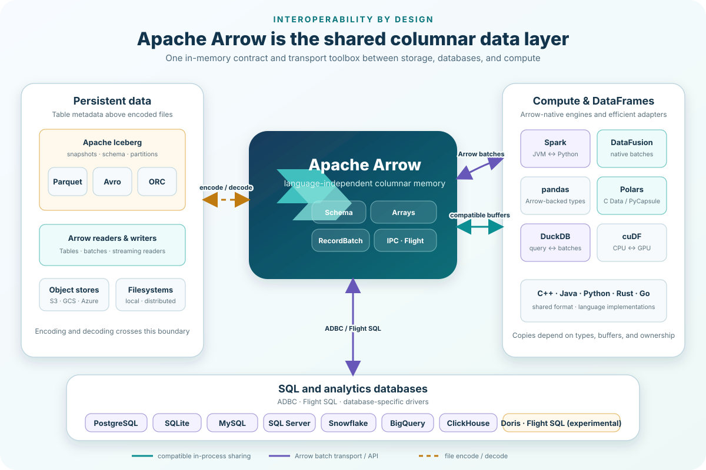

# Why Apache Arrow

Arrow is the one in-memory boundary between text media and Iceberg.



```python
from rekep.iceberg import iceberg_schema
from rekep.text import log_message_field

field = log_message_field()
arrow = field.into_arrow_schema()

assert arrow.names[0] == "currunix"
assert str(arrow.field("currunix").type) == "timestamp[us, tz=UTC]"
print(iceberg_schema(field))
```

The text reader emits `RecordBatch` objects. `Field` validates, casts and
applies any declared partition and digest columns; PyIceberg accepts the
resulting Arrow stream. No row model, cast layer or filesystem of rekep's own
sits between those boundaries.

Arrow does not make every hand-off zero-copy. Compatible in-process buffers
can be shared, while Iceberg and encoded files necessarily read or write
storage. The schema remains the same either way.

Useful boundaries include [PyIceberg](https://py.iceberg.apache.org/api/),
[Polars](https://docs.pola.rs/user-guide/misc/arrow/),
[DataFusion](https://datafusion.apache.org/), and
[DuckDB](https://duckdb.org/docs/stable/guides/python/export_arrow.html).
