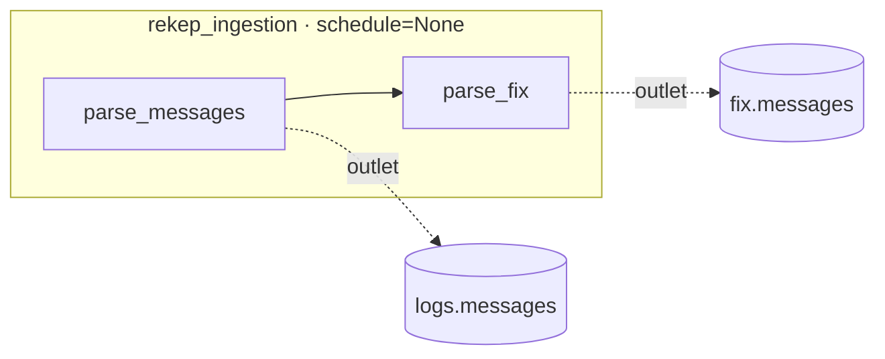
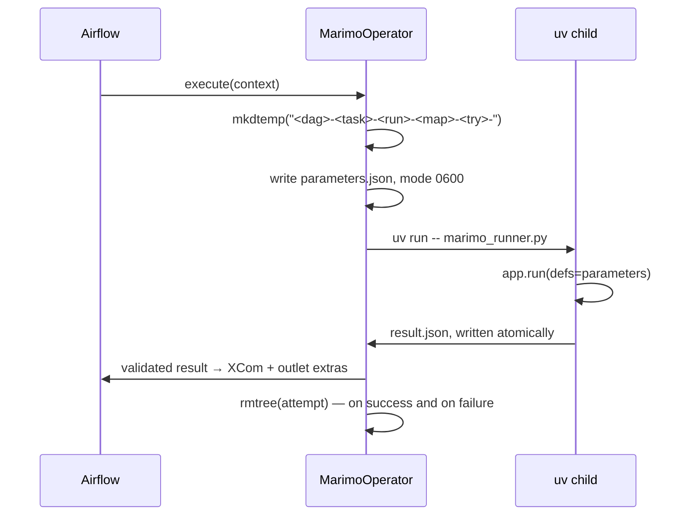
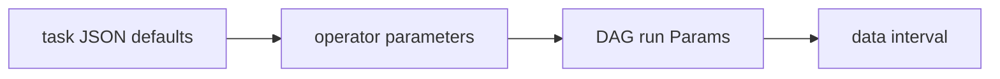

# Airflow

[`tasks/airflow/`](https://github.com/Platob/yggfin/tree/main/tasks/airflow)
holds the DAG folder: one DAG, one operator, one runner. Nothing in the
installed package knows about Airflow, and the DAG imports nothing from it
that a plain `rekep task run` does not.



## The DAG

```python
--8 < --"tasks/airflow/pipeline.py"
```

| setting | value | why |
| --- | --- | --- |
| `schedule` | `None` | `filesystem` must name an immutable capture per run |
| `catchup` | `False` | there is no backfill window to fill |
| `max_active_runs` | `1` | two runs would compete for the same Iceberg key |
| `render_template_as_native_obj` | `True` | a templated `parameters` stays a mapping, not a string |
| `outlets` | one `Asset` per table | asset-aware schedules downstream, and per-run counts |

## The operator

`MarimoOperator` runs one task document's Marimo application in an isolated
child process.

```python
MarimoOperator(
    task_id="parse_messages",
    repository="/srv/rekep",  # the checkout holding python/ and tasks/
    document="tasks/parse_messages/parse_messages.json",
    parameters={"filesystem": "s3://capture/2026-09-06/"},  # optional overrides
    environment={"AWS_PROFILE": "ingest"},  # optional child env
    cache_dir="/var/cache/uv",  # optional shared uv cache
    outlets=[Asset(name="logs.messages")],
)
```

| argument | templated | contract |
| --- | --- | --- |
| `document` | yes | path to the task JSON, refused when outside `repository` |
| `repository` | yes | must hold `python/pyproject.toml` |
| `parameters` | yes (`json`) | only names the document already declares; an undeclared one raises |
| `environment` | yes (`json`) | added to the worker environment for the child |
| `cache_dir` | no | sets `UV_CACHE_DIR` for the child |
| `outlets` | no | assets updated with this run's counts |

### What the child actually runs

```bash
uv run --project <repository>/python --group runner \
       --no-sync --offline --no-progress --no-env-file -- \
  python <repository>/tasks/airflow/marimo_runner.py <document> \
    --parameters-file <attempt>/parameters.json \
    --result-file <attempt>/result.json
```

It never calls the `rekep` CLI. `--no-sync --offline` means a scheduled run
cannot resolve or change dependencies -- install the locked `runner` group on
the worker first, and point `cache_dir` at its shared uv cache.

### One attempt, one directory



The parameter document may hold a credential, so it is written with mode
`0600` inside a directory unique to one attempt and removed either way. Every
character outside `[A-Za-z0-9._-]` in the attempt name becomes `_`, so a run id
carrying `:` or `+` cannot escape the directory it names.

### Parameter precedence



Later wins, and only a name the document already declares is ever set -- a task
that does not take `books` is not handed the scheduler's. The interval fills
`start` and `end` when, and only when, the document declares them:

| context key | parameter |
| --- | --- |
| `data_interval_start` | `start` |
| `data_interval_end` | `end` |

### What comes back

The child publishes one small mapping; the operator validates it, returns it
(so it lands in XCom), and copies the counts onto every outlet the task says it
wrote:

```json
{
  "task": "parse_messages",
  "read": 14,
  "written": 14,
  "skipped": 0,
  "sources": {"capture": "file:data/capture"},
  "targets": {"messages": "logs.messages"},
  "window": {"start": null, "end": null},
  "elapsed_ms": 932
}
```

XCom carries a summary, never a payload. The runner also refuses a result whose
`task` is not the document's name, so a mis-wired document fails the task
instead of publishing under the wrong identity.

### Failure and cancellation

| situation | what happens |
| --- | --- |
| `repository` has no `python/pyproject.toml` | refused before a process starts |
| `document` resolves outside `repository` | refused before a process starts |
| application exits non-zero | `AirflowException` naming the exit code |
| application exits 0 but publishes nothing | `AirflowException` -- a silent success is not a success |
| task cleared or killed | `on_kill` sends `SIGTERM` to the whole child process group, so `uv` and the runner both go |

## Enable it

1. Install Airflow 3 and the locked `runner` group on the worker.
2. Point the Airflow DAG bundle at `tasks/airflow/`.
3. Configure the catalog and source in the two task documents -- the local
   SQLite catalog is a one-host smoke test, not a deployment.
4. [Deploy the table](operations/deploy.md) if catalog creation belongs to a
   separate operator.
5. Trigger `rekep_ingestion`.

```bash
airflow dags trigger rekep_ingestion
airflow tasks test rekep_ingestion parse_messages 2026-09-06
```
