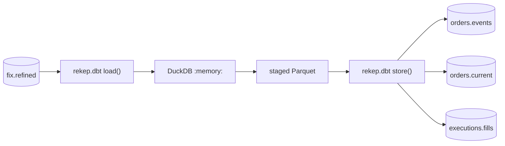

# dbt products

The dbt project under [`data/dbt`](#the-project) builds three SQL products from
`fix.refined` and commits each back into Iceberg. dbt owns the SQL; every
read, schema and commit stays on the same `IcebergDataset` the pipeline
stages write through, and `rekep.dbt` is the one seam between them.

## Build it

From the repository root, because every relative location the project names
-- the staging directory, the local catalog and warehouse -- is spelled from
there:

```bash
uv run --project python dbt build --project-dir data/dbt --profiles-dir data/dbt
```

The `dbt` dependency group carries dbt-core and dbt-duckdb, and `uv` syncs it
by default. A build needs `fix.refined` to exist, which is what
[`parse_fix_refined`](parse-fix-refined.md) writes; nothing needs `dbt deps`.

`profiles.yml` names the local SQLite catalog and file warehouse,
`sqlite:///data/catalog.db` and `data/warehouse`. `REKEP_DBT_CATALOG` replaces
that mapping with JSON of the shape `IcebergCatalog.from_dict` reads, which
the plugin reads ahead of the profile, so a deployment names its catalog
without editing the checked-in project:

```bash
REKEP_DBT_CATALOG='{"name": "rekep", "properties": {"type": "glue", "warehouse": "s3://market-warehouse/rekep", "glue.region": "eu-west-1", "s3.region": "eu-west-1"}}' \
  uv run --project python dbt build --project-dir data/dbt --profiles-dir data/dbt
```

Every catalog on [Catalogs](../storage/catalogs.md) is spelled the same way,
S3 Tables included.

`--select` narrows what the in-memory database holds as well as what is
built: `stg_fix_messages`, which every product reads, is not in
`orders_events+`, and a test that reads two products --
`every_fill_belongs_to_a_known_order`, or the relationship `orders.current`
states to `orders.events` -- fails when a selection builds only one of them.
The shipped products read one another, so the shipped project builds whole.

## Build it in-process

A caller that runs `dbtRunner` in its own process hands the catalog the same
way and closes it after: dbt hands a plugin nothing that says a build is over,
so `rekep.dbt.released()` closes every catalog a plugin opened, where a
`dbt build` process closes them by exiting.

```python
import json
import os
import tempfile
from pathlib import Path

from dbt.cli.main import dbtRunner

from rekep.dbt import CATALOG, released
from rekep.iceberg import IcebergCatalog
from rekep.pipeline import parse_fix_raw, parse_fix_refined, parse_messages
from rekep.times import window_of

root = Path(tempfile.mkdtemp())
settings = {
    "name": "rekep",
    "properties": {
        "type": "sql",
        "uri": f"sqlite:///{root}/catalog.db",
        "warehouse": str(root / "warehouse"),
    },
}
catalog = IcebergCatalog.from_dict(settings)
day = window_of("2026-08-14", "2026-08-14")
try:
    parse_messages("file:data/capture", catalog, day)
    parse_fix_raw(catalog, day)
    parse_fix_refined(catalog, day)
finally:
    catalog.close()

os.environ[CATALOG] = json.dumps(settings)
built = dbtRunner().invoke(
    [
        "build",
        "--project-dir",
        "data/dbt",
        "--profiles-dir",
        "data/dbt",
        "--target-path",
        str(root / "target"),
        "--log-path",
        str(root / "logs"),
    ]
)
released()
assert built.success, built.exception

catalog = IcebergCatalog.from_dict(settings)
try:
    counts = {
        table: catalog.dataset(table).read_arrow_table().num_rows
        for table in ("orders.events", "orders.current", "executions.fills")
    }
    assert counts == {"orders.events": 16, "orders.current": 8, "executions.fills": 7}

    # The chain `parse_fix_refined` walked into four events: one order, three fills.
    chain = "orderid == '00026877711XOEA0'"
    assert catalog.dataset("orders.events").read_arrow_table(row_filter=chain).num_rows == 4
    current = catalog.dataset("orders.current").read_arrow_table(row_filter=chain)
    assert current.column("state").to_pylist() == ["80FILLED"]
    assert catalog.dataset("executions.fills").read_arrow_table(row_filter=chain).num_rows == 3
finally:
    catalog.close()
```

A build writes `target/` -- its compiled project, its run artifacts and the
Parquet each model was staged as -- and `logs/`; `--target-path` and
`--log-path`, or `DBT_TARGET_PATH` and `DBT_LOG_PATH`, move them out of the
checkout, and the staging follows the target path.

## How a model reaches Iceberg



dbt-duckdb reaches a store that is not DuckDB through a plugin, and this
repository's plugin is `rekep.dbt`. A source is one Iceberg read, projected and
filtered in scan planning and handed to DuckDB as one Arrow table. A model is
built as a DuckDB table, staged as one Parquet file, and read back as an Arrow
stream that `IcebergDataset` commits -- so a commit holds a batch of a model at
a time and not the whole of it.

The database is `:memory:`. DuckDB is the compute and holds nothing between
runs: every source is read out of Iceberg at the start of a build and every
product is committed back at the end of one, so a build leaves no second copy
of the warehouse behind.

`iceberg` is the materialization this project declares, in
`data/dbt/macros/iceberg.sql`. It is not dbt-duckdb's own `external`: that one
writes a row of nulls for an empty model so the file always has a schema, and a
row of nulls is not a row this would commit.

## Products

| model | table | grain | key | mode |
| --- | --- | --- | --- | --- |
| `orders_events` | `orders.events` | one normalized order event | `eventkey` | overwrite |
| `orders_current` | `orders.current` | latest settled state per order | `orderkey` | overwrite |
| `executions_fills` | `executions.fills` | one economic execution occurrence | `executionkey` | overwrite |

An identity the parser already named is reused rather than computed again:
`orderkey` is `crossuuid`, the identity over the chain the message states, and
`eventkey` is `curruuid`, the event's own. A digest is written only where SQL
has to name something the parser had no word for -- `executionkey`, over the
chain and the venue execution id, and only where the message states one: where
it states none the event's own identity names the occurrence. It is MD5, which
is what DuckDB spells.

- `orders.events` takes a message that carries an order identity and an order
  lifecycle fact. A message carrying one and not the other stays in
  `fix.refined` rather than being assigned a guessed order, and an unknown
  chain -- an empty `crosscode` -- is not an order.
- `orders.current` is folded from `orders.events` alone, never from FIX. The
  winning event is the latest `eventtime`, then the latest lifecycle `seqnum`,
  then the latest deterministic `eventkey`, so
  a late event changes the row only through that ordering and the same events
  in any arrival order fold to the same row.
- `executions.fills` takes a message that states both a quantity and a price
  for what it executed. A status-only report states neither and does not become
  a zero fill. A bridge relays one execution into every chain it belongs to and
  logs the copy it received beside the copy it sent, so the occurrence is
  scoped by its chain and the earliest `eventtime` wins, then the earliest
  lifecycle `seqnum` and deterministic `eventkey` among the copies that share
  one.

Every shipped model is an overwrite, so a replay of the same capture builds
the same rows and lands them over the ones it landed before.

## What a build checks

A failing node fails the build. Every model's own tests run in the same
build: `dbt build` runs a model and then the tests attached to it, so a
product that broke its key is reported by the build that built it. A test the
project declares as a warning is a quality signal rather than a failure. Two
are declared that way: `every_fill_belongs_to_a_known_order`, because a
capture that starts mid-stream holds executions whose order was accepted
before its first line, and the accepted values of `state`, because the
normalized vocabulary is the codec's and this repository cannot enumerate it
-- a state the products have no reading for is worth reporting and is not a
reason to stop. What the folds do read is pinned against the codec itself in
`python/tests/test_dbt.py`.

## What a model declares

A model's own configuration is its Iceberg declaration; everything else is the
Arrow schema DuckDB staged, so a column a model stops selecting stops being
written.

| key | meaning |
| --- | --- |
| `table` | the Iceberg table to commit to; `{schema}.{identifier}` by default |
| `mode` | `append` adds every row the model built; `overwrite` replaces the rows whose keys match -- or the partitions the model touches, when it has no key -- and adds the rest |
| `primary_key` | the identifier columns; each becomes non-null, and the merge is on them |
| `not_null` | further columns a row must carry |
| `partition_by` | column to Iceberg transform, such as `{'timepartition': 'day'}` |
| `sort_by` | columns each committed chunk is sorted by |
| `arrow_types` | storage types SQL cannot spell, such as `fixed_size_binary[16]` |
| `merge_schema` | add columns a model grew to the table before its rows land; `true` by default |
| `branch` | the Iceberg branch to commit on |
| `batch_row_size` | rows one staged batch carries back out of the file |

It is `arrow_types` and not `column_types` because dbt owns that name for a
seed's own casts. A column named in any of these that the model does not select
fails the commit rather than being ignored.

`merge_schema` adds a column a model grew, which is the one shape change an
Iceberg table takes in place. A key, a partition, a sort order or a narrowed
nullability is fixed when the table is created, so changing one of those in a
model changes the next table created from it and not the one already there:
drop the table and let the next build make it again.

## What a source declares

```yaml
sources:
  - name: fix
    schema: fix
    meta:
      plugin: rekep
    tables:
      - name: refined
        meta:
          table: fix.refined
          columns: [srcuuids, curruuid, crosscode]
```

| key | meaning |
| --- | --- |
| `plugin` | `rekep`, which is what makes the source an Iceberg read |
| `table` | the Iceberg table; `{schema}.{identifier}` by default |
| `columns` | the projection pushed into scan planning |
| `row_filter` | a PyIceberg filter expression, pushed down with it |
| `snapshot_id`, `branch` | the state to read |
| `limit` | a row cap |

DuckDB takes a table, so a source is read into memory: a large one is narrowed
by `columns`, `row_filter` and `limit` rather than read whole. The shipped
project projects the fields from the 128-column FIX row that current products
read. That projection is pushed into the Iceberg scan before DuckDB sees it.

The source is `fix.refined` and never `fix.raw`, though both are declared:
a product needs the chain -- the step an event follows, the state its chain
reached -- and only the walked rows carry one; `fix.raw` holds the same
events with `seqnum` and `prevuuid` empty on every row, so a product built on it
would fold every order from its first event alone. A market fact is FIX's own
field, and the staging model `stg_fix_messages` restates the products' reading
of it off those fields: `px` is `coalesce(price, lastpx, avgpx)`, `qty` is
`coalesce(orderqty, lastqty, cumqty, leavesqty)`, and `symbolticker`,
`isincode`, and `miccode` come directly from their lifted native columns.
`eventtime` is lifecycle `currunix`; applying `TransactTime` again would move a
synthetic expiry away from its deadline.

## The project

```text
data/dbt/
  dbt_project.yml     the project, its paths and its model defaults
  profiles.yml        DuckDB in memory, and the catalog the plugin opens
  macros/
    iceberg.sql       the materialization that commits a model
    rekep.sql         the digest and the normalized states more than one model reads
  models/
    sources.yml       the three published tables, and the projection the one a model reads is read under
    staging/          one narrowing of `fix.refined`, never published
    orders/           orders.events and orders.current
    executions/       executions.fills
  tests/              the checks that span two products
```

Nothing here needs `dbt deps`: there is no package file, and every macro a
model reads is in the checkout. Neither `data/dbt/target/` nor
`data/dbt/logs/` is tracked.

## What these products are not yet

The [roadmap](../roadmap/index.md) specifies these three products as native
`Field` declarations with a replay test and a source-coverage report. These are
the SQL projection of that specification and state where they differ:

| planned | here | why |
| --- | --- | --- |
| `side`, `state`, `exectype` as fixed-width bytes | the normalized strings `fix.refined` carries | a storage width is a declaration, and this layer does not add one to a value it passes through |
| `parties`, `regulatorytimestamps` | not carried | these are lifted nested columns, and a list of structs through DuckDB is a conversion this seam does not own |
| `originalexecutionkey`, `liquidity` | not carried | `ExecRefID` and `LastLiquidityInd` are not in the fixed projection yet |
| rejected-derivation counters | not carried | what a product left behind is still countable in `fix.refined`, but nothing publishes it |

`orders.current` is unpartitioned: one row per order is the whole table, and a
partition on a column that moves would rewrite a file every time an order
ticks.
