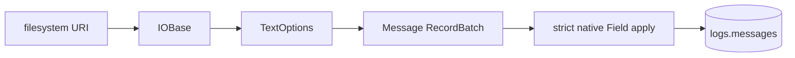

# Pipeline

[`parse_messages`](tasks/parse-messages.md) is the only ingestion stage. It
does not classify protocols or parse the message body.

Yggdryl owns the source side: local and remote filesystem binding, directory
traversal, suffix/media-type compression selection, 1 MiB sequential transport
read-ahead, header capture, and physical-line batching. Yggfin owns the target
side: the Message contract, merge identity, and PyIceberg commits.

The application lives under `tasks/parse_messages/` beside the JSON document
that selects its filesystem and catalog. `rekep.tasks.Task` serializes that
configuration; `rekep task run` executes the Marimo application.
