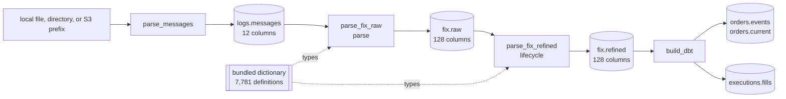

# Pipeline

The supported graph has three streaming tasks and three Iceberg products, and
one build that derives business products from the last of them:



The two FIX tasks are two native stages over one codec, in this order and no
other: parse reads every frame a line carried and settles what it implied,
and lifecycle reads those rows back as the messages that wrote them and as
the chains they belong to. Each lands in a table of its own, under one field.

| task | reads | writes | key | default behavior |
| --- | --- | --- | --- | --- |
| [`parse_messages`](tasks/parse-messages.md) | the window's lines under `filesystem` | `logs.messages` | `curruuid` | header capture, exact line retention, the last day |
| [`parse_fix_raw`](tasks/parse-fix-raw.md) | the window's rows of `logs.messages` | `fix.raw` | `curruuid` | bundled dictionary, one row per event, no chain, the last day |
| [`parse_fix_refined`](tasks/parse-fix-refined.md) | the window's rows of `fix.raw`, off the event clock | `fix.refined` | `curruuid` | the chains walked, the last day |
| [`build_dbt`](tasks/build-dbt.md) | every row of `fix.refined` | `orders.events`, `orders.current`, `executions.fills` | one key per product | the dbt project under `data/dbt`, committed through the same datasets |

Each task is a Marimo application beside a JSON document that owns its
defaults. The CLI and Airflow execute that same document; there is no separate
scheduler implementation.

## Local quick start

```bash
uv sync --project python --all-extras --dev
uv run --project python rekep iceberg deploy \
  tasks/parse_messages/parse_messages.json
uv run --project python rekep task run \
  tasks/parse_messages/parse_messages.json \
  --parameter 'start="2026-08-14"' --parameter 'end="2026-08-14"'
uv run --project python rekep task run \
  tasks/parse_fix_raw/parse_fix_raw.json \
  --parameter 'start="2026-08-14"' --parameter 'end="2026-08-14"'
uv run --project python rekep task run \
  tasks/parse_fix_refined/parse_fix_refined.json \
  --parameter 'start="2026-08-14"' --parameter 'end="2026-08-14"'
uv run --project python rekep task run \
  tasks/build_dbt/build_dbt.json
```

The three ingestion tasks cover one window, the last day unless `start` and
`end` say otherwise -- all three off `currunix`, the event clock, which the
text read settles over a line and the codec settles over a message; the sample
under `data/capture` is dated, so the quick start names its day. Default
locations are:

```text
input       file:data/capture
catalog     sqlite:///data/catalog.db
warehouse   data/warehouse
registry    bundled in rekep
dbt         data/dbt
```

Put one or more capture files under `data/capture`, or override the source on
the command line.

## Complete parameter matrix

| parameter | task | default | contract |
| --- | --- | --- | --- |
| `filesystem` | messages | `file:data/capture` | local object/file tree or object-store prefix |
| `rowheader` | messages | `null` | the row header each line is framed with; `null` is the bridge's own |
| `messages` | raw | `logs.messages` | the stored lines the parse reads |
| `raw` | refined | `fix.raw` | the parsed table the walk reads |
| `start` | messages, raw, refined | `null` | the window's inclusive start; `null` is one day before `end` |
| `end` | messages, raw, refined | `null` | the window's exclusive end; `null` is the instant the run starts, and a whole day is the end of that day |
| `catalog.name` | every | `rekep` | PyIceberg catalog name |
| `catalog.properties.type` | every | `sql` | `sql`, `glue`, `s3tables`, or another installed PyIceberg catalog |
| `catalog.properties.uri` | every | local SQLite | SQL catalog URI; not used by Glue, and derived from the warehouse by `s3tables` |
| `catalog.properties.warehouse` | every | `data/warehouse` | local path, `s3://` Iceberg root, or an S3 Tables bucket: its ARN, its `s3tables://<name>?region=…&account=…` locator, or `<account>:s3tablescatalog/<name>` |
| `registry` | raw, refined | `null` | bundled dictionary; an explicit URI overrides it |
| `codec_options` | raw, refined | `null` | native defaults; an object is forwarded unchanged to `FixCodec` |
| `project` | dbt | `data/dbt` | the dbt project directory |
| `profiles` | dbt | `null` | where `profiles.yml` is; `null` is the project itself |
| `target` | dbt | `null` | the profile target; `null` is the profile's own |
| `select` | dbt | `null` | dbt selection; `null` builds everything |
| `catalog` | dbt | `null` | the profile's own catalog; a mapping overrides it |
| `log_level` | dbt | `INFO` | the level this package's records are written at |

## Run semantics

Every ingestion task covers one window, `[start, end)`: the last day when its
document names neither bound, and exactly the scheduler's data interval under
Airflow. `parse_messages` and `parse_fix_raw` read it off `currunix`: the
text read takes the window as its `where` and answers only the lines it
covers, and the parse prunes `logs.messages` by the same bounds. A line the
header did not match is dated by the modification time of the object it was
read from, so the window of that instant covers it. The epoch pin, which
every window covers, dates a line only where its handle has no clock at all,
and a `fix.raw` message that stated no `SendingTime` until the walk dates it.
`parse_fix_refined` reads the previous hour plus the job window in
`currunix, seqnum, curruuid` order, including unresolved epoch rows. The prior
hour is context only; output is filtered to the job window plus still-undated
rows, and future expiry rows are excluded. Each writer replaces what its
window carries on its field-declared primary key: the first run lands the
window's rows, and a replay of the same window reads the same rows, writes
them again, and leaves the table holding each once.
`parse_fix_raw` always reads the stored lines, so dictionary and
parsing changes are replayed by running the window again without touching
capture storage; `parse_fix_refined` reads `fix.raw` in turn, so a change
to the walk is replayed from the parsed rows. `build_dbt` reads `fix.refined`:
every model is committed on its own key, so a rebuild carries every row it
built and each table holds one row per key.

Every successful task returns the same small result contract. This is
`parse_messages` over the fixture `python/tests/data/ulbridge.log` for its
day:

```json
{
  "task": "parse_messages",
  "read": 144,
  "written": 144,
  "skipped": 0,
  "sources": {"capture": "file:///srv/rekep/python/tests/data/ulbridge.log"},
  "targets": {"messages": "logs.messages"},
  "window": {"start": 1786665600000000000, "end": 1786752000000000000},
  "elapsed_ms": 92
}
```

`window` is the interval the run covered, in epoch nanoseconds. `read` is
the lines the window covers, because the window is pushed into the read; a
window the capture falls outside reads 0.

## Sample rows

Each task page shows business chain `00026877711XOEA0` from the test capture as
that task lands it. The generated example contains 27 source lines and four walked events,
one current order, and three fills. `tools/pipeline_samples.py` runs the
four tasks over the fixture and renders the tables into
`docs/pipeline/tasks/samples/`, one file per page, and each page includes its
own. The integration suite runs the tool with `--check`, which runs the four
tasks again into a throwaway catalog, renders the tables, and fails on any
difference.

## Deployment choices

| mode | capture | catalog | warehouse | guide |
| --- | --- | --- | --- | --- |
| single host | local | SQLite | local | [Deploy locally](operations/deploy.md#local-sqlite-and-files) |
| object-store development | S3 | SQLite | S3 | [S3 with SQL catalog](operations/deploy.md#s3-with-a-sql-catalog) |
| AWS production | S3 | AWS Glue | S3 | [AWS Glue](operations/deploy.md#aws-glue-and-s3) |
| AWS managed tables | S3 | S3 Tables, at its own or the Glue endpoint | the table bucket | [AWS S3 Tables](operations/deploy.md#aws-s3-tables) |
| scheduled | any above | same task parameters | same warehouse | [Airflow](airflow.md) |
| derived products | n/a | same catalog | same warehouse | [build_dbt](tasks/build-dbt.md) |

Credentials belong to the process environment, workload role, or standard AWS
configuration -- not task JSON or command history.
