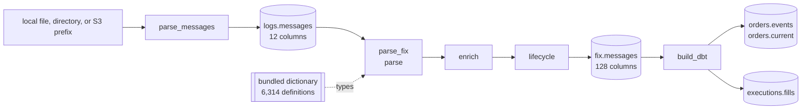

# Pipeline

The supported graph has two streaming tasks and two Iceberg products, and one
build that derives business products from the second of them:



`parse_fix` is three native stages over one codec, in this order and no other:
parse reads every frame a line carried, enrich fills what a message implied but
did not carry, and lifecycle names the chains it belongs to.

| task | reads | writes | key | default behavior |
| --- | --- | --- | --- | --- |
| [`parse_messages`](tasks/parse-messages.md) | every physical line under `filesystem` | `logs.messages` | `(sourceurl, rownum)` | header capture, exact body retention |
| [`parse_fix`](tasks/parse-fix.md) | every row of `logs.messages` | `fix.messages` | `(sourceurl, rownum, msghash)` | bundled dictionary, one row per message, chains named |
| [`build_dbt`](tasks/build-dbt.md) | every row of `fix.messages` | `orders.events`, `orders.current`, `executions.fills` | one key per product | the dbt project under `data/dbt`, committed through the same datasets |

Each task is a Marimo application beside a JSON document that owns its
defaults. The CLI and Airflow execute that same document; there is no separate
scheduler implementation.

## Local quick start

```bash
uv sync --project python --all-extras --dev
uv run --project python rekep iceberg deploy \
  tasks/parse_messages/parse_messages.json
uv run --project python rekep task run \
  tasks/parse_messages/parse_messages.json
uv run --project python rekep task run \
  tasks/parse_fix/parse_fix.json
uv run --project python rekep task run \
  tasks/build_dbt/build_dbt.json
```

Default locations are:

```text
input       file:data/capture
catalog     sqlite:///data/catalog.db
warehouse   data/warehouse
registry    bundled in rekep
dbt         data/dbt
```

Put one or more capture files under `data/capture`, or override the source on
the command line.

## Complete parameter matrix

| parameter | task | default | contract |
| --- | --- | --- | --- |
| `filesystem` | messages | `file:data/capture` | local object/file tree or object-store prefix |
| `rowheader` | messages | `null` | the row header each line is framed with; `null` is the bridge's own |
| `catalog.name` | every | `rekep` | PyIceberg catalog name |
| `catalog.properties.type` | every | `sql` | `sql`, `glue`, or another installed PyIceberg catalog |
| `catalog.properties.uri` | every | local SQLite | SQL catalog URI; not used by Glue |
| `catalog.properties.warehouse` | every | `data/warehouse` | local path or `s3://` Iceberg root |
| `registry` | FIX | `null` | bundled dictionary; explicit URI overrides it |
| `lifecycle` | FIX | `true` | name the event chains; `false` stops after enrichment |
| `project` | dbt | `data/dbt` | the dbt project directory |
| `profiles` | dbt | `null` | where `profiles.yml` is; `null` is the project itself |
| `target` | dbt | `null` | the profile target; `null` is the profile's own |
| `select` | dbt | `null` | dbt selection; `null` builds everything |
| `catalog` | dbt | `null` | the profile's own catalog; a mapping overrides it |
| `log_level` | dbt | `INFO` | the level this package's records are written at |

## Run semantics

Every writer merges on its field-declared primary key. The first run inserts
new source positions. A replay reads them, reports them as skipped, writes no
rows, and creates no empty snapshot. `parse_fix` always reads the stored raw
product, so dictionary and parsing changes can be replayed without touching
capture storage. `build_dbt` reads that stored product in turn: its models
append on their own keys, so a replay of the same capture commits no row, and
`orders.current` is overwritten on `orderkey` so a rebuild leaves one row per
order.

Every successful task returns the same small result contract:

```json
{
  "task": "parse_messages",
  "read": 111,
  "written": 111,
  "skipped": 0,
  "sources": {"capture": "file:///data/capture"},
  "targets": {"messages": "logs.messages"},
  "window": {"start": null, "end": null},
  "elapsed_ms": 92
}
```

## Deployment choices

| mode | capture | catalog | warehouse | guide |
| --- | --- | --- | --- | --- |
| single host | local | SQLite | local | [Deploy locally](operations/deploy.md#local-sqlite-and-files) |
| object-store development | S3 | SQLite | S3 | [S3 with SQL catalog](operations/deploy.md#s3-with-a-sql-catalog) |
| AWS production | S3 | AWS Glue | S3 | [AWS Glue](operations/deploy.md#aws-glue-and-s3) |
| scheduled | any above | same task parameters | same warehouse | [Airflow](airflow.md) |
| derived products | n/a | same catalog | same warehouse | [build_dbt](tasks/build-dbt.md) |

Credentials belong to the process environment, workload role, or standard AWS
configuration—not task JSON or command history.
