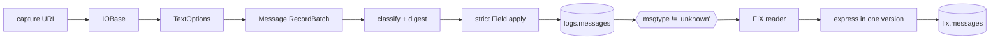
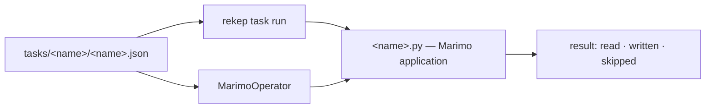

# Pipeline

Two stages, two tables, one merge key.



| stage | source | target | key | partition |
| --- | --- | --- | --- | --- |
| [`parse_messages`](tasks/parse-messages.md) | a filesystem URI | [`logs.messages`](../products/message.md) · 12 columns | `(url, rownum)` | `timepartition` hourly |
| [`parse_fix`](tasks/parse-fix.md) | `logs.messages` where `msgtype != 'unknown'` | [`fix.messages`](../products/fix-message.md) · 101 columns | `(url, rownum)` | `timepartition` hourly |

Stage one stores the physical record without interpreting its body, but does
name what the body *is* -- media type, `MsgType`, direction -- and digests the
exact bytes. Stage two takes the records that named a `MsgType` and reads that
decision rather than repeating it.

Both merge on their key, so a replay reads every row, writes none, and creates
no snapshot.

## Run one

```bash
rekep task run tasks/parse_messages/parse_messages.json
rekep task run tasks/parse_fix/parse_fix.json
```

Each application lives under its own `tasks/` directory beside the JSON
document that configures it. `rekep.tasks.Task` serializes that configuration;
`rekep task run` executes the Marimo application; [Airflow](airflow.md) runs
the same document through `MarimoOperator` without the CLI.



## Operations

| page | covers |
| --- | --- |
| [Run](operations/run.md) | parameters, overrides, replay |
| [Deploy](operations/deploy.md) | creating the table ahead of the job, S3 and Glue |
| [Airflow](airflow.md) | the DAG, the operator, the child process |
| [Logs](operations/logs.md) | what each stage emits |
