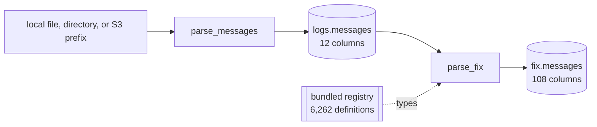

# Pipeline

The supported graph has two streaming tasks and two Iceberg products:



| task | reads | writes | key | default behavior |
| --- | --- | --- | --- | --- |
| [`parse_messages`](tasks/parse-messages.md) | every physical line under `filesystem` | `logs.messages` | `(url, rownum)` | header capture, exact body retention |
| [`parse_fix`](tasks/parse-fix.md) | every row of `logs.messages` | `fix.messages` | `(url, rownum)` | bundled registry, `ulbridge` branch, no dedup |

Each task is a Marimo application beside a JSON document that owns its
defaults. The CLI and Airflow execute that same document; there is no separate
scheduler implementation.

## Local quick start

```bash
uv sync --project python --all-extras --dev
uv run --project python rekep iceberg deploy \
  tasks/parse_messages/parse_messages.json
uv run --project python rekep task run \
  tasks/parse_messages/parse_messages.json
uv run --project python rekep task run \
  tasks/parse_fix/parse_fix.json
```

Default locations are:

```text
input       file:data/capture
catalog     sqlite:///data/catalog.db
warehouse   data/warehouse
registry    bundled in rekep
```

Put one or more capture files under `data/capture`, or override the source on
the command line.

## Complete parameter matrix

| parameter | task | default | contract |
| --- | --- | --- | --- |
| `filesystem` | messages | `file:data/capture` | local object/file tree or object-store prefix |
| `catalog.name` | both | `rekep` | PyIceberg catalog name |
| `catalog.properties.type` | both | `sql` | `sql`, `glue`, or another installed PyIceberg catalog |
| `catalog.properties.uri` | both | local SQLite | SQL catalog URI; not used by Glue |
| `catalog.properties.warehouse` | both | `data/warehouse` | local path or `s3://` Iceberg root |
| `registry` | FIX | `null` | bundled dictionary; explicit URI overrides it |
| `branch` | FIX | `ulbridge` | dictionary branch used for bare names |
| `version` | FIX | `null` | infer per row; a value pins code translation |
| `dedup` | FIX | `false` | preserve one output row per input row |

## Run semantics

Both writers merge on their field-declared primary key. The first run inserts
new source positions. A replay reads them, reports them as skipped, writes no
rows, and creates no empty snapshot. `parse_fix` always reads the stored raw
product, so dictionary and parsing changes can be replayed without touching
capture storage.

Every successful task returns the same small result contract:

```json
{
  "task": "parse_messages",
  "read": 111,
  "written": 111,
  "skipped": 0,
  "sources": {"capture": "file:///data/capture"},
  "targets": {"messages": "logs.messages"},
  "window": null,
  "elapsed_ms": 92
}
```

## Deployment choices

| mode | capture | catalog | warehouse | guide |
| --- | --- | --- | --- | --- |
| single host | local | SQLite | local | [Deploy locally](operations/deploy.md#local-sqlite-and-files) |
| object-store development | S3 | SQLite | S3 | [S3 with SQL catalog](operations/deploy.md#s3-with-a-sql-catalog) |
| AWS production | S3 | AWS Glue | S3 | [AWS Glue](operations/deploy.md#aws-glue-and-s3) |
| scheduled | any above | same task parameters | same warehouse | [Airflow](airflow.md) |

Credentials belong to the process environment, workload role, or standard AWS
configuration—not task JSON or command history.
