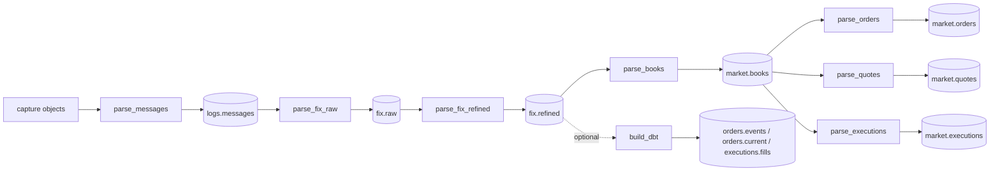

# Pipeline

Seven streaming tasks publish the ingestion and native market tables. The
three event tasks run in parallel after the book task commits; each reads its
exact snapshot and window. The optional dbt products remain independent.



| task | reads | writes | reading |
| --- | --- | --- | --- |
| [`parse_messages`](tasks/parse-messages.md) | capture URI | `logs.messages` | physical lines and provenance |
| [`parse_fix_raw`](tasks/parse-fix-raw.md) | `logs.messages` | `fix.raw` | native parse, without lifecycle |
| [`parse_fix_refined`](tasks/parse-fix-refined.md) | `fix.raw` | `fix.refined` | native lifecycle, preceding-hour context |
| [`parse_books`](tasks/parse-books.md) | `fix.refined` | `market.books` | native book fold over the requested window |
| [`parse_orders`](tasks/parse-orders.md) | pinned `market.books` | `market.orders` | order deltas from both book sides |
| [`parse_quotes`](tasks/parse-quotes.md) | pinned `market.books` | `market.quotes` | quote deltas from both book sides |
| [`parse_executions`](tasks/parse-executions.md) | pinned `market.books` | `market.executions` | native execution leaves |
| [`build_dbt`](tasks/build-dbt.md), optional | `fix.refined` | `orders.events`, `orders.current`, `executions.fills` | existing SQL products |

Each task is a module of `rekep.tasks`, shipped beside the JSON document of
its defaults. `rekep tasks <name> run` runs one, `show` prints the parameters
a run would take and `deploy` creates the tables it writes; Airflow's operator
runs that same `run` command. `rekep tasks list` names every task and its
tables. The market stages require Yggdryl 0.1.11, declared in
`python/pyproject.toml` and locked in `python/uv.lock`.

## Run a window

From the repository root, install the locked dependencies, deploy the seven
tables the ingestion tasks write, and run the three source stages:

```bash
uv sync --project python --all-extras --dev
for TASK in parse_messages parse_fix_raw parse_fix_refined \
  parse_books parse_orders parse_quotes parse_executions; do
  uv run --project python rekep tasks "$TASK" deploy
done
uv run --project python rekep tasks parse_messages run \
  --parameter 'start="2026-08-14"' --parameter 'end="2026-08-14"'
uv run --project python rekep tasks parse_fix_raw run \
  --parameter 'start="2026-08-14"' --parameter 'end="2026-08-14"'
uv run --project python rekep tasks parse_fix_refined run \
  --parameter 'start="2026-08-14"' --parameter 'end="2026-08-14"'
```

The bundled August capture demonstrates ingestion and intentionally includes
an AE report that cannot form a valid sided trade. For market processing, use
your deployed `fix.refined` table containing valid admitted market records.
This separate example selects a ten-second window on 21 September:

```bash
uv run --project python rekep tasks parse_books run \
  --parameter 'start="2026-09-21T10:00:00Z"' --parameter 'end="2026-09-21T10:00:10Z"' \
  --result-file /tmp/rekep-books.json
```

Pass the returned `snapshot_id` to each event task with the same bounds;
[the run guide](operations/run.md#market-events-from-one-book-snapshot) shows
the complete fan-out. Airflow performs this handoff from the validated parent
result automatically. The optional dbt build continues to read `fix.refined`.

Default capture, catalog, warehouse and dictionary remain `file:data/capture`,
`sqlite:///data/catalog.db`, `data/warehouse` and the bundled registry.
Each task page shows its shipped defaults, and `rekep tasks <name> show`
prints them under any override.

## Time, state and replay

Bounds resolve through `window_of`: no bounds means the last day up to now;
a date as `end` covers the end of that day. Market predicates then use exact
`start <= currunix < end`, with no epoch or null exception. Both source rows
and native output books are filtered, since scheduled expiration can extend
beyond the last source event.

Refinement still reads the preceding hour plus its requested window,
including unresolved epoch rows, and writes current-window and still-undated
events. Native lifecycle collects and sorts that finite context. Book creation
reads refined events in `currunix, seqnum, curruuid` order without repeating
lifecycle. Native conversion rejects decreasing effective operation times;
entry timestamps in incremental market-data messages can differ from the
parent FIX time.

A book starts with no resting depth from before `start`. Window-local output
is therefore not a complete reconstruction of an earlier order book. A partial
update whose missing facts require an absent predecessor can be refused.
The native iterator retains live depth while streaming bounded Arrow batches;
its memory bound is not merely the batch size.

Order and quote tables contain deltas, including terminal events, rather than
repeated `live` snapshots. Full-snapshot replacement can remove members without
manufacturing a cancellation event for each disappearance. Executions are
already decomposed by native code, including the sided leaves of AE trades.
Each event keeps its own identity, clock, side and exact decimal facts.

All four market tasks replace exactly the requested window atomically.
Files are staged in bounded chunks and published with the removal of prior
window rows in one Iceberg snapshot. An empty rerun clears that window;
source or commit failure leaves the preceding snapshot visible. Rows outside
the window survive, including those in the same hour partition. This differs
from keyed ingestion replay: changed identities and disappeared events inside
a market window cannot remain as stale rows.

## Results

Every task uses `rekep.logs.Stage`: `task`, `read`, `written`, `skipped`,
`sources`, `targets`, `window` and `elapsed_ms`. Windows in results are epoch
nanoseconds. `parse_books` additionally publishes the committed `snapshot_id`;
the event tasks report `source_snapshot_id`, the source snapshot they read. A snapshot ID of zero
means an empty source with no head and never follows a later table head.
See [logs and results](operations/logs.md) for counter meanings.

## Existing ingestion and dbt samples

The original ingestion and dbt pages show business chain `00026877711XOEA0` from the test capture as
that task lands it. The generated example contains 27 source lines and four walked events,
one current order, and three fills. `tools/pipeline_samples.py` runs the
four tasks over the fixture and renders the tables into
`docs/pipeline/tasks/samples/`, one file per page, and each page includes its
own. The integration suite runs the tool with `--check`, which runs the four
tasks again into a throwaway catalog, renders the tables, and fails on any
difference.

## Deployment choices

| mode | capture | catalog | warehouse | guide |
| --- | --- | --- | --- | --- |
| single host | local | SQLite | local | [Deploy locally](operations/deploy.md#local-sqlite-and-files) |
| object-store development | S3 | SQLite | S3 | [S3 with SQL catalog](operations/deploy.md#s3-with-a-sql-catalog) |
| AWS production | S3 | AWS Glue | S3 | [AWS Glue](operations/deploy.md#aws-glue-and-s3) |
| AWS managed tables | S3 | S3 Tables, at its own or the Glue endpoint | the table bucket | [AWS S3 Tables](operations/deploy.md#aws-s3-tables) |
| scheduled | any above | same task parameters | same warehouse | [Airflow](airflow.md) |
| derived products | n/a | same catalog | same warehouse | [build_dbt](tasks/build-dbt.md) |

Credentials belong to the process environment, workload role, or standard AWS
configuration -- not a parameters file or command history.
