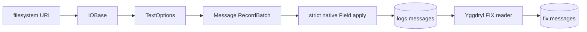

# Pipeline

[`parse_messages`](tasks/parse-messages.md) stores the physical record without
interpreting its body. [`parse_fix`](tasks/parse-fix.md) reads that binary body
through Yggdryl's native FIX reader and stores its fixed, registry-typed Arrow
shape.

Yggdryl owns the source side: local and remote filesystem binding, directory
traversal, suffix/media-type compression selection, 1 MiB sequential transport
read-ahead, header capture, and physical-line batching. Yggfin owns the target
side: the Message contract, merge identity, and PyIceberg commits. Yggdryl also
owns FIX parsing, dictionaries, and the native FIX output schema.

Each application lives under its `tasks/` directory beside the JSON document
that configures it. `rekep.tasks.Task` serializes that configuration; `rekep
task run` executes the Marimo application.
