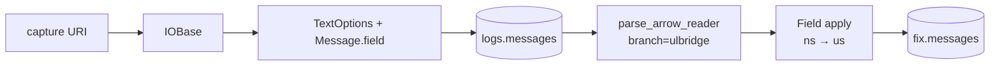
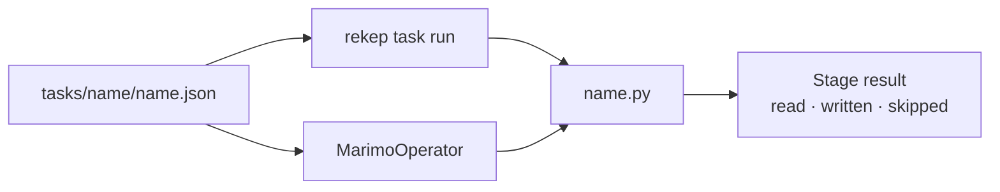

# Pipeline

Two streaming stages publish two Iceberg tables under the same source key.



| stage | source | target | key | partition |
| --- | --- | --- | --- | --- |
| [`parse_messages`](tasks/parse-messages.md) | one filesystem URI | [`logs.messages`](../products/message.md) · 12 columns | `(url, rownum)` | `timepartition` hourly |
| [`parse_fix`](tasks/parse-fix.md) | every row in `logs.messages` | [`fix.messages`](../products/fix-message.md) · 108 columns | `(url, rownum)` | `timepartition` hourly |

Stage one stores a physical line and its ULBridge header without interpreting
the body. Stage two gives the stored reader directly to Yggdryl's FIX codec.
There is no classification table, scan filter, column-renaming adapter, or
Python row conversion between them.

Both writers merge on the native field's primary key. A replay reads every row,
writes none, and creates no snapshot.

## Run

```bash
rekep task run tasks/parse_messages/parse_messages.json
rekep task run tasks/parse_fix/parse_fix.json
```

Each application lives beside the JSON document that owns its defaults.
`rekep task run` and [Airflow](airflow.md) execute the same Marimo application.



## Operations

| page | covers |
| --- | --- |
| [Run](operations/run.md) | parameters, overrides, and replay |
| [Deploy](operations/deploy.md) | tables, S3, and Glue |
| [Airflow](airflow.md) | DAG, operator, and child process |
| [Logs](operations/logs.md) | the shared stage result |
