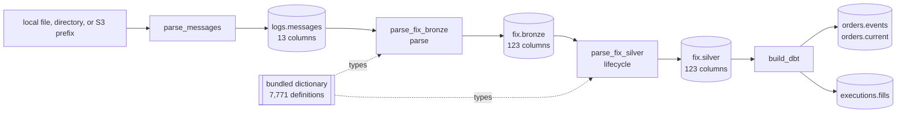

# Pipeline

The supported graph has three streaming tasks and three Iceberg products, and
one build that derives business products from the last of them:



The two FIX tasks are two native stages over one codec, in this order and no
other: parse reads every frame a line carried and settles what it implied,
and lifecycle reads those rows back as the messages that wrote them and as
the chains they belong to. Each lands in a table of its own, under one field.

| task | reads | writes | key | default behavior |
| --- | --- | --- | --- | --- |
| [`parse_messages`](tasks/parse-messages.md) | every physical line under `filesystem`, keeping the window's | `logs.messages` | `bodyhash` | header capture, exact line retention, the last day |
| [`parse_fix_bronze`](tasks/parse-fix-bronze.md) | the window's rows of `logs.messages` | `fix.bronze` | `curruuid` | bundled dictionary, one row per event, no chain, the last day |
| [`parse_fix_silver`](tasks/parse-fix-silver.md) | the window's rows of `fix.bronze`, off the event clock | `fix.silver` | `curruuid` | the chains walked, the last day |
| [`build_dbt`](tasks/build-dbt.md) | every row of `fix.silver` | `orders.events`, `orders.current`, `executions.fills` | one key per product | the dbt project under `data/dbt`, committed through the same datasets |

Each task is a Marimo application beside a JSON document that owns its
defaults. The CLI and Airflow execute that same document; there is no separate
scheduler implementation.

## Local quick start

```bash
uv sync --project python --all-extras --dev
uv run --project python rekep iceberg deploy \
  tasks/parse_messages/parse_messages.json
uv run --project python rekep task run \
  tasks/parse_messages/parse_messages.json \
  --parameter 'start="2026-08-14"' --parameter 'end="2026-08-14"'
uv run --project python rekep task run \
  tasks/parse_fix_bronze/parse_fix_bronze.json \
  --parameter 'start="2026-08-14"' --parameter 'end="2026-08-14"'
uv run --project python rekep task run \
  tasks/parse_fix_silver/parse_fix_silver.json \
  --parameter 'start="2026-08-14"' --parameter 'end="2026-08-14"'
uv run --project python rekep task run \
  tasks/build_dbt/build_dbt.json
```

The three ingestion tasks cover one window, the last day unless `start` and
`end` say otherwise -- the first two off the capture clock, the third off the
event clock; the sample under `data/capture` is dated, so the quick start
names its day. Default locations are:

```text
input       file:data/capture
catalog     sqlite:///data/catalog.db
warehouse   data/warehouse
registry    bundled in rekep
dbt         data/dbt
```

Put one or more capture files under `data/capture`, or override the source on
the command line.

## Complete parameter matrix

| parameter | task | default | contract |
| --- | --- | --- | --- |
| `filesystem` | messages | `file:data/capture` | local object/file tree or object-store prefix |
| `rowheader` | messages | `null` | the row header each line is framed with; `null` is the bridge's own |
| `messages` | bronze | `logs.messages` | the stored raw table the parse reads |
| `bronze` | silver | `fix.bronze` | the parsed table the walk reads |
| `start` | messages, FIX | `null` | the window's inclusive start; `null` is one day before `end` |
| `end` | messages, FIX | `null` | the window's exclusive end; `null` is the instant the run starts, and a whole day is the end of that day |
| `catalog.name` | every | `rekep` | PyIceberg catalog name |
| `catalog.properties.type` | every | `sql` | `sql`, `glue`, or another installed PyIceberg catalog |
| `catalog.properties.uri` | every | local SQLite | SQL catalog URI; not used by Glue |
| `catalog.properties.warehouse` | every | `data/warehouse` | local path or `s3://` Iceberg root |
| `registry` | FIX | `null` | bundled dictionary; explicit URI overrides it, on both FIX tasks |
| `project` | dbt | `data/dbt` | the dbt project directory |
| `profiles` | dbt | `null` | where `profiles.yml` is; `null` is the project itself |
| `target` | dbt | `null` | the profile target; `null` is the profile's own |
| `select` | dbt | `null` | dbt selection; `null` builds everything |
| `catalog` | dbt | `null` | the profile's own catalog; a mapping overrides it |
| `log_level` | dbt | `INFO` | the level this package's records are written at |

## Run semantics

Every ingestion task covers one window, `[start, end)`: the last day when its
document names neither bound, and exactly the scheduler's data interval under
Airflow. `parse_messages` and `parse_fix_bronze` read it off the capture
clock, and a line with no clock is in every window. `parse_fix_silver` reads
it off the event clock `currunix`, with the rows the parse could not date --
those at the codec's pin -- read by their transaction time instead. Each
writer replaces what its window carries on its field-declared primary key:
the first run lands the window's rows, and a replay of the same window reads
the same rows, writes them again, and leaves the table holding each once.
`parse_fix_bronze` always reads the stored raw product, so dictionary and
parsing changes are replayed by running the window again without touching
capture storage; `parse_fix_silver` reads `fix.bronze` in turn, so a change
to the walk is replayed from the parsed rows. `build_dbt` reads `fix.silver`:
every model is committed on its own key, so a rebuild carries every row it
built and each table holds one row per key.

Every successful task returns the same small result contract:

```json
{
  "task": "parse_messages",
  "read": 144,
  "written": 141,
  "skipped": 3,
  "sources": {"capture": "file:///data/capture"},
  "targets": {"messages": "logs.messages"},
  "window": {"start": 1786665600000000000, "end": 1786752000000000000},
  "elapsed_ms": 92
}
```

`window` is the interval the run covered, in epoch nanoseconds.

## Deployment choices

| mode | capture | catalog | warehouse | guide |
| --- | --- | --- | --- | --- |
| single host | local | SQLite | local | [Deploy locally](operations/deploy.md#local-sqlite-and-files) |
| object-store development | S3 | SQLite | S3 | [S3 with SQL catalog](operations/deploy.md#s3-with-a-sql-catalog) |
| AWS production | S3 | AWS Glue | S3 | [AWS Glue](operations/deploy.md#aws-glue-and-s3) |
| scheduled | any above | same task parameters | same warehouse | [Airflow](airflow.md) |
| derived products | n/a | same catalog | same warehouse | [build_dbt](tasks/build-dbt.md) |

Credentials belong to the process environment, workload role, or standard AWS
configuration -- not task JSON or command history.
