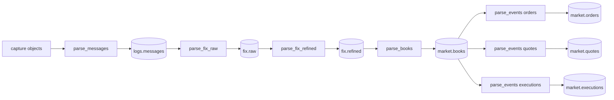

# Pipeline

`rekep.pipeline` holds one function per table the graph writes, in production
order. Each reads one window of its source through an
[`IcebergCatalog`](../storage/catalogs.md), writes its target the way that
table is replaced, creates the target where it is missing, and answers what it
read and wrote. Where a stage runs, how often, over which window and against
which catalog are the caller's, and a stage never closes the catalog it is
handed. The market stages require Yggdryl 0.1.11, declared in
`python/pyproject.toml` and locked in `python/uv.lock`.



| stage | reads | writes | replaces |
| --- | --- | --- | --- |
| [`parse_messages`](parse-messages.md) | a capture `IOBase` or URI | `logs.messages` | on `curruuid` within its hour |
| [`parse_fix_raw`](parse-fix-raw.md) | `logs.messages` | `fix.raw` | on `curruuid` within its hour |
| [`parse_fix_refined`](parse-fix-refined.md) | `fix.raw`, from the hour before the window | `fix.refined` | on `curruuid` within its hour |
| [`parse_books`](parse-books.md) | `fix.refined` | `market.books` | the exact window, in one snapshot |
| [`parse_events`](parse-events.md) | one `market.books` snapshot | `market.orders`, `market.quotes`, `market.executions` | the exact window, in one snapshot |

A stage reads and writes the tables the module's constants name --
`MESSAGES`, `RAW`, `REFINED`, `BOOKS` and `EVENTS[kind]` -- unless its
`source` and `target` keywords name others; `parse_messages` takes the capture
as its first argument, and a table name only as `target`. The two FIX stages
and `parse_books` take the `codec` they parse with, `fix_codec()` when None,
and it is one codec for all three: the walk reads each row back with the
dictionary that wrote it.

## Run the graph

From the repository root, over the checked ULBridge capture and the day it
was captured on, into a SQLite catalog in a scratch directory:

```python
import tempfile
from pathlib import Path

from rekep.iceberg import IcebergCatalog
from rekep.pipeline import (
    Landed,
    parse_books,
    parse_events,
    parse_fix_raw,
    parse_fix_refined,
    parse_messages,
)
from rekep.times import window_of

root = Path(tempfile.mkdtemp())
catalog = IcebergCatalog.from_dict(
    {
        "name": "rekep",
        "properties": {
            "type": "sql",
            "uri": f"sqlite:///{root}/catalog.db",
            "warehouse": str(root / "warehouse"),
        },
    }
)
day = window_of("2026-08-14", "2026-08-14")
try:
    assert parse_messages("file:data/capture", catalog, day) == Landed(read=144, written=144)
    assert parse_fix_raw(catalog, day) == Landed(read=144, written=49, skipped=30)
    assert parse_fix_refined(catalog, day) == Landed(read=49, written=19)

    # The market stages fold the midday hour, where most of the capture's
    # orders trade, and every event kind reads the one book snapshot that
    # fold committed.
    midday = window_of("2026-08-14T12:00:00Z", "2026-08-14T13:00:00Z")
    books = parse_books(catalog, midday)
    assert (books.read, books.written) == (12, 5)
    events = {
        kind: parse_events(kind, catalog, midday, snapshot_id=books.snapshot_id)
        for kind in ("orders", "quotes", "executions")
    }
    assert {kind: landed.written for kind, landed in events.items()} == {
        "orders": 1,
        "quotes": 0,
        "executions": 7,
    }
    assert {landed.snapshot_id for landed in events.values()} == {books.snapshot_id}
finally:
    catalog.close()
```

The order is required: `parse_fix_raw` reads `logs.messages` rather than the
capture, `parse_fix_refined` reads `fix.raw` rather than either, and
`parse_books` reads `fix.refined` and nothing before it. The three event kinds
are independent of one another once the book snapshot is committed, and may
run in separate processes as long as each is handed the same `snapshot_id`
and window.

The market stages are run over the midday hour and not the day because the
capture logs two messages a book cannot admit: an AE trade report at 14:52:55
whose side states no `Side(54)`, and an order cancel reject at 21:59:46 that
names no symbol. `parse_books` raises over any window holding either -- an
admitted message it cannot read is an error, never a skipped row -- and the
refusal leaves the table's prior snapshot visible.

## What a stage answers

Every stage returns `Landed`:

| field | meaning |
| --- | --- |
| `read` | source rows the window selected |
| `written` | target rows the stage carried into the table |
| `skipped` | rows the stage answered that the target's key folded into a written one |
| `snapshot_id` | the `market.books` snapshot `parse_books` committed or `parse_events` read, zero for none; None for every other stage |

- `parse_messages.read` is the lines the window covers, and nothing is
  filtered after the read, so `skipped` is 0; a window the capture falls
  outside reads 0.
- `parse_fix_raw.read` is the stored lines of the window, and
  `written + skipped` is the messages the codec answered: a line carries none,
  one or several, and a message logged at three hops is three answers of one
  identity. Over the capture that is 49 + 30 = 79.
- `parse_fix_refined.read` is the `fix.raw` rows of the window and the hour
  before it, dated or at the epoch pin, and `written` is one row per event the
  walk placed in the window, under identities that need not be the parsed
  rows'.
- `parse_books.read` counts refined rows and `written` counts books, so
  `skipped` is 0: they are different units.
- `parse_events.read` counts books of the pinned snapshot, `written` the
  events of the window it stored, and `skipped` the selected events not
  written, normally 0.

A replay of the same window answers the same numbers as the run it repeats:
`written` is what a run carried, not what it changed, and the table holds each
key once either way. A successful run that wrote no row is not a failure.

## Time, state and replay

Bounds resolve through `window_of`: no bounds means the last day up to the
instant it is read, and a date as `end` covers the end of that day. The three
ingestion stages read the window off `currunix`, the event clock: the text
read settles it over a line, off the header's `mtime` capture or off the
modification time of the object a line the header did not match was read
from, and a `fix.raw` row is already an event, dated by what its message
stated. Market predicates use exact `start <= currunix < end`, with no epoch
or null exception. Both source rows and native output books are filtered,
since scheduled expiration can extend beyond the last source event.

Refinement reads the preceding hour plus its window, including unresolved
epoch rows, and writes current-window and still-undated events. Native
lifecycle collects and sorts that finite context. Book creation reads refined
events in `currunix, seqnum, curruuid` order without repeating lifecycle.
Native conversion rejects decreasing effective operation times; entry
timestamps in incremental market-data messages can differ from the parent FIX
time.

A book starts with no resting depth from before `start`. Window-local output
is therefore not a complete reconstruction of an earlier order book. A partial
update whose missing facts require an absent predecessor can be refused.
The native iterator retains live depth while streaming bounded Arrow batches;
its memory bound is not merely the batch size.

Order and quote tables contain deltas, including terminal events, rather than
repeated `live` snapshots. Full-snapshot replacement can remove members without
manufacturing a cancellation event for each disappearance. Executions are
already decomposed by native code, including the sided leaves of AE trades.
Each event keeps its own identity, clock, side and exact decimal facts.

The three ingestion stages replace on their `curruuid` key: a replay of a
window reads the same rows and lands them over the ones the first run landed,
one more snapshot per table. Running a window again after a registry or parser
change is therefore the rebuild -- the new reading of every message lands over
the old one on the same key. A reading that changes an event's `curruuid` is a
new key, and the old row stays: drop the window's rows first, or write a new
target table, when the identity itself changes. The walk re-settles the
identity of a message it dates, which is why `fix.refined` is written from
`fix.raw` and never in place: a walked row's key is not always the key of the
parsed row it restates.

The two market stages replace exactly the requested window atomically.
Files are staged in bounded chunks and published with the removal of prior
window rows in one Iceberg snapshot. An empty rerun clears that window;
source or commit failure leaves the preceding snapshot visible. Rows outside
the window survive, including those in the same hour partition. Changed
identities and disappeared events inside a market window cannot remain as
stale rows. After a book replacement, run the event kinds again against the
new book snapshot.

## Where the tables live

| mode | capture | catalog | warehouse | guide |
| --- | --- | --- | --- | --- |
| single host | local | SQLite | local | [Local SQLite and files](../storage/catalogs.md#local-sqlite-and-files) |
| object-store development | S3 | SQLite | S3 | [S3 with a SQL catalog](../storage/catalogs.md#s3-with-a-sql-catalog) |
| AWS production | S3 | AWS Glue | S3 | [AWS Glue and S3](../storage/catalogs.md#aws-glue-and-s3) |
| AWS managed tables | S3 | S3 Tables, at its own or the Glue endpoint | the table bucket | [AWS S3 Tables](../storage/catalogs.md#aws-s3-tables) |

Credentials belong to the process environment, workload role, or standard AWS
configuration -- not a catalog mapping committed beside the code.
