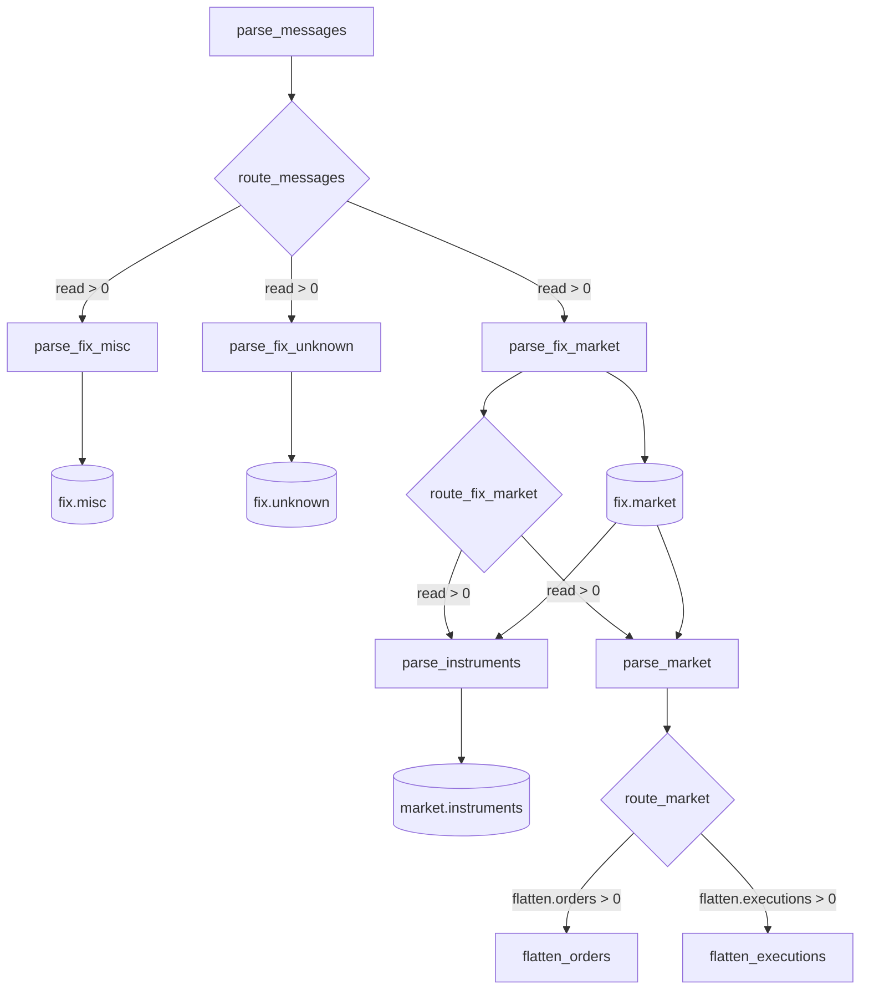

# Deploy and operate with Airflow

Airflow runs eight publishing task instances from six task documents as the
`rekep_market_pipeline` DAG and the catalog-wide maintenance application as
`rekep_iceberg_maintenance`. This page covers a local first run and the
additional requirements for a distributed deployment.

`tasks/airflow/market_pipeline.py` declares both DAGs against the Airflow 3
`airflow.sdk` API; `tasks/airflow/marimo_operator.py` declares the
`MarimoOperator(BaseOperator)` they run every task under. Use Airflow 3.x,
`apache-airflow-providers-standard>=1.0,<2` and Python 3.12 or newer. Airflow
itself runs on Linux or another POSIX system; on Windows, use WSL2 or Linux
containers.

!!! warning "Deploy the repository, not only the DAG file"

    A worker reads the YAML document under `tasks/`, imports the Marimo
    application beside it, and reads the default FIX registry from `data/fix`.
    The DAG names its own checkout as `Path(__file__).resolve().parents[2]`, so
    the DAG file ships inside the repository it schedules. Keep the package,
    DAG, YAML, applications, schemas and registry on the same revision. A
    `rekep` wheel by itself is not a complete deployment.

## What Airflow runs



| DAG | Schedule | Catch-up | Concurrent runs | Runtime parameter |
| --- | --- | --- | --- | --- |
| `rekep_market_pipeline` | hourly in UTC | enabled from 2026-01-01 | one | `branch` (`root`), `books` (`true`) |
| `rekep_iceberg_maintenance` | 02:30 UTC daily | disabled | one | `branch`, default `root` |

The publishing DAG spells its schedule as `CronDataIntervalTimetable("0 * * * *",
timezone="UTC")` rather than as `@hourly`, so one run covers one closed hour
whatever the deployment is configured to do. A bare cron string follows
`[scheduler] create_cron_data_intervals`, which is off by default and gives
every run a zero-width interval — and a zero-width `[start, end)` reads
nothing, on every run, silently. The maintenance DAG reads no interval and
keeps its plain cron string.

Each `MarimoOperator` runs exactly one command, with the repository as the
working directory:

```text
uv run --project <repository>/python --group runner --no-sync --offline --no-progress --no-env-file -- \
  rekep task run <repository>/tasks/parse_fix/parse_fix.yml \
  --parameters-file <attempt>/parameters.json --result-file <attempt>/result.json
```

That is the command a person runs locally, so a laptop and a worker differ in
nothing but the machine. It is an argv list, never a shell string. `<attempt>`
is a 0700 directory made per task attempt and named from the DAG id, task id,
run id, map index and try number; the parameter document inside it is 0600, and
both are deleted in a `finally` whether the task landed or raised.

`--no-sync --offline` means a scheduled task never resolves a dependency,
reaches an index, or writes to the environment it runs in. That environment is
the deployment's, made once from the lock.

Parameters merge once per task, later winning: the task document's defaults,
then the operator's own `parameters` -- which is where each FIX task's
`category` comes from -- then same-name DAG Params, then `data_interval_start`
and `data_interval_end` into a declared `start` and `end`. Only a name the document already declares is set, so a task that does
not take `books` is never handed the scheduler's, and `optimize_iceberg`, which
declares no interval, is handed none. Values keep their native types: `books:
false` is the boolean.

Each application defines a `result` with non-negative counts, in the shape
[every task returns](logs.md#what-one-task-returns). The operator validates it
and returns it from `execute()`, so Airflow pushes that one small mapping to
XCom under `return_value`. Nothing else is pushed: no Arrow data, no tables, no
reports.

A `@task.branch` route reads named counts out of the producer's result and
skips downstream work whose input count is zero: `parse_messages.read` starts
all three `parse_fix_*` tasks, `parse_fix_market.read` starts both readers of
`fix.market`, and `parse_market.flatten.orders` and
`parse_market.flatten.executions` start the two flatteners. Routes read
attempted counts rather than `written`, so an idempotent replay still reaches
consumers even when the producer inserts no new rows. The misc and unknown FIX
tasks are terminal and run beside the market task.

Nothing is read at DAG-import time: no YAML, no application, no catalog, no
Connection and no Variable. Parsing and serializing both DAGs takes 41-45 ms
and loads neither marimo, pyiceberg, pyarrow nor rekep; the serialized DAGs are
13421 and 2382 bytes.

Retries, retry delay, pools, queue, priority, execution timeout, callbacks,
executor configuration, inlets and outlets are ordinary `BaseOperator`
arguments and reach Airflow unchanged through the `marimo_task(name, **kwargs)`
factory in the DAG.

## Credentials a worker does not already have

`document`, `repository`, `parameters` and `environment` are template fields,
so a deployment binds a Connection, a Variable or a secret backend to one of
them and Airflow resolves it when the task runs, never when the DAG is parsed.
`environment` is the one projection: it names environment variables for the
child process, which is how every credential this pipeline reads is supplied.

```python
from marimo_operator import MarimoOperator

MarimoOperator(
    task_id="parse_messages",
    repository="/opt/rekep",
    document="tasks/parse_messages/parse_messages.yml",
    environment={
        "S3_ACCESS_KEY_ID": "{{ conn.rekep_capture.login }}",
        "S3_SECRET_ACCESS_KEY": "{{ conn.rekep_capture.password }}",
        "S3_ENDPOINT_URL": "{{ conn.rekep_capture.host }}",
    },
)
```

`marimo_task(name, **kwargs)` in the DAG passes the same keywords through.

The resolved value reaches the child's environment and nothing else: it is not
written to the parameter document, not recorded in the task log, and not
pushed to XCom. Keep credentials out of the task YAML, which is checked in.

## Configure the jobs first

The default input directory, `data/capture`, is not included in the
repository. Before the first run, edit
`tasks/parse_messages/parse_messages.yml` so `source` points to an existing
worker-visible directory or object-store prefix, and adjust `pattern` and the
header rule for it. Configure timezone, protocol rules, MsgType exclusion,
plugin aliases, null values, and `fix_dictionary` in `parse_fix.yml`.

The three parallel FIX tasks consume that one `parse_fix.yml`; raw
`logs.messages` carries no dictionary or protocol decision to keep in sync.

The active catalog configuration in every task YAML is deliberately local:

```yaml
catalog:
  name: rekep
  properties:
    type: sql
    uri: sqlite:///data/catalog.db
    warehouse: data/warehouse
```

The operator runs every task with the repository as its working directory, so
`sqlite:///data/catalog.db` resolves inside the checkout. `rekep` makes a local
`warehouse` absolute before a table records it, so `data/warehouse` stays
readable from any working directory. This is useful for a single-host test,
but the checkout must be writable and the catalog cannot coordinate distributed
workers.

For production, replace the catalog block consistently in all seven YAML files,
including `tasks/optimize_iceberg/optimize_iceberg.yml`.
The shipped Glue/S3 example is:

```yaml
catalog:
  name: rekep-production
  properties:
    type: glue
    warehouse: s3://example-bucket/rekep/warehouse
    glue.region: eu-west-1
    s3.region: eu-west-1
    # glue.id: "123456789012"  # Optional cross-account catalog ID.
    # KMS is a bucket default; per-request s3.sse.* is unsupported.
```

The `runner` group already carries this catalog's dependency as
`rekep[glue]`. Provide AWS credentials through the worker's workload role or
standard environment. Do not store credentials in the YAML.

For MinIO or another S3-compatible store, configure every scheduler and worker
with the same portable defaults instead:

```bash
export S3_ENDPOINT_URL=http://minio:9000
export S3_ACCESS_KEY_ID=change-me
export S3_SECRET_ACCESS_KEY=change-me
export S3_REGION=us-east-1
# S3_SESSION_TOKEN is also read when temporary credentials require it.
```

Location URL values override these defaults, and explicit `s3.*` catalog
properties override both. Standard AWS profiles and workload roles continue to
work when the portable variables are absent. `s3://`, `s3a://` and `s3n://`
warehouses keep the spelling the document gives them.

Keep the table wiring aligned across the documents:

| Producer | Target | Consumer source |
| --- | --- | --- |
| `parse_messages` | `logs.messages` | all three `parse_fix_*` tasks |
| `parse_fix_market` | `fix.market` | `parse_instruments`, `parse_market` |
| `parse_fix_misc` | `fix.misc` | terminal audit table |
| `parse_fix_unknown` | `fix.unknown` | terminal audit table |
| `parse_instruments` | `market.instruments` | terminal reference table |
| `parse_market` in book mode | `market.books` | both flatteners |
| `parse_market` in direct mode | `market.orders`, `market.executions` | terminal tables |

`tasks/parse_market/parse_market.yml` sets the scheduled default market path;
the DAG's boolean `books` parameter can override it per run:

- `books: true` writes Books, then routes Orders and Executions to their
  independent flatteners.
- `books: false` writes FIX-carried Orders and Executions directly. Both
  flatteners are then intentionally skipped.

When changing an existing deployment to direct mode, use empty or dedicated
Order and Execution targets. Direct events and book-normalized events do not
have identical hashes, and an upsert does not remove historical rows from the
old mode.

## Local installation

The commands below use the current stable Airflow 3 release as an example.
Airflow's matching constraints file keeps its application dependencies
reproducible. Apply that file to the Airflow installation only; for later
dependencies, keep `apache-airflow` pinned so pip cannot change its version.

```bash
cd /path/to/rekep
REPO="$PWD"

python3.12 -m venv .venv-airflow
source .venv-airflow/bin/activate

AIRFLOW_VERSION=3.3.1
PYTHON_VERSION=3.12
CONSTRAINT_URL="https://raw.githubusercontent.com/apache/airflow/constraints-${AIRFLOW_VERSION}/constraints-${PYTHON_VERSION}.txt"

python -m pip install --upgrade pip
python -m pip install \
  "apache-airflow==${AIRFLOW_VERSION}" \
  --constraint "$CONSTRAINT_URL"
python -m pip install \
  "apache-airflow==${AIRFLOW_VERSION}" \
  "apache-airflow-providers-standard>=1.0,<2" \
  -e "${REPO}/python[yaml]"
python -m pip check
```

That environment reads the task document and starts the child. What the
application itself imports lives in the separate `runner` environment, made
once from the lock on every machine that runs a task:

```bash
uv sync --project "${REPO}/python" --locked --group runner
```

The group is Marimo and the catalog extras a task imports:
`marimo>=0.16,<1` and `rekep[glue,iceberg,polars,yaml]`.

Configure paths before starting any Airflow component:

```bash
export AIRFLOW_HOME="$HOME/airflow-rekep"
export AIRFLOW__CORE__DAGS_FOLDER="${REPO}/tasks/airflow"

mkdir -p "$AIRFLOW_HOME"
```

| Variable | Purpose |
| --- | --- |
| `AIRFLOW_HOME` | Airflow's own metadata database, configuration, and logs |
| `AIRFLOW__CORE__DAGS_FOLDER` | Makes Airflow discover `market_pipeline.py` |

Airflow puts the DAG bundle directory on `sys.path`, which is what makes
`from marimo_operator import MarimoOperator` resolve. Deploy both files
together.

Start a local all-in-one Airflow instance:

```bash
airflow standalone
```

Standalone initializes its metadata database and starts the DAG processor,
scheduler, triggerer, and API server. Open <http://localhost:8080>. The generated
admin password is stored at:

```bash
cat "$AIRFLOW_HOME/simple_auth_manager_passwords.json.generated"
```

In another shell with the same environment and virtual environment, validate
discovery before running data:

```bash
airflow info
airflow dags list --local
airflow dags list-import-errors --local
```

`rekep_market_pipeline` must appear in the list and the import-error list must
be empty. From the repository root, check that the worker resolves `uv` and the
prepared `runner` group:

```bash
uv --version
uv run --project "$PWD/python" --group runner python -c "import marimo, rekep; print(rekep.__file__)"
```

## Test one interval

Use a scratch catalog or a dedicated Iceberg branch for validation because
`airflow dags test` executes every selected application and therefore writes
its configured tables. It tests locally without creating a normal scheduled DAG
run.

```bash
airflow dags test \
  --dagfile-path "${REPO}/tasks/airflow/market_pipeline.py" \
  --conf '{"branch":"root"}' \
  rekep_market_pipeline \
  2026-08-21T10:00:00Z
```

`airflow dags test` reads its positional argument as the instant the run is
made at, so that command covers `[2026-08-21T09:00:00Z,
2026-08-21T10:00:00Z)`. A *scheduled* run is named by the hour it covers
instead: logical date `2026-08-21T10:00:00Z` covers
`[2026-08-21T10:00:00Z, 2026-08-21T11:00:00Z)` and starts once 11:00 has
passed. The interval is UTC; the `timezone` in `parse_fix.yml` controls how
captured timestamps without an offset become `FixMsg.recunix`.

The operator streams the child's output into the Airflow task log line by line
— including the package's own records, which each task document sets the level
of. See [Logs](logs.md).

Against the checked-in message fixture and one local SQLite catalog, the
six-task workflow takes 59.0 s at its fastest, 60.2 s at the median and 62.1 s
at its slowest, wall clock. About 5.4 s of each task is startup before its
first cell runs: `uv`, the interpreter, and the package's imports. The counts
that run produces are pinned on [End-to-end run](run.md).

## Start scheduled runs

!!! danger "Review catch-up before unpausing"

    The shipped DAG has `catchup=True` and starts on 2026-01-01. Unpausing it
    creates one run for every completed hourly interval since that date.
    Confirm that the source and storage can serve the full history, or change
    the start date/catch-up policy and deploy that change before unpausing.

Inspect the next intervals, then unpause only when the catch-up policy is
intentional:

```bash
airflow dags next-execution --table --num-executions 5 rekep_market_pipeline
airflow dags unpause rekep_market_pipeline
airflow dags unpause rekep_iceberg_maintenance
```

Pause it without cancelling an already-running task:

```bash
airflow dags pause rekep_market_pipeline
```

Scheduled runs use `branch=root` and `books=true`. In the UI, **Trigger**
presents both fields. This direct-mode CLI run bypasses Book construction:

```bash
airflow dags trigger \
  --conf '{"branch":"root","books":false}' \
  rekep_market_pipeline
```

A trigger submitted while the DAG is paused remains queued. Manual-run data
intervals are inferred by Airflow's timetable and trigger path; use a backfill
when an exact historical sequence is required.

## Run Iceberg maintenance

The maintenance DAG visits every table in every nested namespace and runs the
same bounded routine as `IcebergDataset.optimize`: compact eligible data files,
expire eligible snapshots, then sweep unreachable data and metadata files. It
does not need a source interval and has catch-up disabled.

The checked-in policy in `tasks/optimize_iceberg/optimize_iceberg.yml` retains
at least 24 snapshots and every snapshot from the last seven days. Files are
deleted only when no retained snapshot or ref reaches them and they have been
orphaned for at least three days.

Current table rows remain; time travel to an expired snapshot does not.
Manifest and manifest-list Avro files are shared, so the sweep keeps one
whenever any retained snapshot still references it.

Inspect and adjust that retention before unpausing the DAG. Schedule it for a
quiet warehouse period; the shipped 02:30 UTC time avoids the top-of-hour start
of the publishing DAG. The orphan grace protects new uncommitted files, and a
catalog conflict fails the run rather than silently overwriting another commit.
Airflow retries the task twice at ten-minute intervals.

Run one maintenance pass manually with:

```bash
airflow dags trigger \
  --conf '{"branch":"root"}' \
  rekep_iceberg_maintenance
```

Its result carries the keys every task returns, plus `tables`, `expired`,
`deleted`, `byte_size` and a per-table `reports` breakdown. See
[what one task returns](logs.md#what-one-task-returns).

## Backfill historical hours

Preview the logical dates first:

```bash
airflow backfill create \
  --dry-run \
  --dag-id rekep_market_pipeline \
  --from-date 2026-08-21T10:00:00Z \
  --to-date 2026-08-21T11:00:00Z \
  --reprocess-behavior failed \
  --max-active-runs 1 \
  --dag-run-conf '{"branch":"root"}'
```

Remove `--dry-run` to create the backfill. Both date bounds are inclusive, so
this example creates the logical 10:00 and 11:00 hourly runs. Keep the runs in
ascending time order and keep `max_active_runs=1`: the market stage resumes
Book state from previously completed data. Do not use `--run-backwards` for
this pipeline.

## Iceberg branches

The Airflow `branch` parameter names an Iceberg ref, not a Git branch.
`root`, `main`, and `master` are aliases for the physical Iceberg main ref.

Any other name must already exist on every source and target table used by the
selected path. A named branch cannot bootstrap a fresh catalog: create the
tables on the root ref, write their first snapshots, create the named ref on
each table, and then trigger the DAG with that name.

If the deployment disables `core.dag_run_conf_overrides_params`, trigger-time
configuration cannot replace the default `root` parameter.

## Understand skips and replays

An Airflow `skipped` state is expected when a route count is zero:

| Result | Expected downstream state |
| --- | --- |
| `parse_messages.result.read == 0` | all three `parse_fix_*` tasks and all consumers skipped |
| `parse_fix_market.result.read == 0` | both market readers and both flatteners skipped |
| book mode with only Orders | `flatten_orders` runs; `flatten_executions` skipped |
| book mode with only Executions | `flatten_executions` runs; `flatten_orders` skipped |
| direct mode | both flatteners skipped; `parse_market` wrote terminal tables |

The YAML files ship with `merge_by: true`. Replaying an interval may report
zero writes because the declared keys are already stored. That is not an empty
input: the read/attempted counts still route the replay through downstream
parsing and schema logic.

## Follow a table through the asset outlets

Seven tasks declare one Airflow `Asset` outlet, named for the table they
write on every run:

| Task | Asset |
| --- | --- |
| `parse_messages` | `logs.messages` |
| `parse_fix_market` | `fix.market` |
| `parse_fix_misc` | `fix.misc` |
| `parse_fix_unknown` | `fix.unknown` |
| `parse_instruments` | `market.instruments` |
| `flatten_orders` | `market.orders` |
| `flatten_executions` | `market.executions` |

The operator attaches `{task, read, written, skipped}` to that run's asset
event, so the UI carries per-run counts beside the lineage. `parse_market`
declares no outlet: it writes books or events depending on `books`, and an
asset event is a claim that one named table was written. Nothing is scheduled
on these assets.

## Cancel a running task

Clearing or failing a running task calls the operator's `on_kill()`, which
sends SIGTERM to the child's process group: `uv` and the application under it
both stop. The attempt directory holding the parameter document is deleted on
the way out.

## Monitor and recover

Use Grid view for task state and each task's **Log** tab for the run's records.
The **XCom** tab holds the returned result under `return_value`, which is the
routing contract.

```bash
airflow dags list-runs --output table rekep_market_pipeline
airflow tasks states-for-dag-run \
  --output table \
  rekep_market_pipeline \
  RUN_ID
```

The shipped DAG does not set task-specific retries; the Airflow deployment's
defaults apply. After correcting a transient failure, clear the failed task in
Grid view. Include downstream tasks when their input may have changed. The CLI
equivalent for one logical interval is:

```bash
airflow tasks clear \
  --only-failed \
  --start-date 2026-08-21T10:00:00Z \
  --end-date 2026-08-21T10:00:00Z \
  --yes \
  rekep_market_pipeline
```

## Production deployment checklist

The repository does not ship a Docker, Compose, or Helm deployment. Integrate
the DAG into the Airflow platform your organization already operates. Airflow
3's versioned Git DAG bundles or an immutable image containing the complete
repository are suitable ways to keep the DAG and applications on one revision.

| Concern | Local validation | Distributed production |
| --- | --- | --- |
| Airflow metadata | Standalone SQLite | External PostgreSQL or MySQL |
| DAG delivery | Local DAG folder | Versioned DAG bundle or immutable image |
| Python runtime | One virtual environment | Same pinned image on processor and workers |
| Task runtime | `runner` group synced in the checkout | Same locked `runner` environment on every worker |
| Iceberg catalog | SQLite | Glue, REST, or another concurrent catalog |
| Iceberg warehouse | Local files | Shared object storage |
| Task logs | Local files | Remote logging or persistent shared logs |
| Credentials | Local profile | Workload identity or secret backend |

Before promotion:

1. Install the same Airflow, standard provider and `rekep[yaml]` on the DAG
   processor and every task worker.
2. Ship `uv` on every task worker and prepare the `runner` environment there
   with `uv sync --project python --locked --group runner`, so a scheduled task
   resolves nothing.
3. Deliver the DAG inside the checkout it schedules, or set `repository` on the
   operator, which is a template field, to a path that stays valid for the
   complete DAG run.
4. Replace all local SQLite/file catalog blocks consistently and verify source,
   registry, catalog and warehouse access from a worker.
5. Keep credentials out of YAML and use Airflow's secret backend or workload
   identity.
6. Configure remote task logging, metadata database backups, health checks, and
   alerting.
7. Run `airflow dags test` against a scratch destination, inspect expected
   skips, then dry-run the intended backfill before unpausing.

Do not raise `max_active_runs` or reverse a backfill merely to drain history
faster. The pipeline deliberately carries prior market lifecycle state in
chronological order.

## Troubleshooting

| Symptom | Check |
| --- | --- |
| DAG is absent | Run `airflow dags list-import-errors --local`; verify Airflow 3, `apache-airflow-providers-standard`, and `AIRFLOW__CORE__DAGS_FOLDER`. |
| `No module named marimo_operator` | Deploy `marimo_operator.py` beside `market_pipeline.py` so the DAG bundle directory carries both. |
| `is not a rekep checkout` | The DAG is outside the repository; deploy the complete revision, or pass `repository` to `marimo_task`. |
| YAML or application is missing | Deploy the complete repository revision to the DAG processor and every worker. |
| `running a task needs marimo` | The worker has no `runner` environment; run `uv sync --project python --locked --group runner` there. |
| Route says the result is absent | The application defines no `result`; `rekep task run` says `<path> defines no result`. |
| SQLite is locked or files disappear | The local catalog/warehouse is being used by distributed or ephemeral workers; move to concurrent shared storage. |
| `Cannot scan unknown ref` | Use `root`, `main`, or `master`, or create the named branch on every relevant table first. |
| Many tasks are skipped | Compare the producer's result counts with the routing table above; zero-input skips are intentional. |
| Replay writes zero rows | Expected with `merge_by: true` when keys already exist; confirm read/attempted counts and downstream routing. |
| Thousands of runs become queued | Pause the DAG and review its 2026-01-01 start date and `catchup=True` policy. |

## Airflow references

- [Install Airflow with constraints](https://airflow.apache.org/docs/apache-airflow/stable/installation/installing-from-pypi.html)
- [Airflow prerequisites and supported platforms](https://airflow.apache.org/docs/apache-airflow/stable/installation/prerequisites.html)
- [Standard provider](https://airflow.apache.org/docs/apache-airflow-providers-standard/stable/index.html)
- [Airflow CLI reference](https://airflow.apache.org/docs/apache-airflow/stable/cli-and-env-variables-ref.html)
- [DAG bundles](https://airflow.apache.org/docs/apache-airflow/stable/administration-and-deployment/dag-bundles.html)
- [Production deployment](https://airflow.apache.org/docs/apache-airflow/stable/administration-and-deployment/production-deployment.html)
- [DAG runs and catch-up](https://airflow.apache.org/docs/apache-airflow/stable/core-concepts/dag-run.html)
- [Task logging](https://airflow.apache.org/docs/apache-airflow/stable/administration-and-deployment/logging-monitoring/logging-tasks.html)
- [marimo documentation](https://docs.marimo.io/)
- [uv documentation](https://docs.astral.sh/uv/)
