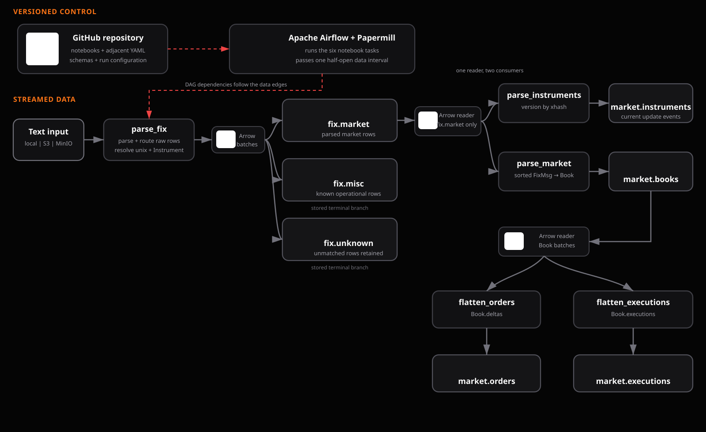
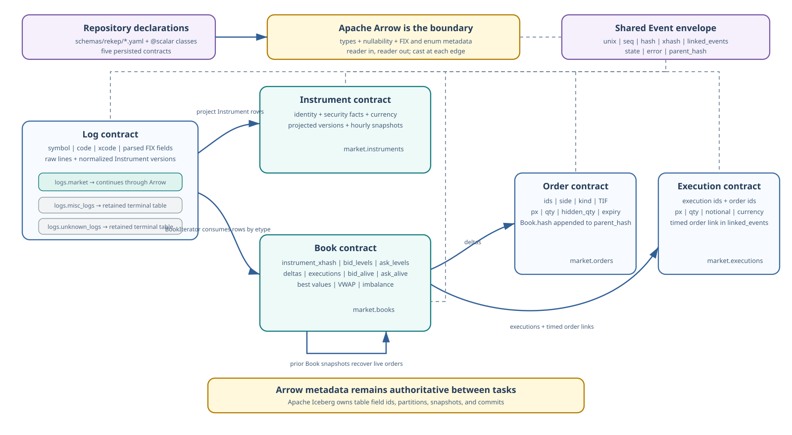

# End-to-end run

Measured on 2026-08-23, this run executed the code cells from all six task
notebooks against a fresh local Iceberg warehouse, then replayed the same
interval. It is a correctness fixture; the larger focused measurements remain
on [Benchmarks](../../storage/benchmarks.md).



Only `fix.market` continues into market readers. `fix.misc` and
`fix.unknown` are terminal routes; a route with no rows need not create a table.

## Run the workflow locally

From the repository root, run the task documents in dependency order. The
first command uses the checked-in sample log; replace its `source` override for
your own capture.

```bash
uv run --project python --with papermill rekep task run \
  tasks/parse_messages/parse_messages.yml \
  --parameter source=python/tests/data/app_messages_sample.txt \
  --output parse_messages.executed.ipynb

uv run --project python --with papermill rekep task run \
  tasks/parse_fix/parse_fix.yml \
  --output parse_fix.executed.ipynb

uv run --project python --with papermill rekep task run \
  tasks/flatten_instruments/flatten_instruments.yml \
  --output flatten_instruments.executed.ipynb

uv run --project python --with papermill rekep task run \
  tasks/parse_market/parse_market.yml \
  --output parse_market.executed.ipynb

uv run --project python --with papermill rekep task run \
  tasks/flatten_orders/flatten_orders.yml \
  --output flatten_orders.executed.ipynb

uv run --project python --with papermill rekep task run \
  tasks/flatten_executions/flatten_executions.yml \
  --output flatten_executions.executed.ipynb
```

Each command preserves its executed notebook for inspection. The task YAML
selects the catalog, branch, tables, and commit sizes; repeatable
`--parameter NAME=VALUE` options override those values for one run.

## Run context

| Context | Value |
| --- | --- |
| Source | 13 generated text rows |
| Interval | `[2026-08-21T10:30:00Z, 2026-08-21T10:30:04Z)` |
| Code | Local working tree based on `7a471ce` |
| Runtime | Python 3.12.13, PyArrow 25.0.1, PyIceberg 0.11.1 |
| Host | Windows 11, AMD Ryzen 5 150, 24 GB RAM |
| Storage | SQLite catalog and local file warehouse |
| Test bounds | 4-row commits, 1 s snapshots, 1.5 s live-order age |

The small commit size deliberately crossed storage boundaries. Cold times
therefore include registry loading, catalog setup, table creation, and several
Iceberg commits; they are not throughput claims.

## Generated input

The capture combined four incremental depth/trade messages, one Security
Definition, three orders, two Execution Reports, one two-sided quote, one
known heartbeat, and one unmatched transport line. Selected message bodies:

```text
8=FIX.4.4|35=X|55=BTC-USD|268=2|279=0|269=0|270=100.0|271=5|...|
8=FIX.4.4|35=d|55=AAPL|48=US0378331005|22=4|207=XNAS|15=USD|969=0.01|561=1|107=Apple Inc.|
8=FIX.4.4|35=D|55=AAPL|11=BAD-AAPL|54=1|38=10|40=2|...|
heartbeat without structured protocol
opaque transport payload :: 7f3a9c
```

The missing-price order is intentional. It proves that a rejected event
remains auditable and carries its reason.

## Stage results

| Notebook | First result | Cold wall time | Replay writes |
| --- | --- | ---: | ---: |
| `parse_fix` | 13 raw read; 13 raw + 16 Instrument rows written | 4.706 s | 0 |
| `flatten_instruments` | 16 versions, 16 written | 1.182 s | 0 |
| `parse_market` | 17 books, 17 written | 2.396 s | 0 |
| `flatten_orders` | 21 projected, 15 written | 1.539 s | 0 |
| `flatten_executions` | 3 projected, 3 written | 0.800 s | 0 |
| **Total** |  | **10.623 s** | **0** |

For the requested `[10:30:00, 10:30:04)` output, `parse_market` planned the
hour-aligned superset `[09:00:00, 11:15:00)`: floor the start hour and subtract
one hour, then ceil the end hour and add 15 minutes. The Iceberg predicates
remain half-open and the output filter restores the exact requested interval.

The replay took 4.520 s. It preserved every row count and sorted hash set;
every notebook wrote zero. `parse_fix` reported 29 skips: 13 raw rows and 16
deterministically reconstructed Instrument lifecycle rows.

| Iceberg table | Rows | Iceberg snapshots |
| --- | ---: | ---: |
| `fix.market` | 27 | 7 |
| `fix.misc` | 2 | 1 |
| `fix.unknown` | 0 | 0 |
| `market.instruments` | 16 | 4 |
| `market.books` | 17 | 5 |
| `market.orders` | 15 | 4 |
| `market.executions` | 3 | 1 |

Routing conserved all input: 11 FIX market rows and two `MISC` rows without a
MsgType. `parse_fix` added 16 normalized Instrument versions to the same market
table, including hourly snapshots; only this table continued.

| Contract | State counts | Errors |
| --- | --- | ---: |
| Instrument | `OPEN=16` | 0 |
| Book | `OPEN=12`, `CLOSED=5` | carried in nested events |
| Order | `PENDING_NEW=2`, `NEW=2`, `OPEN=3`, `PARTIALLY_FILLED=1`, `FILLED=1`, `CANCELLED=1`, `INTERNAL_EXPIRED=4`, `INTERNAL_REJECTED=1` | 5 |
| Execution | `FILLED=3` | 0 |

The intentional rejection rate was 1/15 order rows (6.67%), or 1/18 flattened
order and execution rows (5.56%). The four internal expiries are expected from
the short 1.5 s test bound; the normal workflow default is one day.

## Sampled output

### Logs

| Category and time | Classification | Identity | Selected parsed data |
| --- | --- | --- | --- |
| market, `10:30:00.100Z` | `FIX / BOOK / X` | `BTC-USD` | repeated depth tags retained in wire order |
| market, `10:30:00.350Z` | `FIX / INSTRUMENT / d` | `US0378331005` | `969=.01`, `561=1`, `107=Apple Inc.` |
| market, `10:30:00.350Z` | `REKEP / INSTRUMENT / d` | `AAPL` | normalized lifecycle envelope and ordered registry fields |
| misc, `10:30:00.800Z` | `MISC` | `HealthMonitor` | heartbeat retained verbatim |
| misc, `10:30:00.900Z` | `MISC` | `ExperimentalAdapter` | opaque payload retained verbatim |

The raw Security Definition remains lossless. `parse_fix` infers 4.4 from its
`BeginString`, prepares that registry once, versions the Instrument, and stores
the normalized result beside the raw line. `flatten_instruments` then performs
only the exact `FixMsg` to `Instrument` projection.

### Instruments

| Symbol | Venue / currency | Enrichment | `xhash` |
| --- | --- | --- | --- |
| `BTC-USD` | `XCME / USD` | synthetic market identity | `7683678321830537938` |
| `AAPL` | `XNAS / USD` | ISIN `US0378331005`, tick `0.01`, lot `1`, label `Apple Inc.` | `-9052458260103799025` |
| `MSFT` | `XNAS / USD` | synthetic market identity | `-1664556628408186290` |

### Books

| Event time | Instrument | State | Best bid / ask |
| --- | --- | --- | --- |
| `10:30:00.010Z` | `BTC-USD` | `OPEN` | `100 x 5` / `100.5 x 7` |
| `10:30:00.400Z` | `AAPL` | `CLOSED` | none / none; rejected delta retained |
| `10:30:00.600Z` | `MSFT` | `OPEN` | none / `200 x 8` |

The BTC book relates both source order lifecycles with their event times in
`linked_events` and both source versions in `parent_hash`. Bid and ask levels
remain best-price ordered.

### Orders

| Order | State | Side, price, quantity | Lineage / reason |
| --- | --- | --- | --- |
| `BAD-AAPL` | `INTERNAL_REJECTED` | buy limit, null, `10` | parent Book version; `rejected for book: required price is missing or non-finite` |
| `CA1 / OA1` | `INTERNAL_EXPIRED` | buy limit, `150`, `0` | preceding observation time retained; live-age expiry |
| `CM1 / OM1` | `FILLED` | sell limit, `200`, `0` | lifecycle closed by execution report |

### Executions

| Execution | State | Side, price, quantity | Order link |
| --- | --- | --- | --- |
| BTC depth trade | `FILLED` | trade, `100.5`, `3` | source depth lifecycle |
| `EA1` | `FILLED` | buy, `150`, `4` | `OA1 / CA1`, timed order link |
| `EM1` | `FILLED` | sell, `200`, `8` | `OM1 / CM1`, timed order link |

Flattening appends the carrying `Book.hash` to each event's `parent_hash`;
`linked_events` retains the event time and lifecycle linkage between executions
and orders.

## Schema lineage



| Contract | Primary key | Partitions | Nested payloads |
| --- | --- | --- | --- |
| `Message` | `unix, hash` | `unix_partition` | generic ordered `kwargs`, event lineage and `codes` |
| `FixMsg` | `unix, hash` | `unix_partition` | `kwargs`, `Parties`, `TrdRegTimestamps`, `SideTrdRegTS`, `SecurityAltID`, `Legs`, `codes` |
| `Instrument` | `unix, hash` | `unix_partition` | `alt_ids`, `legs`, `codes` |
| `Book` | `unix, hash` | `unix_partition` | levels, deltas, executions, live snapshot orders, `codes` |
| `Order` | `unix, hash` | `unix_partition` | standard event lineage, `codes` and metadata |
| `Execution` | `unix, hash` | `unix_partition` | standard event lineage, `codes` and metadata |

The hour is the only partition. An instrument identity is a 64-bit hash, so
bucketing it multiplies the files inside each hour without pruning a read the
hour and the sort order do not already prune.

The YAML contracts under `schemas/rekep/` are the portable source. Arrow owns
types and metadata between stages, Iceberg owns table ids and snapshots, and
the [binary identity contract](../../contracts/identity.md) keeps hashes cross-language stable.
