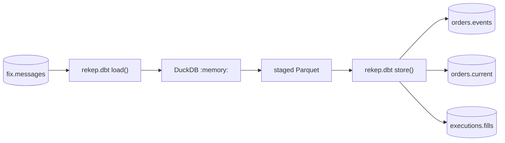

# build_dbt

`build_dbt` runs the dbt project under [`data/dbt`](#the-project) and commits
each of its products back into Iceberg. dbt owns the SQL; every read, schema
and commit stays on the same `IcebergDataset` the two ingestion tasks write
through.

## Task document

```json
{
  "name": "build_dbt",
  "application": "build_dbt.py",
  "parameters": {
    "project": "data/dbt",
    "profiles": null,
    "target": null,
    "select": null,
    "catalog": null,
    "log_level": "INFO"
  }
}
```

| parameter | default | meaning |
| --- | --- | --- |
| `project` | `data/dbt` | the dbt project directory, relative to the working directory |
| `profiles` | `null` | where `profiles.yml` is; `null` is the project itself |
| `target` | `null` | the profile target to build; `null` is the profile's own |
| `select` | `null` | dbt selection, one string or a list; `null` builds everything |
| `catalog` | `null` | the catalog to read and commit through; `null` is the profile's own |
| `log_level` | `INFO` | the level this package's records are written at |

`catalog` is the same mapping every other task document spells. The task hands
it to dbt as `REKEP_DBT_CATALOG`, which the plugin reads ahead of the profile,
so a deployment configures dbt the way it configures every other task and the
checked-in project keeps its local default.

## How a model reaches Iceberg



dbt-duckdb reaches a store that is not DuckDB through a plugin, and this
repository's plugin is `rekep.dbt`. A source is one Iceberg read, projected and
filtered in scan planning and handed to DuckDB as one Arrow table. A model is
built as a DuckDB table, staged as one Parquet file, and read back as an Arrow
stream that `IcebergDataset` commits — so a commit holds a batch of a model at
a time and not the whole of it.

The database is `:memory:`. DuckDB is the compute and holds nothing between
runs: every source is read out of Iceberg at the start of a build and every
product is committed back at the end of one, so a build leaves no second copy
of the warehouse behind.

`iceberg` is the materialization this project declares, in
`data/dbt/macros/iceberg.sql`. It is not dbt-duckdb's own `external`: that one
writes a row of nulls for an empty model so the file always has a schema, and a
row of nulls is not a row this would commit.

## Products

| model | table | grain | key | mode |
| --- | --- | --- | --- | --- |
| `orders_events` | `orders.events` | one normalized order event | `eventkey` | append |
| `orders_current` | `orders.current` | latest settled state per order | `orderkey` | overwrite |
| `executions_fills` | `executions.fills` | one economic execution occurrence | `executionkey` | append |

An identity the parser already named is reused rather than computed again:
`orderkey` is `msgphash`, the sixteen bytes over the event chain `code`, which
scopes a client order id by the session pair it was seen on. A digest is
written only where SQL has to name something the parser had no word for —
`eventkey` over the source position, `executionkey` over the chain and the
venue execution id — and those are MD5, which is what DuckDB spells.

- `orders.events` takes a message that carries an order identity and an order
  lifecycle fact. A message carrying one and not the other stays in
  `fix.messages` rather than being assigned a guessed order, and an unknown
  chain — an empty `code` — is not an order.
- `orders.current` is folded from `orders.events` alone, never from FIX. The
  winning event is the latest `eventtime`, then the latest source position, so
  a late event changes the row only through that ordering and the same events
  in any arrival order fold to the same row.
- `executions.fills` takes a message that states both a quantity and a price
  for what it executed. A status-only report states neither and does not become
  a zero fill. A bridge relays one execution into every chain it belongs to and
  logs the copy it received beside the copy it sent, so the occurrence is
  scoped by its chain and the earliest source position wins.

## What a model declares

A model's own configuration is its Iceberg declaration; everything else is the
Arrow schema DuckDB staged, so a column a model stops selecting stops being
written.

| key | meaning |
| --- | --- |
| `table` | the Iceberg table to commit to; `{schema}.{identifier}` by default |
| `mode` | `append` inserts and skips existing keys, `overwrite` replaces matching keys and inserts the rest |
| `primary_key` | the identifier columns; each becomes non-null, and the merge is on them |
| `not_null` | further columns a row must carry |
| `partition_by` | column to Iceberg transform, such as `{'timepartition': 'day'}` |
| `sort_by` | columns each committed chunk is sorted by |
| `arrow_types` | storage types SQL cannot spell, such as `fixed_size_binary[16]` |
| `merge_schema` | add columns a model grew to the table before its rows land; `true` by default |
| `branch` | the Iceberg branch to commit on |
| `batch_row_size` | rows one staged batch carries back out of the file |

It is `arrow_types` and not `column_types` because dbt owns that name for a
seed's own casts. A column named in any of these that the model does not select
fails the commit rather than being ignored.

`merge_schema` adds a column a model grew, which is the one shape change an
Iceberg table takes in place. A key, a partition, a sort order or a narrowed
nullability is fixed when the table is created, so changing one of those in a
model changes the next table created from it and not the one already there:
drop the table and let the next build make it again.

## What a source declares

```yaml
sources:
  - name: fix
    schema: fix
    meta:
      plugin: rekep
    tables:
      - name: messages
        meta:
          table: fix.messages
          columns: [sourceurl, rownum, msghash, code]
```

| key | meaning |
| --- | --- |
| `plugin` | `rekep`, which is what makes the source an Iceberg read |
| `table` | the Iceberg table; `{schema}.{identifier}` by default |
| `columns` | the projection pushed into scan planning |
| `row_filter` | a PyIceberg filter expression, pushed down with it |
| `snapshot_id`, `branch` | the state to read |
| `limit` | a row cap |

DuckDB takes a table, so a source is read into memory: a large one is narrowed
by `columns`, `row_filter` and `limit` rather than read whole. The shipped
project projects the 38 columns its products read out of the 128 a FIX row
carries.

## Run it

```bash
uv run --project python rekep task run tasks/build_dbt/build_dbt.json
```

Relative locations — the project, the staging directory, the local catalog and
warehouse — are spelled from the repository root, which is where a run starts.
The task prints one result and nothing else: dbt's own console is silent and
its events are relayed into this package's records, so `stdout` carries the
result a route reads.

dbt on its own reads the same project and the same profile:

```bash
uv run --project python dbt build --project-dir data/dbt --profiles-dir data/dbt
```

Narrow a run the way dbt does:

```bash
uv run --project python rekep task run tasks/build_dbt/build_dbt.json \
  --parameter 'select=["orders_events+"]'
```

Airflow runs the same document. The [`rekep_products`](../airflow.md#the-products-dag)
DAG is scheduled on the `fix.messages` Asset the ingestion DAG publishes, so a
build starts when `parse_fix` writes.

## What the result says

```json
{
  "task": "build_dbt",
  "read": 40,
  "written": 75,
  "skipped": 0,
  "sources": {"project": "data/dbt"},
  "targets": {
    "orders_events": "orders.events",
    "orders_current": "orders.current",
    "executions_fills": "executions.fills"
  },
  "window": {"start": null, "end": null},
  "elapsed_ms": 2417,
  "models": 4,
  "tests": 36,
  "warned": [],
  "rows": {"orders.events": 62, "orders.current": 6, "executions.fills": 7}
}
```

A build's unit of work is a node, so `read` is the nodes dbt ran — models,
tests and all — and `skipped` is the nodes it skipped. `written` is rows: what
the plugin committed, and `rows` says which table each went to. An append
states the rows it added, so a replay of the same capture states none; an
overwrite states the rows it carried, because replacing a key that already held
those values changes nothing to count.

A failing node fails the task, and the record names it. Every model's own
tests run in the same build: `dbt build` runs a model and then the tests
attached to it, so a product that broke its key is reported by the run that
built it. A test the project declares as a warning is a quality signal rather
than a failure, and `warned` names the ones that fired. Two are declared that
way: `every_fill_belongs_to_a_known_order`, because a capture that starts
mid-stream holds executions whose order was accepted before its first line, and
the accepted values of `state`, because the normalized vocabulary is the
codec's and this repository cannot enumerate it — a state the products have no
reading for is worth reporting and is not a reason to stop. What the folds do
read is pinned against the codec itself in `python/tests/test_dbt.py`.

## The project

```text
data/dbt/
  dbt_project.yml     the project, its paths and its model defaults
  profiles.yml        DuckDB in memory, and the catalog the plugin opens
  macros/
    iceberg.sql       the materialization that commits a model
    rekep.sql         the digest and the normalized states more than one model reads
  models/
    sources.yml       the two published tables, and the projection each is read under
    staging/          one narrowing of `fix.messages`, never published
    orders/           orders.events and orders.current
    executions/       executions.fills
  tests/              the checks that span two products
```

Nothing here needs `dbt deps`: there is no package file, and every macro a
model reads is in the checkout. A build writes `data/dbt/target/` — its
compiled project, its run artifacts and the Parquet each model was staged as —
and `data/dbt/logs/`; neither is tracked. `DBT_TARGET_PATH` and `DBT_LOG_PATH`
move them, and the staging follows the target path, so a worker whose checkout
is read-only writes nothing into it. That is what the Airflow operator's
`environment` argument is for.

## What these products are not yet

The [roadmap](../../roadmap/index.md) specifies these three products as native
`Field` declarations with a replay test and a source-coverage report. These are
the SQL projection of that specification and state where they differ:

| planned | here | why |
| --- | --- | --- |
| `side`, `state`, `exectype` as fixed-width bytes | the normalized strings `fix.messages` carries | a storage width is a declaration, and this layer does not add one to a value it passes through |
| `parties`, `regulatorytimestamps` | not carried | a repeating group is in the arrival record, and a list of structs through DuckDB is a conversion this seam does not own |
| `originalexecutionkey`, `liquidity` | not carried | `ExecRefID` and `LastLiquidityInd` are not in the fixed projection yet |
| rejected-derivation counters | not carried | what a product left behind is still countable in `fix.messages`, but nothing publishes it |

`orders.current` is unpartitioned: one row per order is the whole table, and a
partition on a column that moves would rewrite a file every time an order
ticks.
