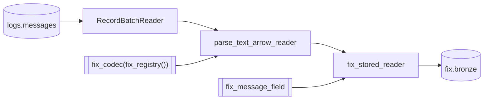

# parse_fix_bronze

`parse_fix_bronze` streams one window of the stored raw rows through the FIX
codec's parse and publishes the parsed rows, walked by nothing yet, to
`fix.bronze`.

## Task document

```json
{
  "name": "parse_fix_bronze",
  "application": "parse_fix_bronze.py",
  "parameters": {
    "messages": "logs.messages",
    "registry": null,
    "start": null,
    "end": null,
    "catalog": {
      "name": "rekep",
      "properties": {
        "type": "sql",
        "uri": "sqlite:///data/catalog.db",
        "warehouse": "data/warehouse"
      }
    }
  }
}
```

| parameter | default | meaning |
| --- | --- | --- |
| `messages` | `logs.messages` | the stored raw rows to read; named for what it reads, so the Airflow DAG's one parameter mapping cannot hand this stage `parse_fix_silver`'s source |
| `registry` | `null` | use the 7,771-definition bundled dictionary; an explicit path/URI overrides it |
| `start`, `end` | `null` | the window of `messages` to read, over its capture clock; `null` is the last day, as [`parse_messages`](parse-messages.md#the-window) reads it |
| `catalog` | local SQL | same catalog and warehouse that hold `logs.messages` |

A dictionary is not a parameter: the registry is one namespace, so a field is
resolved by tag, name or path and never by the dictionary that contributed it.
A version is not a parameter either: what a message was read at is what its own
`beginstring` said. `fix_codec` takes seven pins -- `default_sending_time`,
`separator`, `payload_column`, `capture_names`, `null_values`, `direction` and
`batch_byte_size` -- and refuses by name any keyword that is not one of them, so
a `version=` that no longer means anything fails the call rather than being
carried silently into the parse.

## The parse, and nothing after it

The capture pipeline is two native stages over one codec, in this order and
no other, and this task is the first:

```text
parse -> fix.bronze, lifecycle -> fix.silver
```

The parse reads every frame a line carried and settles it where it is read: a
parsed message already carries what it implied about itself -- its typed facts
lifted, its deprecated fields restated to their latest spellings, the
dictionary's own derivations run, the identifiers its message component
declares filled, its side's lane filled, and its instant and identity settled.
There is no enriching stage between the parse and the walk. `fix_parse_lines`
is the line door, for a reader holding lines; `fix_parse_arrow_reader` is the
batch door, for a stored capture's batches, and it is what this task takes
because it holds a table. The native core requires the two to agree row for
row.

A bronze row is that and nothing more. What a message implied about the message
*before* it is the walk's to fill, and nothing has walked yet, so `seqnum`,
`prevuuid` and `prevunix` are null and `parentuuids` is empty on every row
this task writes; a message read back off a bronze row stands at step zero of
a chain no walk has named. What the parse did settle is on every row: `state`
is the state the message reached, read where it states one and settled where
it states none, and `creaunix` is the row's own instant, the one `currunix`
carries, before any fold. A bronze row is dated by the `SendingTime(52)` the message
stated, else it sits at the codec's pin -- see
[the pin](#a-key-is-scoped-to-its-partition) below. The walk is
[`parse_fix_silver`](parse-fix-silver.md), and it reads this table.

## Read, parse, narrow, write



The codec is the whole parse surface: the dictionary and the instant an undated
message takes are pinned on it once, and each stage after it is a call rather
than another pin. No capture order is among them. This door reads stored rows,
where a column named after a field fills that field *by name*; a capture
position is what the line door resolves, and pinning one here would be a
reading of a header this task never sees -- stale the moment the capture is read
under a header of its own, which
[`parse_messages`](parse-messages.md#a-bridge-that-writes-the-header-its-own-way)
takes as a parameter. `body` is the payload column the codec reads by default,
text or bytes alike. Source columns lead the result unless a fixed field owns
the same folded name.

The published field is read from the dictionary alone, before the first batch.
`fix_schema(registry, "fixmsg")` is the 117-column row the dictionary
publishes and `fix_schema_carrying` is the supported way to put a capture's
own columns in front of it, so `fix_parse_field(codec, carrier)` is the 125
columns the codec writes and `fix_message_field(codec, carrier)` is that row as
a table stores it, 123 columns -- `iceberg_fix_field` narrows the second from
the first, and declares the key, the partition and the sort order on it once.
So an empty window creates the same table a full one does, and the published
contract is the field the task actually writes. Both FIX tables are declared
with this one field.

```python
from rekep.fix import (
    fix_codec,
    fix_message_field,
    fix_parse_arrow_reader,
    fix_registry,
    fix_stored_reader,
)
from rekep.iceberg import IcebergCatalog, window_filter
from rekep.text import Message
from rekep.times import window_of

messages, registry = "logs.messages", None
catalog = {
    "name": "rekep",
    "properties": {
        "type": "sql",
        "uri": "sqlite:///data/catalog.db",
        "warehouse": "data/warehouse",
    },
}

window = window_of("2026-08-14", "2026-08-14")
carrier = Message.into_field()
codec = fix_codec(fix_registry(registry))
field = fix_message_field(codec, carrier)

store = IcebergCatalog.from_dict(catalog)
lines = store.dataset(messages, field=carrier).read_arrow_reader(
    carrier, row_filter=window_filter("timestamp", window)
)
parsed = fix_parse_arrow_reader(codec, lines)
applied = fix_stored_reader(parsed, field)
written = store.dataset("fix.bronze", field=field, merge_schema=True).overwrite_arrow_reader(
    applied, field, merge_by=True
)
```

`window_filter` is the stored half of the window rule: the rows whose capture
clock falls in `[start, end)` and the rows carrying none, which belong to every
window. It is read off `timestamp` rather than off `timepartition` -- a file
holds one hour of that clock, so its own stored bounds prune the scan without
the predicate naming the partition column, which it must not: a capture line
with no clock lands in the null partition and PyIceberg 0.12 cannot plan a
comparison against one.

`fix_parse_arrow_reader` is the codec's `parse_text_arrow_reader`, and its
rows land in the parse's own shape: the carrier's columns first, the
dictionary's after, `body` and `bodyhash` still among them. Narrowing that
shape to what a table stores belongs to the storage boundary, which is
`fix_stored_reader`: the content codes read as the signed integers Iceberg
stores, then `field.apply_arrow_reader(safe=False, nullability="strict")` in
its native order, which drops the two text columns because the field does not
declare them. `parse_fix_silver` crosses the same boundary on its way out.

See [Decode rules](../../fix/decode.md) for numeric FIX, ULLINK, packed groups,
configuration JSON, FIXML, registry translation, source-column fill, and
content-level failures.

## A row is an event, not a line

A source row is read for every message it carries. One frame is one row, a
line carrying two frames is two, and a bulk configuration answer is one row
per configuration it names. A line that carries no message at all publishes no
row, which is why `read` counts lines and the result's own `messages` key
counts what the codec answered.

A message is then logged again at every hop it passes, and each of those
arrivals is a restatement of one event rather than a second one: they settle on
one `curruuid`, which is a UUIDv7 over the instant the event settled on and the
code of its content. The bundled capture makes the gap visible -- its
`e7254b12:9f0316669a` chain is stated 37 times and those statements are 23
rows here, and over the whole capture 141 stored lines carry 79 messages that
are 53 events. The walk moves two of those 23 into another chain, so the
counts this chain answers after it are the ones
[`parse_fix_silver`](parse-fix-silver.md) states. A day's run over it reads 141, answers 79, writes 53 and skips 26,
and the 26 are restatements of an identity already landed, counted against the
messages rather than the lines.

That is why `fix.bronze` is keyed on `curruuid` alone. Keying on where a line
was read from is what made one message three rows.

`logs.messages` is keyed on `bodyhash`, the digest of the exact line bytes, so
identical lines are one row whatever session carried them. The two digests
answer two questions and neither stands in for the other: `bodyhash` is of the
bytes, and the row's own `currhashcode` is of the settled event -- its facts,
its text, its metadata and its entry tree -- so two different lines stating the
same message share a `currhashcode` and not a `bodyhash`. Neither the bytes nor
their digest is stored here; a row names the line it was read from with
`sourceurl`, `rownum` and, exactly, `srcuuids`: the stored line's own
`curruuid`, which the read stated and the parse copied. That is provenance,
never lineage, and no walk moves it.

## A key is scoped to its partition

`fix.bronze` is laid out by the hour of `currunix`, the instant the event
happened at, and a key is scoped to the partition it lands in. Every
restatement of one event carries that same instant, so they meet in one
partition and the write folds them.

The parse dates a message by the `SendingTime(52)` it stated and by nothing
else. A message stating none takes the codec's `default_sending_time`, pinned
to `UNDATED`, the epoch instant that means no clock was read: one instant, so
one hour, so one partition, `currunix_hour` 0, where every such row of the
table meets. Pinned rather than dated by the instant the parse ran, because an
identity computed from that clock is a different one on every read, and a
replay would insert every such message again. Over the bundled capture 37 of
the 53 bronze rows sit there, and the walk is what dates them, by the
`TransactTime(60)` they state, into the hour they happened in.

A capture's own clock is context and stamps nothing, in either door. The bridge
spells a line's clock the way a log spells one and not the way `SendingTime` is
spelled, and the same message logged at three hops carries three of them, so a
line clock that dated a message would make each hop a different event. It stays
on the row as `timestamp`, which is what it is.

What that leaves is an event whose `currunix` *moves* between two runs -- a
dictionary that reads its clock differently, say. The second run lands it in a
second hour, where the first copy's key is not in scope and is not replaced, so
the event is in the table twice. A dictionary change that moves an instant is
therefore a rewrite of the windows it touches, not an incremental run.

## Schema and precision

The bundled dictionary yields the [123 columns](../../products/fix-message.md)
both FIX tables share. Venue clocks may parse at nanosecond precision, while
Iceberg v2 stores microseconds. Every top-level and nested timestamp is
narrowed once at the storage boundary. Original text remains in `fixentries`,
so the wire value is still auditable.

## Registry override

An explicit registry is useful for validating a venue extension:

```bash
uv run --project python rekep task run \
  tasks/parse_fix_bronze/parse_fix_bronze.json \
  --parameter 'registry="file:/srv/rekep/fix-candidate"'
```

The location must contain specification fields; every registry holds the
crate's own 22 columns and the two standard clocks from construction. The task
refuses an empty external dictionary before creating a narrow table.
`parse_fix_silver` takes the same parameter and must be run under the same
dictionary, because the walk reads each row back as the message that wrote it.

A dictionary narrow enough to type no message type at all is a different
matter, and not a refusal: the identity, the instant and the chain are the
crate's own block, so a frame is a message whether or not a dictionary can
name its type, and such a run lands every event under the dictionary's own
shape -- no `msgtype` column, because nothing defined it. The walk is where
that dictionary falls short: a chain is read off what a message is, and
`parse_fix_silver` under it reads every bronze row of the window and places
none of them.

## Row behavior

- Prose and unreadable content produce no row; a payload that was there and
  would not parse produces one row holding an empty message.
- A pair no dictionary explains is an entry of tag 0 inside `fixentries`, so
  one arrival record holds everything that arrived. The row ends `metadata`,
  `nofixentries`, `fixentries`: the arrival record is a group named after
  itself, under the counter that counts it.
- A conversion failure leaves the typed column null and preserves its arrival.
- The source message wins over a same-field source-column fill: `sourceurl`,
  `msgsessionid`, `msgctxid` and `msgseqnum` are the row's own columns and the
  capture fills them; `pluginid` rides in front under the capture's own name,
  because the row's column for the plugin is `msgpluginid`.
- The writer replaces on `curruuid` and can create a missing table: a replay of
  a window lands the same events once, and a dictionary change lands their new
  reading over the old.
- An identity is stored as `fixed_size_binary[16]` and nothing else. Arrow
  sorts, compares and hashes those bytes and refuses the `arrow.uuid`
  extension over them, so a table keyed, ordered and merged on an identity
  needs the bytes a predicate can be lowered onto -- including the bounds a
  replace plans its stored files by. `iceberg_fix_field` drops the semantic
  extension name a URL, an ISIN, a MIC or a currency crosses Arrow under for
  the same reason.
- A content code -- `currhashcode`, `crosshashcode` -- is an unsigned 64-bit
  integer and Iceberg's only 64-bit integer is signed. The same eight bytes
  read as signed are the code, so the column says `int64` and
  `fix_stored_reader` views rather than converts: half the codes read back
  negative and name the same rows.

## Sample rows

The sample is chain `e7254b12:9f03166699` of `python/tests/data/ulbridge.log`,
a partial fill and the fill that closed the order: ten lines in `rownum`
order, as `parse_fix_bronze` lands them in `fix.bronze`. An identity is shown
by its last eight hex digits behind a leading `…`, and the stored value is
sixteen bytes; a null is an empty cell.

--8<-- "docs/pipeline/tasks/samples/parse-fix-bronze.md"

Ten lines answer ten messages, one frame each, and the first table is what the
parse read off them and what it settled. `msgdirection` reads `R` on rows 6
and 35, the two frames the bridge received, and `S` on its own eight lines.
`ordstatus` is read where the message spells it -- `1` on row 6, off `39=1`,
and `partfilled` on rows 7, 8, 9, 10, 11, 15 and 22, where the bridge spells
the field as a word -- and settled where no message does: rows 35 and 36 read
`2`, filled, though line 35 states no status at all and line 36 spells
`ORDERSTATE=partfilled`, a key the dictionary does not read as
`OrdStatus(39)`. The two `execid` values are the order's two venue
executions. `lastqty` beside them is each execution's own, `21` and `57`,
while `cumqty` and `leavesqty` are the order's running totals: `340` and
`260` on the eight rows from 6 to 22, `600` and `0` on rows 35 and 36.

`sendingtime` is set on the two received frames alone, because the bridge's
key=value form carries no `SendingTime(52)`, and `currunix` follows it:
`2026-08-14 12:46:39.761` on row 6, `.762` on row 35, and the pin
`1970-01-01 00:00:00.000` on the other eight. A `curruuid`'s first 48 bits
are that instant, so row 6's begins `01a0004f6a91…`, row 35's
`01a0004f6a92…`, and the eight pinned ones begin with zeros.

`transacttime` is the `TransactTime(60)` each message stated, and the parse
reads it for nothing. Row 6 states the tag to the microsecond,
`12:46:39.743016`, the eight bridge lines state `12:46:39.743`, and row 35
states a bare date, so its column reads `2026-08-14 00:00:00.000`. What that
bare date costs a product is on [`build_dbt`](build-dbt.md#sample-rows).

The second table is the event columns, and the four it leaves empty are the
walk's, on [`parse_fix_silver`](parse-fix-silver.md#sample-rows). `crosscode`
is the bridge's `msgsessionid:msgctxid` as parsed, so the fill is a chain of
its own here: `e7254b12:9f03166699` on the eight rows from 6 to 22, and
`e7254b12:9f0316669a` on rows 35 and 36. `srcuuids` names the stored line
each message was parsed out of, row 6 naming `…7eeab44c`, the identity
[`parse_messages`](parse-messages.md#sample-rows) shows against that line.

`tools/pipeline_samples.py` regenerates the file from a run over the fixture,
and the integration suite checks it with `--check`.

## Run

```bash
uv run --project python rekep task run \
  tasks/parse_messages/parse_messages.json \
  --parameter 'filesystem="file:/srv/captures/2026-08-14"' \
  --parameter 'start="2026-08-14"' --parameter 'end="2026-08-14"'
uv run --project python rekep task run \
  tasks/parse_fix_bronze/parse_fix_bronze.json \
  --parameter 'start="2026-08-14"' --parameter 'end="2026-08-14"'
uv run --project python rekep task run \
  tasks/parse_fix_silver/parse_fix_silver.json \
  --parameter 'start="2026-08-14"' --parameter 'end="2026-08-14"'
```

Run `parse_messages` first, over the same window: `parse_fix_bronze` reads the
stored raw product, never source files, and reads the rows whose capture clock
falls in `[start, end)` -- the last day up to now when the document names
neither bound, which is why a run over the sample capture names its day. Run
[`parse_fix_silver`](parse-fix-silver.md#run) after it, over the same window
again. A `logs.messages` that is not there yet reads as zero rows and
succeeds, so a first window against a fresh catalog is a run rather than a
failure -- it is an empty capture that publishes nothing, not a missing
dependency the task can detect. An invalid registry, an incompatible existing
target schema, or a failed Iceberg commit fails the task.
