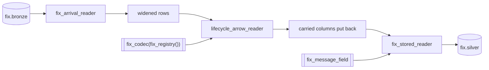

# parse_fix_silver

`parse_fix_silver` reads one window of `fix.bronze` back as the messages that
wrote it, walks them as the chains they belong to, and publishes the walked
rows to `fix.silver`.

## Task document

```json
{
  "name": "parse_fix_silver",
  "application": "parse_fix_silver.py",
  "parameters": {
    "bronze": "fix.bronze",
    "registry": null,
    "start": null,
    "end": null,
    "catalog": {
      "name": "rekep",
      "properties": {
        "type": "sql",
        "uri": "sqlite:///data/catalog.db",
        "warehouse": "data/warehouse"
      }
    }
  }
}
```

| parameter | default | meaning |
| --- | --- | --- |
| `bronze` | `fix.bronze` | the parsed rows to read; named for what it reads, so the Airflow DAG's one parameter mapping cannot hand this stage `parse_fix_bronze`'s source |
| `registry` | `null` | the dictionary `parse_fix_bronze` parsed under: the 7,771-definition bundled one, or the path/URI that overrode it there |
| `start`, `end` | `null` | the window of `bronze` to read, over the event clock; `null` is the last day, as [`parse_messages`](parse-messages.md#the-window) reads it |
| `catalog` | local SQL | same catalog and warehouse that hold `fix.bronze` |

## Walk the chains

The second of the two native stages one codec exposes, over the first one's
table, in this order and no other:

```text
parse -> fix.bronze, lifecycle -> fix.silver
```

The walk reads each bronze row back as the message that wrote it and reads
those messages as the chains they belong to. A parse fills what a message
implied about itself; only the walk fills what it implied about the message
before it: the `prevuuid` it follows and the `prevunix` that one happened at,
the `seqnum` it stands at, the `parentuuids` it descends from, and the
`creaunix`, `expirunix` and `state` its chain folded forward. It also dates
what the parse could not. The parse dates a message by the `SendingTime(52)`
it stated and by nothing else; the walk dates the rest by the
`TransactTime(60)` they state, which re-settles their identity -- see
[the pin](#an-undated-message-takes-the-pin-not-the-clock-of-the-run) below.
Those are the columns the walk exists to fill. It also restates what it read:
the cross reference a chain settled on -- `crosscode`, `crossuuid`,
`crosshashcode` -- where the parse's own differed, the `identifiers` and
`parties` groups, a value the dictionary spells differently from the capture,
and the arrival record it read them off. So a silver row is not its bronze
twin with columns filled, and its identity re-settles wherever the code or the
clock moved. Over the bundled capture 10 of the 53 identities are the same in
both tables, and the count is the same on both sides, because the walk
restates events and adds none.

Lineage holds on every silver row that follows one: its `prevuuid` and every
`parentuuids` entry are identities this table holds, the predecessor is among
the parents, a step never precedes what it follows, and `seqnum` is at least
1. Over the bundled capture 22 of the 53 rows follow a step, and the widest
chain is `e7254b12:9f0316669a`, 21 events walked to step 6. A chain is named
by the bridge's `msgsessionid:msgctxid` where the row header stated both, else
by the first identifier the message states, and `currunix, seqnum` within a
partition is the order the walk gave it.

A chain is read off a stream, and a stream has an order: the walk states each
message as the one after the live message it follows, so the order it is
handed decides which message that is. A table hands its rows back in its own
layout -- one partition after another, the pinned hour first -- which is no
order a venue described, so this task puts the window back in the order the
capture logged its lines, `sourceurl` then `rownum`, before the walk sees it:
`fix_arrival_reader`. Walked in that order, the stored rows answer the same
events under the same steps as the parse's own rows.

`fix_lifecycle_messages` is the line door of this stage and
`fix_lifecycle_arrow_reader` is the batch door, which is what this task takes
because it holds a table; the native core requires the two to agree. A row
read off a table arrives narrowed -- identities as sixteen bytes, instants at
the microsecond, content codes signed -- and is widened back to the
dictionary's own types before the walk reads it, so the door reads
`fix.bronze` and the parse's own output alike and answers the same rows over
either. `fix_row_messages` is that same widening for a reader that wants the
messages rather than the rows.

### The walk reads the row and never the capture beside it

The walk reads the fixed row alone. A capture's own column beside it -- a line
number, a line clock -- would be read as content the message never carried,
and a pair that differs between two logs of one message is enough to make one
event look like several: the table would hold every arrival rather than every
event. So `fix_lifecycle_arrow_reader` holds the carrier's columns back, walks
the dictionary's columns, and puts the carrier's back afterwards -- by name,
not by position, because the walk dates messages, sorts what it answers by
`currunix` and re-settles identities, so its rows do not come out in the order
they went in. What the walk never moves is `srcuuids`, the stored line each
row was parsed out of, and the carried columns are that line's facts: each
walked row takes them back from the line it names, and a row naming no line,
or two, is refused rather than matched to nothing. The walk reads every input
row before it answers the first, and closes each output batch on the codec's
`batch_byte_size` pin, 128 MiB unless the codec was given another, so a
window is held whole and answered sorted by the event clock.

### A duplicate is not a successor

One message logged at several hops is one identity, and the walk gives every
copy the same place, the same lineage and the same state: the chain grows by
nothing. Dropping a repeat from a stream is `FixDedup`'s job, not the walk's.
Over the stored tables the bronze key has already folded the copies, so the
walk here sees one row per identity; the walk over the parse's own 79 rows,
copies and all, answers the same 53 events under the same chain steps.

## Read, order, widen, walk, narrow, write



The codec is the one `parse_fix_bronze` pinned, because the walk reads each
row back as the message that wrote it and the dictionary is what wrote it.
The field is the same too, `fix_message_field(codec, carrier)`: a walked row
is the parsed row restated, so both tables are one field, one key, one
partition and one sort order, declared once.

```python
from rekep.fix import (
    fix_arrival_reader,
    fix_codec,
    fix_lifecycle_arrow_reader,
    fix_message_field,
    fix_registry,
    fix_stored_reader,
    fix_window_filter,
)
from rekep.iceberg import IcebergCatalog
from rekep.text import Message
from rekep.times import window_of

bronze, registry = "fix.bronze", None
catalog = {
    "name": "rekep",
    "properties": {
        "type": "sql",
        "uri": "sqlite:///data/catalog.db",
        "warehouse": "data/warehouse",
    },
}

window = window_of("2026-08-14", "2026-08-14")
codec = fix_codec(fix_registry(registry))
field = fix_message_field(codec, Message.into_field())

store = IcebergCatalog.from_dict(catalog)
rows = store.dataset(bronze, field=field).read_arrow_reader(
    field, row_filter=fix_window_filter(window)
)
walked = fix_lifecycle_arrow_reader(codec, fix_arrival_reader(rows))
applied = fix_stored_reader(walked, field)
written = store.dataset("fix.silver", field=field, merge_schema=True).overwrite_arrow_reader(
    applied, field, merge_by=True
)
```

The window is read off the event clock and not the capture's: a bronze row is
already an event, dated by what its message stated. `fix_window_filter` is
the rows whose `currunix` falls in `[start, end)`, and the rows the parse
could not date -- those at the `UNDATED` pin -- where the `transacttime` the
walk will date them by falls in the window, or where they state none and so
belong to every window until a walk can place them. The pin is one hour of one
partition, so the second reading opens that partition alone and prunes its
files by the transaction clock they hold. Over the bundled capture a day's run
reads all 53 bronze rows, the 37 pinned ones among them, and a window the
capture falls outside reads none.

`fix_stored_reader` is the storage boundary bronze crossed, crossed again on
the way out: the content codes read as the signed integers Iceberg stores,
then the field applied in its native order. The walk answers one row per row,
so `read` counts bronze rows and `skipped` is what the write left out, a copy
of an identity already landed. Over the bundled capture a day's run reads 53,
writes 53 and skips none.

## An undated message takes the pin, not the clock of the run

A message carrying no `SendingTime(52)` is one the parse could not date, and
`parse_fix_bronze` pins it at `UNDATED` rather than at the instant the parse
ran, so a replay of the same bytes answers the same identity. That pin is
where this task finds it. The walk dates it by the `TransactTime(60)` it
states and settles its identity again, on that instant: the row leaves the
pin's hour for the hour it happened in, under a new `curruuid`, and the write
lands it there. Over the bundled capture 37 of the 53 bronze rows sit at the
pin and no silver row does. The same walk over the same rows settles the same
identities however often it runs, which is what a table keyed on what the
walk answers needs.

A message stating neither clock has nothing for the walk to date it by: it
keeps the pin, and `fix_window_filter` reads it into every window's walk. A
capture's own clock is context and stamps nothing here either; it is put back
beside the walked row as `timestamp`, the clock of the same line it named in
bronze.

A key is scoped to its partition, on this table as on bronze: the walked rows
replace what `fix.silver` held under the same `curruuid` in the same hour. An
event the walk moves between two runs -- a dictionary that reads its clock
differently -- lands in a second hour where the first copy is not in scope, so
a dictionary change that moves an instant is a rewrite of the windows it
touches, in bronze first and then here.

## Registry override

`registry` is [the same parameter](parse-fix-bronze.md#registry-override)
`parse_fix_bronze` takes, and the two must agree: the walk reads a row back
under the dictionary that parsed it. The task refuses an empty external
dictionary before creating a narrow table, and a dictionary that types no
message type at all walks nothing: the table is created with the dictionary's
shape and no row lands.

## Row behavior

- The walk answers one row per row it read and adds none; what the write
  leaves out is a copy of an identity already landed.
- `prevuuid`, `prevunix`, `seqnum` and `parentuuids` are filled where a
  message follows one; a chain's first event follows nobody and its
  `prevuuid` stays null. `state`, `creaunix` and `expirunix` are what the
  chain folded forward, and `state` and `creaunix` are filled on every row.
- The writer replaces on `curruuid`, scoped to the hour of `currunix`, and can
  create a missing table: a replay of a window lands the same walked rows
  once.
- A stored row is narrowed the way a bronze row is -- an identity as sixteen
  bytes, an instant at the microsecond, a content code signed -- for the
  reasons [`parse_fix_bronze`](parse-fix-bronze.md#row-behavior) gives.
- Reading rows that carry a nested party group back prints `FIX column
  parties: kept what reads and nulled the rest` from the core; it is a notice,
  not a dropped row.

## Migrating a warehouse that holds the retired table

There is no compatibility shim for the one FIX table the two replaced. Create
the two tables with `rekep iceberg deploy`, give an existing `logs.messages`
its `curruuid` column through the dataset's `add_fields`, then replay each
window through `parse_messages`, `parse_fix_bronze` and then this task; the
[deploy page](../operations/deploy.md#migrating-a-warehouse-that-holds-the-retired-fix-table)
spells the steps. Drop the retired table afterwards. The product tables are
rebuilt by [`build_dbt`](build-dbt.md); drop them first, because the
products' `lastpx` and `avgpx` moved from double to decimal with the
dictionary.

```bash
uv run --project python rekep task run \
  tasks/parse_fix_silver/parse_fix_silver.json \
  --parameter 'bronze="fix.retired"' \
  --parameter 'start="2026-08-14"' --parameter 'end="2026-08-14"'
```

`bronze` names any table to walk, so a retired table can be read straight
into `fix.silver` -- but only where its rows carry the pinned core's
117-column row. A table the previous core wrote does not, so it is replayed
from `logs.messages` rather than walked.

## Run

```bash
uv run --project python rekep task run \
  tasks/parse_messages/parse_messages.json \
  --parameter 'filesystem="file:/srv/captures/2026-08-14"' \
  --parameter 'start="2026-08-14"' --parameter 'end="2026-08-14"'
uv run --project python rekep task run \
  tasks/parse_fix_bronze/parse_fix_bronze.json \
  --parameter 'start="2026-08-14"' --parameter 'end="2026-08-14"'
uv run --project python rekep task run \
  tasks/parse_fix_silver/parse_fix_silver.json \
  --parameter 'start="2026-08-14"' --parameter 'end="2026-08-14"'
```

Run [`parse_messages`](parse-messages.md#run) and then
[`parse_fix_bronze`](parse-fix-bronze.md#run) first, all three over the same
window: this task reads the stored parsed rows, never source files or raw
lines, and reads the bronze rows whose event falls in `[start, end)` -- the
last day up to now when the document names neither bound, which is why a run
over the sample capture names its day. A `fix.bronze` that is not there yet
reads as zero rows and succeeds, so a first window against a fresh catalog is
a run rather than a failure. An invalid registry, a row that names no stored
line, an incompatible existing target schema, or a failed Iceberg commit fails
the task. Under Airflow the three run in this order as
[`rekep_ingestion`](../airflow.md), and `rekep_products` is scheduled on the
`fix.silver` Asset this task publishes.
