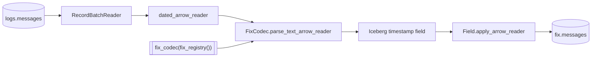

# parse_fix

`parse_fix` streams every stored raw row through the FIX codec and publishes
the complete fixed projection to `fix.messages`.

## Task document

```json
{
  "name": "parse_fix",
  "application": "parse_fix.py",
  "parameters": {
    "registry": null,
    "version": null,
    "catalog": {
      "name": "rekep",
      "properties": {
        "type": "sql",
        "uri": "sqlite:///data/catalog.db",
        "warehouse": "data/warehouse"
      }
    }
  }
}
```

| parameter | default | meaning |
| --- | --- | --- |
| `registry` | `null` | use the 6,303-definition bundled dictionary; an explicit path/URI overrides it |
| `version` | `null` | infer version per row; otherwise pin code translation |
| `catalog` | local SQL | same catalog and warehouse that hold `logs.messages` |

A dictionary is not a parameter: the registry is one namespace, so a field is
resolved by tag, name or path and never by the dictionary that contributed it.

## Read, parse, apply, write



The codec is the whole parse surface: the dictionary and everything that holds
for the run are pinned on it once, and the read is one call over the stored
reader. `body` is the payload column it reads by default, text or bytes alike.
Source columns lead the result unless a fixed field owns the same folded name.
The output schema is known before the first batch, converted to a `Field`,
narrowed to Iceberg-supported microseconds recursively, then applied with
strict nullability.

```python
from rekep.fix import dated_arrow_reader, fix_codec, fix_registry, iceberg_fix_field

codec = fix_codec(fix_registry(), version=None)
parsed = codec.parse_text_arrow_reader(dated_arrow_reader(source))
field = iceberg_fix_field(parsed.schema)
applied = field.apply_arrow_reader(parsed, safe=False, nullability="strict")
```

See [Decode rules](../../fix/decode.md) for numeric FIX, ULLINK, packed groups,
configuration JSON, FIXML, registry translation, source-column fill, and
content-level failures.

## A row is a message, not a line

A source row is read for every message it carries. One frame is one row, a
line carrying two frames is two, and a bulk configuration answer is one row
per configuration it names — so the Jolokia wildcard response in the tracked
corpus publishes one `pluginconfig` row per plugin it returned. A line that
carries no message at all publishes no row, which is why `read` counts lines
and the result's own `messages` key counts what the codec answered.

That is also why `fix.messages` is keyed on `(url, rownum, uuid)` where
`logs.messages` is keyed on `(url, rownum)`: two messages of one line share
the line's identity and differ only in their own.

## A capture clock dates a message that states none

A message carrying no `SendingTime(52)` is otherwise dated by the instant the
parse ran, and the `uuid` computed from that clock is a different one on every
read — so a replay would insert every such message again. `dated_arrow_reader`
offers the stored capture `timestamp` as a `sendingtime` column, which
outranks the codec's default; the column clashes with the FIX column of that
name, so it lands there rather than beside it. A message that carried its own
clock keeps it, replay recomputes the same identity either way, and the merge
on `(url, rownum, uuid)` is idempotent.

## Schema and precision

The bundled configuration yields [118 columns](../../products/fix-message.md#complete-schema).
Venue clocks may parse at nanosecond precision, while Iceberg v2 stores
microseconds. Every top-level and nested timestamp is narrowed once at the
storage boundary. Original text remains in `nofixentries`, so the wire value
is still auditable.

## Registry override

An explicit registry is useful for validating a venue extension:

```bash
uv run --project python rekep task run \
  tasks/parse_fix/parse_fix.json \
  --parameter 'registry="file:/srv/rekep/fix-candidate"'
```

The location must contain specification fields. Runtime and bridge fields are
added automatically. The task refuses an empty external dictionary before
creating a narrow table.

## Row behavior

- Prose and unreadable content produce no row; a payload that was there and
  would not parse produces one row holding an empty message.
- A pair no dictionary explains is an entry of tag 0 inside `nofixentries`,
  so one arrival record holds everything that arrived.
- A conversion failure leaves the typed column null and preserves its arrival.
- The source message wins over a same-field source-column fill.
- The writer merges on `(url, rownum, uuid)` and can create a missing table.

## Run

```bash
uv run --project python rekep task run tasks/parse_fix/parse_fix.json
```

Run `parse_messages` first: `parse_fix` reads the stored raw product, never
source files. A `logs.messages` that is not there yet reads as zero rows and
succeeds, so a first interval against a fresh catalog is a run rather than a
failure — it is an empty capture that publishes nothing, not a missing
dependency the task can detect. An invalid registry, an incompatible existing
target schema, or a failed Iceberg commit fails the task.
