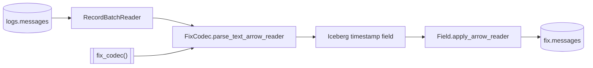

# parse_fix

`parse_fix` streams every stored raw row through the FIX codec and publishes
the complete fixed projection to `fix.messages`.

## Task document

```json
{
  "name": "parse_fix",
  "application": "parse_fix.py",
  "parameters": {
    "registry": null,
    "branch": "ulbridge",
    "version": null,
    "catalog": {
      "name": "rekep",
      "properties": {
        "type": "sql",
        "uri": "sqlite:///data/catalog.db",
        "warehouse": "data/warehouse"
      }
    }
  }
}
```

| parameter | default | meaning |
| --- | --- | --- |
| `registry` | `null` | use the 6,303-definition bundled registry; an explicit path/URI overrides it |
| `branch` | `ulbridge` | resolve bridge names before standard names |
| `version` | `null` | infer version per row; otherwise pin code translation |
| `catalog` | local SQL | same catalog and warehouse that hold `logs.messages` |

## Read, parse, apply, write



The codec receives the full raw reader. Capture columns lead the result
unless a fixed field owns the same folded name, in which case they fill it —
see [Capture columns](../../fix/capture.md). The output
schema is known before the first batch, converted to a `Field`, narrowed to
Iceberg-supported microseconds recursively, then applied with strict
nullability.

```python
from rekep.fix import PAYLOAD_COLUMN, FixCodec, fix_registry, iceberg_fix_field

codec = FixCodec(
    fix_registry(),
    branch="ulbridge",
    version=None,
    payload_column=PAYLOAD_COLUMN,
)
parsed = codec.parse_text_arrow_reader(source)
field = iceberg_fix_field(parsed.schema)
applied = field.apply_arrow_reader(parsed, safe=False, nullability="strict")
```

A pin is on the codec and a stage is a call, so `branch`, `version` and the
payload column are stated once and every batch is parsed the same way. Filling
what a message implied, and restating one at the dictionary's newest version,
are separate stages this task does not run.

See [Decode rules](../../fix/decode.md) for numeric FIX, ULLINK, packed groups,
configuration JSON, FIXML, registry translation, capture-column fill, and
content-level failures.

## Schema and precision

The bundled configuration yields [114 columns](../../products/fix-message.md#complete-schema).
Venue clocks may parse at nanosecond precision, while Iceberg v2 stores
microseconds. Every top-level and nested timestamp is narrowed once at the
storage boundary. Original text remains in `nofixentries`, so the wire value
is still auditable.

## Registry override

An explicit registry is useful for validating a venue extension:

```bash
uv run --project python rekep task run \
  tasks/parse_fix/parse_fix.json \
  --parameter 'registry="file:/srv/rekep/fix-candidate"'
```

The location must contain specification fields. Runtime and bridge fields are
added automatically. The task refuses an empty external dictionary before
creating a narrow table.

## Row behavior

- Every source row produces one fixed row, except a bridge configuration
  document, which produces one per MBean it states. Nothing drops a row
  unasked: `written` counts the rows stored and `skipped` the parsed messages
  the merge already held, so a replay reports `0 written` and every message
  skipped.
- Prose and unreadable content produce an `unknown` row with required stamps.
- Unknown fields stay in both arrival lists and, for one-message inspection,
  as nullable text fields.
- A conversion failure leaves the typed column null and preserves its arrival.
- The message itself wins over a same-field capture-column fill.
- The writer merges on `(url, rownum, msghash)` and can create a missing
  table. The line's own identity is a key prefix, so a join back to
  `logs.messages` on `(url, rownum)` still reaches every message of a line.

## Run

```bash
uv run --project python rekep task run tasks/parse_fix/parse_fix.json
```

Run `parse_messages` first: `parse_fix` reads the stored raw product, never
source files. A `logs.messages` that is not there yet reads as zero rows and
succeeds, so a first interval against a fresh catalog is a run rather than a
failure — it is an empty capture that publishes nothing, not a missing
dependency the task can detect. An invalid registry, an incompatible existing
target schema, or a failed Iceberg commit fails the task.
