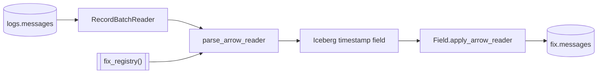

# parse_fix

`parse_fix` streams every stored raw row through the FIX codec and publishes
the complete fixed projection to `fix.messages`.

## Task document

```json
{
  "name": "parse_fix",
  "application": "parse_fix.py",
  "parameters": {
    "registry": null,
    "branch": "ulbridge",
    "version": null,
    "dedup": false,
    "catalog": {
      "name": "rekep",
      "properties": {
        "type": "sql",
        "uri": "sqlite:///data/catalog.db",
        "warehouse": "data/warehouse"
      }
    }
  }
}
```

| parameter | default | meaning |
| --- | --- | --- |
| `registry` | `null` | use the 6,262-definition bundled registry; an explicit path/URI overrides it |
| `branch` | `ulbridge` | resolve bridge names before standard names |
| `version` | `null` | infer version per row; otherwise pin code translation |
| `dedup` | `false` | retain one output row per raw input row |
| `catalog` | local SQL | same catalog and warehouse that hold `logs.messages` |

## Read, parse, apply, write



The parser receives the full raw reader and the name `body`. Source columns
lead the result unless a fixed field owns the same folded name. The output
schema is known before the first batch, converted to a `Field`, narrowed to
Iceberg-supported microseconds recursively, then applied with strict
nullability.

```python
from rekep.fix import fix_registry, iceberg_fix_field, parse_arrow_reader

parsed = parse_arrow_reader(
    source,
    fix_registry(),
    "body",
    branch="ulbridge",
    version=None,
    dedup=False,
)
field = iceberg_fix_field(parsed.schema)
applied = field.apply_arrow_reader(parsed, safe=False, nullability="strict")
```

See [Decode rules](../../fix/decode.md) for numeric FIX, ULLINK, packed groups,
configuration JSON, FIXML, registry translation, source-column fill, and
content-level failures.

## Schema and precision

The bundled configuration yields [108 columns](../../products/fix-message.md#complete-schema).
Venue clocks may parse at nanosecond precision, while Iceberg v2 stores
microseconds. Every top-level and nested timestamp is narrowed once at the
storage boundary. Original text remains in `nofixentries`, so the wire value
is still auditable.

## Registry override

An explicit registry is useful for validating a venue extension:

```bash
uv run --project python rekep task run \
  tasks/parse_fix/parse_fix.json \
  --parameter 'registry="file:/srv/rekep/fix-candidate"'
```

The location must contain specification fields. Runtime and bridge fields are
added automatically. The task refuses an empty external dictionary before
creating a narrow table.

## Row behavior

- With `dedup=false`, every source row produces one fixed row.
- Prose and unreadable content produce an `unknown` row with required stamps.
- Unknown fields stay in both arrival lists and, for one-message inspection,
  as nullable text fields.
- A conversion failure leaves the typed column null and preserves its arrival.
- The source message wins over a same-field source-column fill.
- The writer merges on `(url, rownum)` and can create a missing table.

## Run

```bash
uv run --project python rekep task run tasks/parse_fix/parse_fix.json
```

`logs.messages` must already exist. A missing source table, invalid registry,
incompatible existing target schema, or failed Iceberg commit fails the task.
