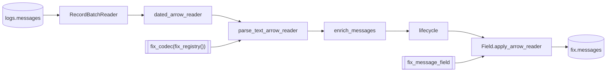

# parse_fix

`parse_fix` streams one window of the stored raw rows through the FIX codec
and publishes the complete fixed projection to `fix.messages`.

## Task document

```json
{
  "name": "parse_fix",
  "application": "parse_fix.py",
  "parameters": {
    "registry": null,
    "lifecycle": true,
    "start": null,
    "end": null,
    "catalog": {
      "name": "rekep",
      "properties": {
        "type": "sql",
        "uri": "sqlite:///data/catalog.db",
        "warehouse": "data/warehouse"
      }
    }
  }
}
```

| parameter | default | meaning |
| --- | --- | --- |
| `registry` | `null` | use the 6,314-definition bundled dictionary; an explicit path/URI overrides it |
| `lifecycle` | `true` | name the event chains after enrichment; `false` publishes parsed and enriched rows only |
| `start`, `end` | `null` | the window of `logs.messages` to read, over `timepartition`; `null` is the last day, as [`parse_messages`](parse-messages.md#the-window) reads it |
| `catalog` | local SQL | same catalog and warehouse that hold `logs.messages` |

A dictionary is not a parameter: the registry is one namespace, so a field is
resolved by tag, name or path and never by the dictionary that contributed it.
A version is not a parameter either: what a message was read at is what its own
`beginstring` said. `fix_codec` takes seven pins — `default_sending_time`,
`separator`, `payload_column`, `capture_names`, `null_values`, `direction` and
`batch_byte_size` — and refuses by name any keyword that is not one of them, so
a `version=` that no longer means anything fails the call rather than being
carried silently into the parse.

## Parse, enrich, lifecycle

The capture pipeline is three native stages over one codec, in this order and
no other:

```text
parse -> enrich -> lifecycle
```

- **parse** reads every frame a line carried. `parse_text_lines` is the form
  for a reader holding lines; `parse_text_arrow_reader` is its twin for a
  stored capture's batches. One frame is one row, and a line carrying no
  message answers none.
- **enrich** — `enrich_messages`, the stream form — fills what a message
  implied but did not carry, and remembers the bridge configurations the
  stream passed, so a later message naming a plugin takes that plugin's
  `SenderCompID` and `TargetCompID`. It also fills `altids` with the
  identifiers the message declares at its own level. Only the stream form
  carries that memory, which is why there is no per-message form of it.
- **lifecycle** names the chains: a non-empty `code`, an `updatedat` floored
  to the one-second snapshot grid while `createdat` and `snapshotat` keep the
  real instant, the `createdat` its chain opened at, and the
  `prevupdatedat`/`prevmsghash` pair linking a message to the one before it.
  `lifecycle` set to `false` stops the task after enrichment.

Two doors run those same three stages and the native core requires them to
agree row for row. `fix_line_messages(codec, lines)` is the line door, for a
capture read straight through without a table in between.
`fix_arrow_messages(codec, source)` and `fix_arrow_reader(codec, source)` are
the batch door, which is what this task takes because it holds a table.

## Read, parse, apply, write



The codec is the whole parse surface: the dictionary and the instant an undated
message takes are pinned on it once, and each stage after it is a call rather
than another pin. No capture order is among them. This door reads stored rows,
where a column named after a field fills that field *by name*; a capture
position is what the line door resolves, and pinning one here would be a
reading of a header this task never sees — stale the moment the capture is read
under a header of its own, which
[`parse_messages`](parse-messages.md#a-bridge-that-writes-the-header-its-own-way)
now takes as a parameter. `body` is the payload column the codec reads by
default, text or bytes alike. Source columns lead the result unless a fixed
field owns the same folded name.

The published field is read from the carrier and the dictionary alone, before
the first batch: `fix_message_field(codec, carrier)` runs the whole pipeline
over an empty reader of the carrier's schema and narrows what comes back with
`iceberg_fix_field` — sixteen-byte identities, timestamps recursively narrowed
to Iceberg-supported microseconds, no semantic extension name left on a column
a predicate has to be lowered onto, and the carrier's own key members restored
beside `msghash`. So an empty capture creates the same table a full one does,
and the published contract is the field the task actually writes.

```python
from rekep.fix import (
    fix_arrow_reader,
    fix_codec,
    fix_message_field,
    fix_registry,
)
from rekep.iceberg import IcebergCatalog, window_filter
from rekep.text import Message
from rekep.times import window_of

registry, lifecycle = None, True
catalog = {
    "name": "rekep",
    "properties": {
        "type": "sql",
        "uri": "sqlite:///data/catalog.db",
        "warehouse": "data/warehouse",
    },
}

window = window_of("2026-08-14", "2026-08-14")
carrier = Message.into_field()
codec = fix_codec(fix_registry(registry))
field = fix_message_field(codec, carrier)

store = IcebergCatalog.from_dict(catalog)
counted = store.dataset("logs.messages", field=carrier).read_arrow_reader(
    carrier, row_filter=window_filter("timepartition", window)
)
parsed = fix_arrow_reader(codec, counted, lifecycle=lifecycle)
applied = field.apply_arrow_reader(parsed, safe=False, nullability="strict")
written = store.dataset("fix.messages", field=field, merge_schema=True).overwrite_arrow_reader(
    applied, field, merge_by=True
)
```

`window_filter` is the stored half of the window rule: the rows whose
`timepartition` falls in `[start, end)` and the rows carrying none, pruned to
the hours the table is laid out by.

`fix_arrow_reader` is the batch door end to end: `dated_arrow_reader`, then
`parse_text_arrow_reader`, then `messages`, then `enrich_messages`, then
`lifecycle`. The rows land in the parse's own shape — the carrier's columns
first, the dictionary's after — and narrowing that shape to what a table stores
belongs to the storage boundary, which is `field` and the strict apply.

See [Decode rules](../../fix/decode.md) for numeric FIX, ULLINK, packed groups,
configuration JSON, FIXML, registry translation, source-column fill, and
content-level failures.

## A row is a message, not a line

A source row is read for every message it carries. One frame is one row, a
line carrying two frames is two, and a bulk configuration answer is one row
per configuration it names — so the Jolokia wildcard response in the tracked
corpus publishes one `pluginconfig` row per plugin it returned. A line that
carries no message at all publishes no row, which is why `read` counts lines
and the result's own `messages` key counts what the codec answered.

That is also why `fix.messages` is keyed on `(sourceurl, rownum, msghash)`
where `logs.messages` is keyed on `(sourceurl, rownum)`: two messages of one
line share the line's identity and differ only in their own.

## A capture clock dates a message that states none

A message carrying no `SendingTime(52)` would otherwise be dated by the instant
the parse ran, and the `msghash` computed from that clock is a different one on
every read — so a replay would insert every such message again. The codec's
`default_sending_time` is the floor under that, pinned to `UNDATED`, the epoch
instant that means no clock was read. It is one instant for the whole run,
though, so the batch door offers the per-row clock beside it:
`dated_arrow_reader` hands the stored capture `timestamp` over as a
`sendingtime` column, which outranks the codec's default. The column clashes
with the FIX column of that name, so it lands there rather than beside it.

The column is filled, never merely cast. A line whose header the reader did not
match carries no clock of its own either, and a null would hand that message
back to the run-wide floor rather than to anything the capture recorded — so
those rows state `UNDATED`, which is the same instant the floor would have
given them. A message that carried its own clock keeps it, replay recomputes
the same identity either way, and the replace on `(sourceurl, rownum, msghash)`
is idempotent for every capture rather than only for one whose every line the
header matched.

The line door has no such column. A bridge spells a line's capture clock the
way a log spells one and not the way `SendingTime` is spelled, so
`fix_line_messages` dates an undated message with the codec's `UNDATED` floor
instead. Both doors are replayable; neither reads the instant the parse ran.

## Schema and precision

The bundled configuration yields [128 columns](../../products/fix-message.md#complete-schema).
Venue clocks may parse at nanosecond precision, while Iceberg v2 stores
microseconds. Every top-level and nested timestamp is narrowed once at the
storage boundary. Original text remains in `fixentries`, so the wire value is
still auditable.

## Registry override

An explicit registry is useful for validating a venue extension:

```bash
uv run --project python rekep task run \
  tasks/parse_fix/parse_fix.json \
  --parameter 'registry="file:/srv/rekep/fix-candidate"'
```

The location must contain specification fields. Runtime and bridge fields are
added automatically. The task refuses an empty external dictionary before
creating a narrow table.

## Row behavior

- Prose and unreadable content produce no row; a payload that was there and
  would not parse produces one row holding an empty message.
- A pair no dictionary explains is an entry of tag 0 inside `fixentries`, so
  one arrival record holds everything that arrived. The row ends
  `msgdirection`, `nofixentries`, `fixentries`: the arrival record is a group
  named after itself, under the counter that counts it.
- A conversion failure leaves the typed column null and preserves its arrival.
- The source message wins over a same-field source-column fill.
- The writer replaces on `(sourceurl, rownum, msghash)` and can create a
  missing table: a replay of a window lands the same messages once, and a
  dictionary change lands their new reading over the old.
- `msghash` is stored as `fixed_size_binary[16]` and nothing else: an
  extension type carries no compute kernel, so a column of one could appear in
  no predicate — including the bounds a replace plans its stored files by. A
  key that reaches the writer under an extension name is compared as the bytes
  it holds, and `iceberg_fix_field` drops the semantic extension name a URL,
  an ISIN, a MIC or a currency crosses Arrow under for the same reason.

## Run

```bash
uv run --project python rekep task run tasks/parse_fix/parse_fix.json \
  --parameter 'start="2026-08-14"' --parameter 'end="2026-08-14"'
```

Run `parse_messages` first, over the same window: `parse_fix` reads the stored
raw product, never source files, and reads the rows whose `timepartition`
falls in `[start, end)` — the last day up to now when the document names
neither bound, which is why a run over the sample capture names its day. A
`logs.messages` that is not there yet reads as zero rows and succeeds, so a
first window against a fresh catalog is a run rather than a failure — it is
an empty capture that publishes nothing, not a missing dependency the task can
detect. An invalid registry, an incompatible existing target schema, or a
failed Iceberg commit fails the task.
