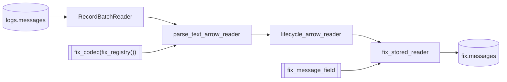

# parse_fix

`parse_fix` streams one window of the stored raw rows through the FIX codec
and publishes the complete fixed projection to `fix.messages`.

## Task document

```json
{
  "name": "parse_fix",
  "application": "parse_fix.py",
  "parameters": {
    "registry": null,
    "lifecycle": true,
    "start": null,
    "end": null,
    "catalog": {
      "name": "rekep",
      "properties": {
        "type": "sql",
        "uri": "sqlite:///data/catalog.db",
        "warehouse": "data/warehouse"
      }
    }
  }
}
```

| parameter | default | meaning |
| --- | --- | --- |
| `registry` | `null` | use the 7,787-definition bundled dictionary; an explicit path/URI overrides it |
| `lifecycle` | `true` | walk the event chains after the parse; `false` publishes the parsed rows alone |
| `start`, `end` | `null` | the window of `logs.messages` to read, over its capture clock; `null` is the last day, as [`parse_messages`](parse-messages.md#the-window) reads it |
| `catalog` | local SQL | same catalog and warehouse that hold `logs.messages` |

A dictionary is not a parameter: the registry is one namespace, so a field is
resolved by tag, name or path and never by the dictionary that contributed it.
A version is not a parameter either: what a message was read at is what its own
`beginstring` said. `fix_codec` takes ten pins — `default_sending_time`,
`separator`, `payload_column`, `capture_names`, `null_values`, `direction`,
`batch_byte_size`, `batch_row_size`, `include_msgtypes` and `exclude_msgtypes`
— and refuses by name any keyword that is not one of them, so a `version=`
that no longer means anything fails the call rather than being carried
silently into the parse. An unstated `exclude_msgtypes` is not `[]`: unstated
is the core's own refusal of `Heartbeat`, `TestRequest` and the untyped line,
and `[]` keeps every type.

## Parse, then walk the chains

The capture pipeline is two native stages over one codec, in this order and
no other:

```text
parse -> lifecycle
```

- **parse** reads every frame a line carried and settles it where it is read:
  a parsed message already carries what it implied — its typed facts lifted,
  its deprecated fields restated to their latest spellings, the dictionary's
  own derivations run, the identifiers its message component declares filled,
  its side's lane filled, and its instant and identity settled. There is no
  enriching stage between the two. `parse_text_lines` is the form for a reader
  holding lines; `parse_text_arrow_reader` is its twin for a stored capture's
  batches. One frame is one row, and a line carrying no message answers none.
- **lifecycle** reads those messages as the chains they belong to: the
  `prevuuid` a message follows, the `seqnum` it stands at, the `prevpx` and
  `prevqty` the step before it settled on, the predecessor among its
  `parentuuids` and the `creatunix` its chain opened at. `lifecycle` set to
  `false` stops the task after the parse.

Two doors run those same stages and the native core requires them to agree row
for row. `fix_line_messages(codec, lines)` is the line door, for a capture read
straight through without a table in between. `fix_arrow_messages(codec, source)`
and `fix_arrow_reader(codec, source)` are the batch door, which is what this
task takes because it holds a table.

The walk reads the whole row, and a capture's own column is a column. A line
number and a line clock are not content — a walk that read one would give every
hop that logged a message its own identity, and the bridge logs one message at
several hops, so the table would hold every arrival rather than every event.
The core settles that where a row becomes a message again: a column no tag and
no counter names is marked `fix:captured` and left out of the message's
entries, so it reaches no digest and no wire but stays on the row. So
`fix_arrow_reader` hands the walk what the parse answered and takes back what
it returns.

Which is also why it does not hold those columns back and put them in front
again: the walk does not answer its rows in the order it was handed them, so a
caller that rejoined them by position would pair a row with whichever line sat
at its index. `fix.messages` names the line each event was read from, and that
is the line that states it.

## Read, parse, apply, write



The codec is the whole parse surface: the dictionary and the instant an undated
message takes are pinned on it once, and each stage after it is a call rather
than another pin. No capture order is among them. This door reads stored rows,
where a column named after a field fills that field *by name*; a capture
position is what the line door resolves, and pinning one here would be a
reading of a header this task never sees — stale the moment the capture is read
under a header of its own, which
[`parse_messages`](parse-messages.md#a-bridge-that-writes-the-header-its-own-way)
now takes as a parameter. `body` is the payload column the codec reads by
default, text or bytes alike. Source columns lead the result unless a fixed
field owns the same folded name.

The published field is read from the dictionary alone, before the first batch.
`fix_schema(registry, "fixmsg")` is the row the dictionary publishes and
`fix_schema_carrying` is the supported way to put a capture's own columns in
front of it, so `fix_parse_field(codec, carrier)` is what the codec writes and
`fix_message_field(codec, carrier)` is that row as a table stores it —
`iceberg_fix_field` narrows the second from the first. So an empty capture
creates the same table a full one does, and the published contract is the field
the task actually writes.

```python
from pyiceberg.expressions import And

from rekep.fix import (
    fix_arrow_reader,
    fix_codec,
    fix_message_field,
    fix_registry,
    fix_stored_reader,
)
from rekep.iceberg import IcebergCatalog, carrying_filter, window_filter
from rekep.text import Message
from rekep.times import window_of

registry, lifecycle = None, True
catalog = {
    "name": "rekep",
    "properties": {
        "type": "sql",
        "uri": "sqlite:///data/catalog.db",
        "warehouse": "data/warehouse",
    },
}

window = window_of("2026-08-14", "2026-08-14")
carrier = Message.into_field()
codec = fix_codec(fix_registry(registry))
field = fix_message_field(codec, carrier)

store = IcebergCatalog.from_dict(catalog)
counted = store.dataset("logs.messages", field=carrier).read_arrow_reader(
    carrier,
    row_filter=And(window_filter("timestamp", window), carrying_filter("body")),
)
parsed = fix_arrow_reader(codec, counted, lifecycle=lifecycle)
applied = fix_stored_reader(parsed, field)
written = store.dataset("fix.messages", field=field, merge_schema=True).overwrite_arrow_reader(
    applied, field, merge_by=True
)
```

`carrying_filter` is the other half of what the read asks for: the lines that
carry a body. A row header can consume the whole of its line -- the bundled
capture has one, a matched `[ULBridge] (INFO)` header with nothing after it --
and a line with no body states no message. The codec refuses it either way, so
this changes what is read and never what is written: 122 stored lines become
121 read, and `messages` and `written` are what they were.

It is spelled `GreaterThan(column, b"")` and not `NotNull`. `body` is declared
non-null, so a null test folds to `AlwaysTrue` and selects every row; what a
line can carry instead is nothing, and for bytes ordered lexicographically
"greater than empty" is exactly "not empty". It is also the spelling that can
prune: PyIceberg answers `ROWS_MIGHT_MATCH` for `NotEqualTo` whatever the
bounds say, while `GreaterThan` compares the stored upper bound and skips a
file whose widest body is empty.

`window_filter` is the stored half of the window rule: the rows whose capture
clock falls in `[start, end)` and the rows carrying none, which belong to every
window. It is read off `timestamp` rather than off `timepartition` — a file
holds one hour of that clock, so its own stored bounds prune the scan without
the predicate naming the partition column, which it must not: a capture line
with no clock lands in the null partition and PyIceberg 0.12 cannot plan a
comparison against one.

`fix_arrow_reader` is the batch door end to end: `parse_text_arrow_reader`,
then `lifecycle_arrow_reader` over the row it answered. The rows land in the parse's
own shape — the carrier's columns first, the dictionary's after — and narrowing
that shape to what a table stores belongs to the storage boundary, which is
`fix_stored_reader`: the content codes read as the signed integers Iceberg
stores, then `field.apply_arrow_reader(safe=False, nullability="strict")` in
its native order.

See [Decode rules](../../fix/decode.md) for numeric FIX, ULLINK, packed groups,
configuration JSON, FIXML, registry translation, source-column fill, and
content-level failures.

## A row is an event, not a line

A source row is read for every message it carries. One frame is one row, a
line carrying two frames is two, and a bulk configuration answer is one row
per configuration it names. A line that carries no message at all publishes no
row, which is why `read` counts the lines the read asked for and the result's
own `messages` key counts what the codec answered.

A message is then logged again at every hop it passes, and each of those
arrivals is a restatement of one event rather than a second one: they settle on
one `curruuid`, which is a UUIDv7 over the instant the event settled on and the
code of its content. The bundled capture makes the gap visible — its
`00026877711XOEA0` chain is stated 49 times and those statements are 31 events.

That is why `fix.messages` is keyed on `curruuid` alone. Keying on where a line
was read from is what made one message three rows.

`logs.messages` is keyed on `bodyhash`, the digest of the exact body bytes, so
identical bytes are one row whatever session carried them. The two digests
answer two questions and neither stands in for the other: `bodyhash` is of the
bytes, and the row's own `hashcode` is of the settled event — its facts, its
text, its metadata and its entry tree — so two different lines stating the same
message share a `hashcode` and not a `bodyhash`.

## A key is scoped to its partition

`fix.messages` is laid out by the hour of `unix`, the instant the event
happened at, and a key is scoped to the partition it lands in. Every
restatement of one event carries that same instant, so they meet in one
partition and the write folds them.

What that leaves is an event whose `unix` *moves* between two runs — a
dictionary that reads its clock differently, say. The second run lands it in a
second hour, where the first copy's key is not in scope and is not replaced, so
the event is in the table twice. A dictionary change that moves an instant is
therefore a rewrite of the windows it touches, not an incremental run.

## An undated message takes the pin, not the clock of the run

A message carrying no `SendingTime(52)` and no `TransactTime(60)` would
otherwise be dated by the instant the parse ran, and the identity computed from
that clock is a different one on every read — so a replay would insert every
such message again. The codec's `default_sending_time` is the floor under that,
pinned to `UNDATED`, the epoch instant that means no clock was read.

A capture's own clock is context and stamps nothing, in either door. The bridge
spells a line's clock the way a log spells one and not the way `SendingTime` is
spelled, and the same message logged at three hops carries three of them, so a
line clock that dated a message would make each hop a different event. It stays
on the row as `timestamp`, which is what it is.

## Schema and precision

The bundled configuration yields [128 columns](../../products/fix-message.md#complete-schema).
Venue clocks may parse at nanosecond precision, while Iceberg v2 stores
microseconds. Every top-level and nested timestamp is narrowed once at the
storage boundary. Original text remains in `fixentries`, so the wire value is
still auditable.

## Registry override

An explicit registry is useful for validating a venue extension:

```bash
uv run --project python rekep task run \
  tasks/parse_fix/parse_fix.json \
  --parameter 'registry="file:/srv/rekep/fix-candidate"'
```

The location must contain specification fields; every registry holds the
crate's own columns and the two standard clocks from construction. The task
refuses an empty external dictionary before creating a narrow table.

A dictionary narrow enough to type no message type at all is a different
matter: the codec's message-type filter is on by default — it refuses
`Heartbeat(0)`, `TestRequest(1)` and the untyped line before it builds a frame
— and every line is untyped to a dictionary that cannot resolve `MsgType(35)`.
Such a run creates the table with the dictionary's shape and writes no row.

## Row behavior

- Prose and unreadable content produce no row; a payload that was there and
  would not parse produces one row holding an empty message.
- A pair no dictionary explains is an entry of tag 0 inside `fixentries`, so
  one arrival record holds everything that arrived. The row ends `metadata`,
  `nofixentries`, `fixentries`: the arrival record is a group named after
  itself, under the counter that counts it.
- A conversion failure leaves the typed column null and preserves its arrival.
- The source message wins over a same-field source-column fill.
- The writer replaces on `curruuid` and can create a missing table: a replay of
  a window lands the same events once, and a dictionary change lands their new
  reading over the old.
- An identity is stored as `fixed_size_binary[16]` and nothing else. Arrow
  sorts, compares and hashes those bytes and refuses the `arrow.uuid`
  extension over them, so a table keyed, ordered and merged on an identity
  needs the bytes a predicate can be lowered onto — including the bounds a
  replace plans its stored files by. `iceberg_fix_field` drops the semantic
  extension name a URL, an ISIN, a MIC or a currency crosses Arrow under for
  the same reason.
- A content code — `hashcode`, `crosshashcode` — is an unsigned 64-bit integer
  and Iceberg's only 64-bit integer is signed. The same eight bytes read as
  signed are the code, so the column says `int64` and `fix_stored_reader`
  views rather than converts: half the codes read back negative and name the
  same rows.

## Run

```bash
uv run --project python rekep task run tasks/parse_fix/parse_fix.json \
  --parameter 'start="2026-08-14"' --parameter 'end="2026-08-14"'
```

Run `parse_messages` first, over the same window: `parse_fix` reads the stored
raw product, never source files, and reads the rows whose capture clock
falls in `[start, end)` — the last day up to now when the document names
neither bound, which is why a run over the sample capture names its day. A
`logs.messages` that is not there yet reads as zero rows and succeeds, so a
first window against a fresh catalog is a run rather than a failure — it is
an empty capture that publishes nothing, not a missing dependency the task can
detect. An invalid registry, an incompatible existing target schema, or a
failed Iceberg commit fails the task.
